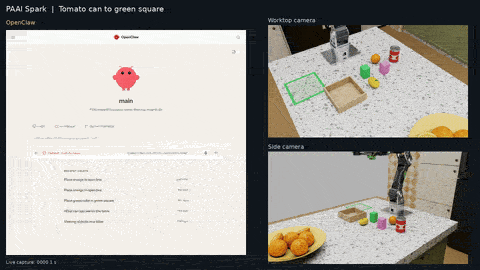

# CASCADE 🦾 — Cascaded Agentic Skill Control with Adaptive Dispatch and Execution

<p align="center">
  <br>
  <a href="docs/DGX_SPARK_SETUP.md">PAAI demo running on NVIDIA DGX Spark · 6× speed</a>
</p>

<p align="center">
  <a href="https://github.com/johnnynunez/cascade/actions/workflows/ci.yml"></a>
  <a href="pyproject.toml"></a>
  <a href="LICENSE"></a>
  <a href="docs/ARCHITECTURE.md"></a>
</p>

CASCADE is a **robot- and device-agnostic** framework for agentic
manipulation: arms, cameras, compute and LLM backends are all pluggable
behind one curated skill API, so the same 33 skills, safety harness and
traces work on a 5-DoF hobby arm over USB serial or a 6-DoF industrial arm
over CAN, on a RealSense or a generic UVC webcam, in MuJoCo or Isaac Sim, on
a datacenter GPU or a laptop CPU, with a cloud LLM or a local one. Its
defining idea is the cascade itself: routine commands resolve on a regex
reflex or a learned habit tier and never touch the LLM, which only gets
called when both fail — behavior, safety and tracing stay identical
regardless of which tier (or which hardware) acted.

**Nothing above the driver layer knows which robot is attached.** An arm
contributes six methods and a [profile](configs/arms/); its joint count,
home poses, tool-frame convention, reach and gripper travel come from that
profile, and the skills, safety harness and grasp planner read them. The
same is true of compute: no module names an accelerator, and every model
routes through [`resolve_device()`](src/cascade/device.py), which probes the
host and degrades instead of failing.

The reference deployment drives a Seeed reBot DevArm B601 (RobStride build)
from an NVIDIA DGX Spark — that is *a* configuration this framework runs on,
not what it is. It is the agentic evolution of the
[reBot-DevArm-Grasp](https://github.com/Seeed-Projects/reBot-DevArm-Grasp)
baseline, designed after NVIDIA GEAR's
[ASPIRE](https://research.nvidia.com/labs/gear/aspire/) (curated skill API +
multimodal traces + skill library) and
[Agentic-VLA](https://arxiv.org/abs/2605.22896) (task decomposition + VLM
advisor + experience memory), in the same
service-oriented/composable spirit as [RPent](https://github.com/RLinf/RPent).

[PAAI staff guide](docs/BOOTH_GUIDE.md) · [DGX Spark setup](docs/DGX_SPARK_SETUP.md) · [Spark delivery](docs/SPARK_DELIVERY.md) · [Architecture](docs/ARCHITECTURE.md) · [Quickstart](docs/QUICKSTART.md) · [Physical rig runbook](docs/BOOTH_RUNBOOK.md) · [Roadmap](docs/ROADMAP.md) · [Agent guide](CLAUDE.md)

```
┌──────────────────────────────────────────┐   ┌──────────────────────────────────────────┐
│  chat host: OpenClaw / Hermes /          │   │  CLI: --task / --interactive REPL        │
│  Claude Code / Codex  (MCP stdio,        │   │  AgentOrchestrator: reflex → habit → LLM │
│  the host's LLM picks the tools)         │   │  (+ its own history as IMAGES, Vesta)    │
└──────────────────────────────────────────┘   └──────────────────────────────────────────┘
                     │ 41 tools                                   │ 33 skills
                     └────────────────────┬──────────────────────┘
                     SkillRuntime.execute() — ONE choke point, every tier, every robot:
                     arm select ▸ BEFORE frame ▸ skill ▸ VERIFY effect on an independent
                     channel ▸ AFTER frame ▸ trace row (tier) ▸ memory <frame, action, verdict>
        ▼                ▼                ▼                ▼                ▼                ▼
   perception       grasping         control          safety           memory          sim / eval
┌──────────────┐ ┌──────────────┐ ┌──────────────┐ ┌──────────────┐ ┌──────────────┐ ┌──────────────┐
│ RS/UVC/Isaac/│ │ GraspGen-X   │ │ FK/IK (pin)  │ │ per-arm gate │ │ beliefs      │ │ MuJoCo world │
│ MuJoCo cams  │ │ + OBB fallbk │ │ min-jerk to  │ │ every 50 Hz  │ │ (persisted)  │ │ arm+cams+    │
│ YOLOE, HSV   │ │ outcome mem  │ │ any N-DoF arm│ │ waypoint     │ │ frames K=4   │ │ truth share  │
│ occupancy    │ │ jaw datum    │ │ mjc | warp   │ │ +occupancy   │ │ habits, env. │ │ Isaac bridge │
│ device: auto │ │              │ │ ros2 | serial│ │ +neighbours  │ │ grasp prior  │ │ judge (GRM)  │
└──────────────┘ └──────────────┘ └──────────────┘ └──────────────┘ └──────────────┘ └──────────────┘
```

Motion skills report **confirmed, refuted or unverified postconditions**
from sim physics truth, perception or jaw width. A refuted claim downgrades
the skill's own `ok`. The verdict travels with the result into the
trace, into the planner's visual memory and to the off-line progress judge.
That, plus the cascade of tiers above it, is the whole design; the
[architecture doc](docs/ARCHITECTURE.md) walks the runtime end to end.

## PAAI, Physical Agentic AI

PAAI is the initial **Build a Claw** event demo. Attendees use OpenClaw chat
to inspect a simulated kitchen and ask the arm to move prepared objects.
CASCADE connects those requests to robot skills in NVIDIA Isaac Sim 6.1.
Three camera views show the action; simulator physics readback helps check
the result.

The authenticated attendee page shows cameras. A separate `/staff/` page
explains the prompts, result checks and recovery steps. See the
[booth guide](docs/BOOTH_GUIDE.md) for the staff walkthrough.

## Brev deployment

The kitchen demo runs on Brev.dev with an AWS `g7e.2xlarge`: one RTX PRO 6000
Blackwell Server Edition with 96 GB VRAM, eight vCPUs, 62 GiB RAM and a 1.7 TB
NVMe volume. It uses Isaac Sim 6.1 / CUDA PhysX and Qwen3.8-27B **Q8_0**, with
the vision projector and model fully on the GPU.

Select a matching instance with `brev create <name> --type g7e.2xlarge --flex-ports`.
GPU/VRAM and `--min-disk` search filters help check capacity; verify the actual
NVMe mount after boot. Brev SSH uses a managed relay that can close while the
VM remains healthy. Tailscale to the VM's own SSH server was the working
fallback; check both devices' key expiry. Put heavy data under
`/opt/dlami/nvme/paai-demo`. If bridge containers fail because `docker0` is
missing, `sudo systemctl restart docker` repairs that specific first-boot fault.

Prepare the external source/asset bundle and site profile using
[the deployment instructions](docs/BREV.md). For the first installation:

```bash
./deploy/brev/deploy.sh preflight --profile /srv/cascade/site.json
./deploy/brev/deploy.sh install --profile /srv/cascade/site.json
```

`install` prepares and starts the demo; `start` resumes a prepared installation.
The same entry point supports `status`, `restart` and `stop`. The demo and
public ngrok visitor use supervision across disconnects. The public page
shows authenticated cameras while OpenClaw administration and raw Isaac
control ports remain private. See [the deployment instructions](docs/BREV.md)
for preparation inputs, observed behavior and remaining certification limits.

## Chrome extension

The optional [camera companion](extensions/chrome) puts Kitchen, Worktop and
Side views beside the real OpenClaw chat. In `chrome://extensions`, enable
**Developer mode**, choose **Load unpacked**, and select `extensions/chrome`.
Open the private booth guide, click **Open OpenClaw**, and wait for **Ready**.
In the connected chat tab, click the extension, select **Connect cameras**,
allow the demo host, then choose **Side panel** or **Show in chat**.

The public camera page needs no extension. Real Chrome on Brev passed the
native side panel, host permission and three advancing camera feeds. The guide
also opened authenticated OpenClaw beside the native panel on Brev. The extension
does not handle gateway authentication or public visitor credentials.
See [installation details and tested limitations](docs/CHROME_EXTENSION.md).

## What it runs on

**Robots.** Add one by subclassing `ArmBase` (six methods) and dropping a
YAML profile in `configs/arms/` — see
[the arm interface](src/cascade/control/arm_base.py). No other file changes.

| profile | robot | DoF | transport | needs |
|---|---|---|---|---|
| `so101` | [The Robot Studio SO-101](https://github.com/TheRobotStudio/SO-ARM100) | 5 | Feetech STS3215 over USB serial | `pip install -e '.[arm-feetech]'` — **driver untested on hardware**, see [safety notes](#safety-notes-for-a-live-rig) |
| `so101_mujoco` | same, in MuJoCo physics (C engine) | 5 | — | `.[sim]` + `scripts/fetch_robot_assets.py so101` |
| `so101_mjwarp` | same, in [MuJoCo Warp](https://github.com/google-deepmind/mujoco_warp) (GPU runtime, CPU-capable) | 5 | — | `.[sim-warp]` + `scripts/fetch_robot_assets.py so101` |
| `so101_mock` | same, kinematic only | 5 | — | nothing |
| `so101_ros2` | same, over ROS2 (`ros2_control` + JTC bringup) | 5 | ROS2 topics | a sourced ROS2 env (`rclpy`) — **untested on hardware** |
| `so101_left` / `so101_right` | two SO-101s sharing a table | 5 each | — | nothing; see [multi-arm](#multi-arm) |
| `piper` | [AgileX PiPER](https://github.com/agilexrobotics/piper_ros) | 6 | ROS2 topics | a sourced ROS2 env — **untested on hardware** |
| `piper_mujoco` / `piper_mock` | same, MuJoCo physics / kinematic | 6 | — | `.[sim]` + `fetch_robot_assets.py piper` / nothing |
| `h1` | [Unitree H1](https://github.com/unitreerobotics/unitree_ros) right arm (gen 1: bare forearm, no hand) | 4 | ROS2 topics | a sourced ROS2 env — **untested on hardware** |
| `h1_2` | [Unitree H1-2](https://github.com/unitreerobotics/unitree_ros) right arm (7-DoF wrist, flange) | 7 | ROS2 topics | a sourced ROS2 env — **untested on hardware** |
| `h1_mock` / `h1_2_mock` | same, kinematic only | 4 / 7 | — | nothing |
| `rebot_rs` | Seeed reBot DevArm B601 (RobStride) | 6 | RobStride over SocketCAN | `.[arm]`, `can0` up |
| `rebot_rs_mb` | same, via MotorBridge | 6 | MotorBridge | `.[arm]` |
| `isaac` | reBot in Isaac Sim | 6 | ZMQ bridge | Isaac Sim + NVIDIA GPU |
| `libero_panda` | Franka Panda in LIBERO | 7 | benchmark harness | LIBERO |
| `mock` | kinematic stand-in | 6 | — | nothing |
| `ros2_generic` | **template**: ANY robot a `ros2_control` bringup exposes | — | ROS2 topics | copy the file, fill in your robot's numbers, drop the `template: true` flag |

**Any ROS2 robot without writing Python.** `type: ros2`
([`control/ros2_arm.py`](src/cascade/control/ros2_arm.py)) speaks the two
interfaces every `ros2_control` deployment already has — `sensor_msgs/JointState`
in, `trajectory_msgs/JointTrajectory` (or `Float64MultiArray` for a forward
position controller) out, joints addressed **by name** so driver-defined
`JointState` order can never shift the mapping. Adding a robot = copying
[`configs/arms/ros2_generic.yaml`](configs/arms/ros2_generic.yaml) and filling
in its URDF, joint names, keyframes, gripper travel and workspace: the whole
stack above (safety harness, IK, grasping, skills, MCP tools) drives it
unchanged. The humanoid profiles drive the ARM of a standing H1/H1-2 for
tabletop skills — locomotion stays with Unitree's own controller, and a
handless arm declares `max_width_m: 0` so grasps are *refused honestly*
instead of mimed. See [`docs/ROS2_BACKEND_BRIEF.md`](docs/ROS2_BACKEND_BRIEF.md)
for the design rationale (QoS, streaming trade, stop semantics).

> **Scope, honestly:** ROS2 and the humanoid profiles drive **arms**. There
> is no mobile base, navigation, mapping or robot self-localization in
> cascade yet -- "localization" here means finding *objects*. The mobility
> layer (a `MobileBase` twin of `ArmBase`, Vesta's pixel-goal / turn / stop
> navigation verbs as skills with the visual memory harness spanning the
> walk, Nav2 or a Warp costmap planner behind one interface, Unitree G1/H1
> in Isaac Sim first) is designed in
> [`docs/MOBILITY_AND_NAVIGATION_DESIGN.md`](docs/MOBILITY_AND_NAVIGATION_DESIGN.md)
> and is the next structural addition on the [roadmap](docs/ROADMAP.md).

<a id="multi-arm"></a>
**Multi-arm.** `--arms a,b` builds an `ArmRig` (first = manipulation arm, the
same shape as the camera rig); every motion skill then takes an optional
`arm="<name>"` and `list_arms` reports the names. Each arm gets its **own**
`SafetyHarness`, because every limit in `SafetyLimits` belongs to a particular
robot on a particular table — merging the profiles would let whichever loaded
last define the envelope for both.

> **Inter-arm collision** is gated geometrically, not with meshes: an arm
> profile may declare `base_pose` (where the robot is bolted, in a shared
> TABLE frame — [`so101_left.yaml`](configs/arms/so101_left.yaml) documents the
> convention), and with it set on both arms each harness gates every 50 Hz
> waypoint on the measured segment-to-segment distance between link
> centrelines (`safety.neighbor_clearance_m`, default 0.05 m, standing in for
> unmodelled link *shape*). Two caveats, both in that profile's header: an
> unreadable neighbour (a standby LazyArm) degrades to SKIP, not to block, and
> `base_pose` is a **measurement** — a wrong one makes the distance
> confidently wrong. Measure your own table before running two real arms.

**Compute.** Configs say `device: auto`; the host is probed at startup
(CUDA/ROCm → Apple MPS → CPU) and an explicit device the machine does not
have degrades with a warning rather than killing the run. Override
everything at once with `CASCADE_DEVICE=cpu`.

| host | perception | sim | notes |
|---|---|---|---|
| NVIDIA DGX Spark / DGX Station | CUDA | Isaac Sim or MuJoCo | the reference rig |
| Jetson Orin / Thor (aarch64) | CUDA | MuJoCo | CI covers linux-aarch64 |
| RTX workstation / generic CUDA server | CUDA | Isaac Sim or MuJoCo | |
| AMD ROCm | `torch.cuda` API, reported as `cuda:0` | MuJoCo | |
| Apple Silicon laptop | MPS | MuJoCo | CI covers macOS arm64 |
| CPU-only box | CPU | MuJoCo | slow but complete; nothing is GPU-gated |

The mock and MuJoCo stacks import no accelerator library at all, so
`--arm so101_mock` works on any of the above with base deps + `.[kinematics]`
(CI's `minimal-install` job enforces that).

**Two MuJoCo runtimes, one MJCF.** `so101_mujoco` runs the MuJoCo **C engine**
(`engine: mjc`) — the fast default everywhere: ~200k steps/s for one arm on an
Apple laptop, no accelerator. `so101_mjwarp` runs the same model on **MuJoCo
Warp** (`engine: warp`), the GPU runtime Google DeepMind + NVIDIA maintain under
the [Newton](https://github.com/newton-physics/newton) project, so the identical
control code exercises the path the DGX/Jetson accelerate. MJWarp is a *batched*
engine — its throughput is in simulating many worlds on a GPU — so for a single
arm on a machine with no CUDA (e.g. this Mac, where Warp falls back to CPU) it is
~650× slower than the C engine but still runs, which is what keeps the GPU path
developable on a laptop. Pick `so101_mujoco` to run a demo; pick `so101_mjwarp`
to work on the MJWarp path itself. `device: auto` resolves to CUDA when present,
CPU otherwise — the same profile runs on both.

## Install

Start with the [DGX Spark setup guide](docs/DGX_SPARK_SETUP.md) for host
checks, installation, startup and recovery.

The Spark installer prepares **Isaac Sim 6.1, Qwen Q4 with vision,
OpenClaw and the kitchen assets**. It downloads and verifies the model and
kitchen automatically. Use the single command in the
[Spark setup guide](docs/DGX_SPARK_SETUP.md#2-install), then start with:

```bash
python3 scripts/desktop.py launch --repo "$PWD"
```

READY requires two native OpenClaw orders: green cube to green square,
then orange to open box, with a verified reset after each. Live simulation
state and advancing cameras verify both cases. Logs and screenshots remain
under `runs/.install/` and `runs/.launch/profile-cascade-demo/`.

For development without Isaac or a local model:

```bash
git clone https://github.com/johnnynunez/cascade.git && cd cascade
uv venv && uv pip install -e '.[dev,kinematics]'
```

`kinematics` (Pinocchio) is not optional in practice — FK/IK back the safety
layer, so every run needs it. Everything else is opt-in, one extra per
capability, because none of them are wanted on all hosts:

| extra | brings | when |
|---|---|---|
| `kinematics` | `pin` (Pinocchio) | always |
| `perception` | `ultralytics` | real cameras / open-vocabulary detection |
| `llm` | `openai`, `anthropic` | any real brain (also covers Nous Portal and local servers) |
| `sim` | `mujoco` | hardware-free physics on any host |
| `sim-warp` | `mujoco-warp`, `warp-lang` | the same MJCF on the MuJoCo Warp GPU runtime (`engine: warp`); CPU-capable, so it installs anywhere |
| `arm-feetech` | `pyserial` | SO-101 and other Feetech-servo arms |
| `arm` | `motorbridge` | RobStride over SocketCAN |
| `grasping` | `pyzmq`, `msgpack-numpy` | the GraspGen-X / nvblox **client** wire (`grasp.backend: graspgenx`, the default). Model stacks stay in their own venvs and processes, so cascade never imports torch for them |

**torch is deliberately not a dependency.** The right build is per-platform
(CUDA, ROCm, Jetson wheels, MPS, CPU) and pinning one here would fight the
host; install it however your platform prefers, then
[`cascade/device.py`](src/cascade/device.py) finds it.

Robot assets: URDF *text* is vendored (that is all kinematics and the safety
layer read), while meshes and MuJoCo MJCFs are fetched on demand from a
pinned upstream commit:

```bash
python scripts/fetch_robot_assets.py --list
python scripts/fetch_robot_assets.py so101      # ~17 MB, MJCF + meshes
python scripts/fetch_robot_assets.py piper h1   # PiPER + Unitree H1 (Menagerie, same pin)
```

Optional one-shot helpers, none of them required:

```bash
# Hermes agent host (this project's default) + register the robot with it
./scripts/install_hermes.sh --portal

# occupancy/collision-map backend deps (pyzmq, msgpack-numpy, scipy, Warp;
# nvblox_torch is added on NVIDIA GPUs where a wheel exists)
curl -fsSL https://raw.githubusercontent.com/johnnynunez/cascade/main/scripts/install_occupancy_backend.sh | bash

# Explicit CPU/laptop preparation; never installs Isaac or Cosmos:
bash scripts/install.sh --profile laptop --brain keep --prepare-only --dir "$PWD"
```

See the [installation notes](#setup-notes) below for pyrealsense2, YOLOE's
text encoder, and other rig-specific gotchas.

## One click

Use the installer above for a new Spark. `run.sh` launches an installed rig
or an explicit laptop development mode; its auto-detection is not the
Spark installation contract. Local MuJoCo/OpenAI tests and standalone
Newton CPU tests do not certify the Spark event flow.

```bash
git clone https://github.com/johnnynunez/cascade && cd cascade
./run.sh                 # Isaac Sim if installed (ISAACSIM_PATH or a standard
                         # install path), else MuJoCo on any laptop
python3 scripts/desktop.py launch --repo "$PWD"  # prepared Spark, full stack
./run.sh mujoco --brain keep  # Mac: keep an already authenticated OpenClaw brain
./run.sh check isaac     # preflight only -- lists what is missing, starts nothing
./run.sh down            # stop everything it started
./run.sh isaac --headless --no-open   # extra flags pass through to scripts/launch.sh
```

The Spark installer creates a private app environment, managed Isaac runtime,
OpenClaw CLI and model runtime. It downloads Qwen Q4, its vision projector,
robot assets and kitchen files. See [Spark delivery](docs/SPARK_DELIVERY.md)
for the pinned identities and isolation rules.

`./run.sh` is a thin wrapper: `scripts/launch.sh --setup --sim <mode>` when
setup is needed, `scripts/launch.sh --sim <mode>` afterwards. Before it
prints READY it proves the stack, not just the wiring: it builds the robot
runtime once with the exact environment the MCP server gets, lists the
tools through OpenClaw, gets a trivial answer from the brain, and in sim
modes runs physical orders and reset in one persistent chat session. Spark
requires green cube to green square and orange to open box; generic Isaac
uses the pink cube, and MuJoCo uses the red cube. A `proof.json` receipt must bind the
expected model/session/MCP runtime to the physical result and reset of the
manipulated prop. `--no-robot-turn` is **STARTED / UNVERIFIED**, never READY.
The banner names the components actually selected (sim bridge, occupancy
backend, grasp planner, tool count, chat URL, run log), so a shared machine
never runs a demo that is silently missing a piece. Every tool call the
chat host makes is logged to `runs/mcp_<pid>/server.log` -- OpenClaw only
reports a failure count.

The pre-delivery laptop launcher was exercised from a fresh export on
macOS: installed extras/assets, exposed the robot tools and completed a
physics-confirmed pick and reset. That historical result is not a Spark
certificate or evidence for a later edited launcher. Current evidence and
remaining target checks belong in [SPARK_DELIVERY](docs/SPARK_DELIVERY.md).
`./run.sh check <mode>` is read-only (it never installs or fetches) and
`./run.sh down` also reaps the per-session MCP servers the chat host leaves
behind.

The memory demo (two props, the planner must remember what it already
moved):

```bash
./run.sh mujoco --cameras mujoco_scene_two
# then, in the chat:
#   "Put both cubes in the drop zone, one at a time. Before each action call
#    task_memory to see what you already did, and when both are done tell me
#    how many cubes you moved and how you know."
```

Measured through OpenClaw in one gateway session (what the dashboard does):
2 `pick_and_place` calls, both `postcondition: confirmed` on the physics
channel, 0 tool failures, ~100 s, and the brain's answer cites the memory
frames' verdicts, not its intent. Asked afterwards "how many did you move
and how do you know?", it answers from `task_memory`.

Between visitors say **"reset the scene"** (or "start over"): arm home, sim
props back on their spawn pose, world model and task
memory cleared. CASCADE's own CLI has an offline reset reflex; in OpenClaw,
the host model still chooses the tool. The launcher invokes reset after its
proof turn so the first visitor starts from the spawn layout.

## Quick start

```bash
# offline wiring check: mock camera + mock arm + scripted LLM, no hardware,
# no GPU. Routine commands run on the REFLEX fast path (no LLM); a livestream
# dashboard with N camera streams + robot narration prints its URL.
python -m cascade.apps.demo --task "pick and place pink object"

# the same cascade on a 5-DoF SO-101 instead of the 6-DoF reference arm.
# `mock_small` is the matching synthetic scene -- the default one holds a 7 cm
# box, which this arm's 55 mm jaw correctly refuses.
python -m cascade.apps.demo --arm so101_mock --camera mock_small \
    --task "pick and place the red object"

# ...and in real physics, still no robot and no GPU (pip install -e '.[sim]').
# `mujoco_scene` is a camera RENDERED from the same MuJoCo world the arm
# steps (perception sees the physics prop, not a painted one), and the
# postcondition checker reads the prop's true pose from that world:
# `postcondition: confirmed (channel: physics)` instead of `unverified`.
python scripts/fetch_robot_assets.py so101
python -m cascade.apps.demo --arm so101_mujoco --camera mujoco_scene --interactive

# ONE CLICK: simulator (Isaac Sim if installed, else MuJoCo) + OpenClaw 2.0
# chat with the robot tools registered, probed, and a trivial brain turn
# proven before it prints the chat URL. Real hardware = OpenClaw only.
./scripts/launch.sh                                     # --sim auto
./scripts/launch.sh --sim isaac                         # Isaac bridge + editor window
./scripts/launch.sh --sim none --arm rebot_rs --cameras l515   # real arm: no sim
./scripts/launch.sh --dry-run                           # print the plan, touch nothing
./scripts/launch.sh --down                              # stop what it started

# two arms on one table: skills take arm="left"/"right", list_arms names them
python -m cascade.apps.demo --arms so101_left,so101_right --camera mock_small --interactive

# a different robot entirely, same cascade: AgileX PiPER, no hardware
python -m cascade.apps.demo --arm piper_mock --camera mock_small \
    --task "pick and place the red object"

# any ROS2 robot (needs a sourced ROS2 env + a ros2_control bringup):
python -m cascade.apps.demo --arm so101_ros2      # or piper / h1 / h1_2

# tests (unit/integration; live-hardware tests deselected by default)
python -m pytest tests/ -q
python -m pytest tests/ -m hardware -q     # needs a RealSense camera (profile: l515) + can0 up (read-only)

# learned grasps (the DEFAULT backend) need two things: the wire deps and a
# server. Without the deps the client cannot even be built, so every grasp
# silently falls back to the analytic OBB planner:
uv pip install -e '.[grasping]'            # pyzmq + msgpack-numpy

# ...then a server. The real one needs an NVIDIA GPU, its own venv and
# downloaded checkpoints:
scripts/serve_graspgenx.sh

# ...or, on a machine without CUDA (laptop, booth box, CI), a protocol-
# compatible stub that plans analytically. Same wire format, so the whole
# GraspGen-X client path runs anywhere -- but it is NOT the learned model and
# says nothing about grasp quality:
python scripts/serve_graspgenx_stub.py

# occupancy / distance-field map (`occupancy.enabled: true`, the default).
# ONE bridge, three backends: `nvblox` (real nvblox_torch TSDF+ESDF, P0 on
# NVIDIA GPUs), `warp` (hardware-agnostic TSDF with carving + exact EDT in
# Warp kernels -- CPU on this Mac, CUDA on Jetson/x86), `voxel` (numpy). The
# demo PROBES it at startup and prints which backend answered; a bridge nobody
# started shows as "occupancy=none (...)" in the banner and the run summary.
# scripts/launch.sh starts it for you; by hand:
./scripts/serve_occupancy.sh            # auto: nvblox > warp > voxel

# real SO-101 over USB serial. CHECK THE JOINT SIGNS FIRST -- read-only scan,
# then a single-joint jog that tells you which wire_signs entry to flip:
python scripts/diag_so101.py --port /dev/ttyACM0
python scripts/diag_so101.py --port /dev/ttyACM0 --jog 1
python -m cascade.apps.demo --arm so101 --cameras d455f --interactive

# real rig, N cameras (first = manipulation camera), cloud LLM fallback
sudo ip link set can0 up type can bitrate 1000000
python -m cascade.apps.demo --interactive \
    --cameras d455f,uvc4k --arm rebot_rs --llm anthropic

# two D455F (serials pinned in the profiles: with identical hardware an
# unpinned profile binds to whichever unit enumerates first). The live
# window shows one row per camera, RGB beside its depth colormap.
python -m cascade.apps.demo --interactive \
    --cameras d455f_wrist,d455f_scene --arm rebot_rs --llm anthropic

# Isaac Sim instead of hardware (same demo, simulated reBot):
#   1. inside Isaac Sim's python:  python.sh scripts/isaac_bridge.py --usd <rebot.usd>
#   2. then:
python -m cascade.apps.demo --cameras isaac --arm isaac --interactive

# Hermes / Nous Portal as the brain (the default when NOUS_API_KEY is set)
export NOUS_API_KEY=...                 # or: hermes setup --portal
python -m cascade.apps.demo --arm so101_mock --camera mock_small \
    --task "tidy the table"             # --llm auto picks hermes

# real rig, a locally served Qwen3.6 (start the server first)
scripts/serve_qwen_llamacpp.sh          # or serve_qwen_vllm.sh (MTP spec decoding)
python -m cascade.apps.demo --task "..." --cameras d455f --arm rebot_rs --llm local_qwen

# talk to it through a chat host instead of the CLI loop
./scripts/launch.sh                     # OpenClaw 2.0: sim (if any) + skills + probe + web chat
./scripts/hermes_demo.sh                # Hermes: register + test + chat
./scripts/openclaw_demo.sh              # OpenClaw, local-brain variant (Cosmos3-Edge / Qwen servers)
```

`--llm` defaults to `auto`: Hermes/Nous Portal, then Anthropic, then OpenAI,
whichever has its key exported, else the offline mock. So a fresh clone runs
with no credentials and a configured machine gets a real brain from the same
command. Name a profile explicitly (`--llm mock`) to pin it, or set
`CASCADE_LLM` to override every invocation.

## How it fits together

- **[Perception](src/cascade/perception/)** is camera-agnostic: every
  backend yields `Frame` objects with float32 *metric* depth aligned to
  color. Cameras without depth fall through a strategy chain (sensor →
  optional mono-depth plugin → table-plane ray-casting), so an RGB-only
  webcam still grasps tabletop objects.
- **[Safety](src/cascade/safety/)** is a fail-closed `SafetyHarness` that
  vets every streamed waypoint (joint limits, velocity caps, workspace AABB,
  table-plane clearance, keep-out zones, perception watchdog, e-stop latch,
  and a measured-clearance gate against the [occupancy map](src/cascade/perception/occupancy.py)
  -- nvblox on NVIDIA GPUs, a Warp TSDF/EDT anywhere else, with the robot's
  own body masked out of the depth before integration),
  plus an ASPIRE-style multimodal trace (`trace.jsonl` + before/after
  keyframes) on every skill call.
- **[Grasping](src/cascade/grasping/)** uses learned 6-DoF grasps from a
  GraspGen-X ZMQ server, probed once at startup (300 ms): when no server
  answers, the banner and `summary.txt` say `grasp_planner=obb (graspgenx
  down)` and the analytic 3D OBB planner runs -- no per-grasp timeout, no
  silent substitution. Candidates are re-ranked by a persisted grasp-outcome
  memory, then vetted against IK *and* the safety-harness geometry.
  The model is conditioned on the gripper as a **swept volume**, so an arm
  whose gripper differs from `demo.yaml`'s reBot default (90 mm jaw) must
  override `grasp.graspgenx.sweep` in its own profile — see
  [`configs/arms/so101.yaml`](configs/arms/so101.yaml) (55 mm). Inheriting the
  wrong sweep returns grasps too wide to close, and it looks like poor model
  quality rather than a config error.
- **[Control](src/cascade/control/)** is self-contained Pinocchio FK/IK on
  whichever URDF the arm profile names, damped-least-squares with random
  restarts, and min-jerk joint streaming with feedback-based settling —
  never `sleep(duration)` — over RobStride CAN, a Feetech serial bus,
  MuJoCo or Isaac. Joint count, limits and tool convention are the profile's,
  not the code's, so a 5-, 6- or 7-DoF arm needs no new control logic.
- **[Memory](src/cascade/memory/)** is a 10–15 s episodic window plus an
  object-permanence belief store, so "the mug you saw 10 seconds ago" is
  still actionable after occlusion -- and a task-scale **visual memory
  harness** (Vesta, arXiv:2606.20905 §2.4): the planner sees up to K
  captioned frames of what it already did (initial state, the view after
  each action, the physics verdict on it) next to the current view, on
  every LLM turn and, for a chat host, through the `task_memory` tool.
  Vesta's ablation is the reason it is images *and* text: a text-only
  history keeps "continuing the current task". Try it on the two-prop scene
  (`--camera mujoco_scene_two`): "put both cubes in the drop zone, then
  tell me how many are there" -- after the first pick the current view
  alone cannot say whether one cube moved or none.
- The **[agent](src/cascade/agent/)** dispatches through three tiers —
  reflex (regex, no LLM) → experience (learned habits) → LLM — so routine
  commands never wait on the model, with a VLM advisor kicking in on failure.

cascade works with hosted and local [LLM backends](#llm-backends) and is
exposed as an [MCP server](#run-it-under-any-mcp-agent-platform) any
MCP-capable host can drive.

## LLM backends

| profile | backend | notes |
|---|---|---|
| `hermes` | [Hermes / Nous Portal](https://hermes-agent.nousresearch.com/) (cloud gateway, 300+ models) | `NOUS_API_KEY`; OpenAI-compatible. **Default** via `--llm auto`. Text-only |
| `anthropic` | Claude (cloud) | `ANTHROPIC_API_KEY`; vision + tools |
| `local_qwen` | local Qwen via llama.cpp / vLLM | OpenAI-compatible; MTP speculative decoding (~1.4–2.2× decode) measured on a DGX Spark |
| `local_cosmos` | NVIDIA Cosmos3-Edge Reasoner via vLLM | `scripts/serve_cosmos_vllm.sh` (:8082); 2.44B MoT, thinking on by default — see the script header for the day-one serving pitfalls it works around |
| `local_cosmos_sglang` | same Cosmos3-Edge Reasoner via SGLang instead of vLLM | `scripts/serve_cosmos_sglang.sh` (:8083); same `type: cosmos3` client (chat template is a property of the checkpoint, not the engine) — **UNVERIFIED**, first booth run against it is the verification pass |
| `openai` | any OpenAI-compatible cloud endpoint | `OPENAI_API_KEY` |
| `mock` | scripted | tests / wiring checks |

> **Keep the profile in sync with the server:** `configs/llm/local_qwen.yaml`
> pins `model: Qwen/Qwen3.6-27B`, matching what both serve scripts load.
> llama.cpp ignores the request's model name (vision comes via the mmproj
> projector its script downloads); vLLM rejects a mismatch — if you change
> the script's `MODEL`/`HF_REPO`, update the profile's `model:` (and
> `supports_vision:` if the server lacks a vision path) to match.

## Run it under any MCP agent platform

The whole skill runtime is also exposed as an **MCP stdio server**
(`cascade/apps/mcp_server.py`) — so instead of the built-in loop, any
MCP-capable agent platform can drive the arm. The agent gets the same 33
safety-gated skills (only the loop-internal `task_done` is excluded) plus
eight gateway extras — `camera_snapshot` (returns a live JPEG the agent can
*see*), `world_state`, `live_view_url`, `robot_knowledge`,
`verify_last_action`, `task_memory` (the visual memory harness, as images),
and `emergency_stop`/`reset_stop` — 41 tools total (re-derive with
`openclaw mcp probe cascade --json`; see [The 33 skills](#the-33-skills) below
for what each one does). Safety harness, tracing and memory are identical —
only the brain swaps.

One registrar for every host — prints what each platform needs, `--write`
applies the file edits (preserving unrelated entries):

```bash
python scripts/setup_agents.py                     # show all hosts
python scripts/setup_agents.py --host codex --write
python scripts/setup_agents.py --camera d455f --arm rebot_rs --write
```

> **Host and brain are different roles**, and Hermes can be either. As a
> **host** (this section) Hermes runs the agent loop and cascade is a tool
> server: Hermes owns the conversation and cascade's reflex/experience tiers
> are bypassed — `mcp_server.py` pins `llm='mock'` so there is never a second
> brain arguing with the first. As a **brain** (`--llm hermes`) cascade runs
> its own loop and calls Portal only for reasoning, keeping the LLM-free tiers
> and the full `trace.jsonl`. Use the host when the robot should be one tool
> among many in a wider session; use the brain for a reproducible run.

| platform | mechanism | setup |
|---|---|---|
| **Hermes** *(default)* | `~/.hermes/config.yaml` `mcp_servers` | `./scripts/install_hermes.sh --portal` (installs the CLI, logs into Portal, registers this robot), then `./scripts/hermes_demo.sh` (register + test + chat) |
| **Claude Code** | project `.mcp.json` (ships in this repo; interpreter path is machine-specific, and it pins the Isaac camera/arm profiles) | if your checkout lives elsewhere, regenerate with the profiles you want: `setup_agents.py --host claude --camera isaac,isaac_side --arm isaac --write` (add `--python <interpreter>` if your venv is not at `<checkout-parent>/.demo`); user-scope: `--host claude` prints the `claude mcp add` one-liner |
| **Claude Desktop** | `claude_desktop_config.json` | paste the JSON block from `setup_agents.py --host claude` |
| **Codex CLI** | `~/.codex/config.toml` `[mcp_servers.cascade]` | `setup_agents.py --host codex --write`, verify with `codex mcp list` |
| **OpenClaw** | native `mcp.servers` (2026+) or [mcporter](https://docs.openclaw.ai/cli/mcp) | `./scripts/launch.sh` (one click, verified on OpenClaw 2.0 = 2026.9.3: brings up the simulator if there is one, registers the server idempotently with `openclaw mcp set`, restarts the gateway, checks the robot tools are listed via `mcp probe --json` and that the brain answers a turn, then opens the web chat; `--brain auto` keeps whatever auth OpenClaw already has unless a local model server is answering) · `./scripts/bootstrap.sh` (fresh Spark: installs Isaac, Qwen Q4, OpenClaw and verified kitchen assets) · `./scripts/openclaw_demo.sh` (local-brain variant when the servers are already up); `setup_agents.py --host openclaw` prints the `openclaw mcp add` one-liner + JSON block. OpenClaw blocks the `PYTHONPATH` env — the package must be editable-installed in the venv (the scripts handle it). On macOS the server is launched under `mjpython` so the MuJoCo viewer can open (plain python refuses `launch_passive` there) |

The server pre-warms perception at startup (cameras + detector + world
model) while the ARM stays unpowered until the first motion command
(LazyArm) -- so "pick and place pink object" from the chat is a single
`pick_and_place` tool call that starts moving immediately. Stopping is
never queued behind a running motion: `emergency_stop` frames are handled
out-of-band by the stdin reader, Esc/cancellation in the host mid-motion
freezes the arm, first Ctrl+C on the server latches the e-stop (no
free-fall), and the dashboard STOP button works from any browser on the
LAN. For attendee-facing sessions, `CASCADE_HIDE_TOOLS=reset_stop` makes
clearing a stop staff-only. Env knobs:
`CASCADE_CAMERAS` (comma list, first = manipulation camera), `CASCADE_CAMERA`
(single-camera fallback), `CASCADE_ARM`, `CASCADE_DETECTOR_MODEL`,
`CASCADE_DETECT_CLASSES`, `CASCADE_HIDE_TOOLS`, `CASCADE_VIEW` (cv2 camera window),
`CASCADE_MJ_VIEW` (MuJoCo physics window; the launcher sets it in sim modes),
`CASCADE_PREWARM`, `CASCADE_STREAM`, `CASCADE_STREAM_PORT`, `CASCADE_RUN_DIR`
(trace dir), `CASCADE_OCCUPANCY` (`0` skips the bridge probe), `DISPLAY`. The Isaac bridge
side has its own knobs (`CASCADE_USD`, `CASCADE_PHYSICS_DEVICE` — `cpu` is the
escape hatch for GPU-PhysX boot NaNs —, `CASCADE_BRIDGE_BIND`,
`CASCADE_BRIDGE_NO_TARGETS`, `CASCADE_COMPANION_EXTS`); see `scripts/isaac_bridge.py`.

## The 33 skills

One schema source (`TOOL_SPECS` in `src/cascade/skills/runtime.py`) feeds
every consumer — the built-in `AgentOrchestrator`, the OpenAI/Anthropic
LLM backends, and the MCP server — so this list is exactly what any brain,
built-in or external, can call. "moves arm" marks the 17 skills in
`_MOTION_SKILLS`, the only ones that pause `WorldWatcher` belief fusion while
they run (and the ones that record a memory frame + verdict afterwards).

**Perception (no motion)**

| skill | what it does |
|---|---|
| `get_observation` | Fresh camera capture and tracking update. MCP returns the image, frame freshness, configured destinations and robot state; use `localize_object` for measured object positions |
| `list_objects` | Tracked detections and remembered entries with last-known position and age; labels are tentative and the list is not an exhaustive scene inventory |
| `describe_scene` | Fresh scene observation without motion. MCP returns an image and scene metadata for visual inspection; configured destinations do not establish visibility or occupancy |
| `analyze_scene` | Full perception report: per-camera detections, depth quality, scene description, numbered object key |
| `annotated_view` | Fresh annotated image and numbered-object key in MCP, with a 5 cm grid. Badges are tracked estimates; off-frame entries are flagged. Display bands do not verify reachability |
| `count_objects` | Count known objects, optionally filtered ("red", "cube", "pink object") |
| `localize_object` | Localize a named object from camera depth: base-frame position and size in meters. Configured-zone names return their configured XY center, with configuration provenance |
| `probe_point` | Measure a pixel's depth, 3D position, nearby tracked object, workspace membership and offset from the gripper. Does not solve IK or validate a grasp |
| `locate_pixel` | Inverse of `probe_point`: given a tracked object, where is it in the image right now |
| `preview_grasp` | Plan a grasp and report the proposed waypoint (position, approach, confidence) **without** moving |
| `open_live_view` / `close_live_view` / `live_view_status` | Open/close/check the browser dashboard (closed by default — chat is the interface) |

**Manipulation (moves arm)**

| skill | what it does |
|---|---|
| `grasp_object` | Full pipeline on a named object: localize → plan top-down grasp → approach → material-aware close → lift → verify |
| `grasp_at_pixel` | Grasp whatever is at a pixel, without needing to name it |
| `pick_and_place` | Fast path: complete pick-and-place in one call |
| `place_at` | Place the held object at base-frame coordinates |
| `place_on_object` | Place the held object on/in another named object |
| `push_object` | Push a named object along the table (too wide to grasp, or to reposition it) |
| `move_relative` | Nudge the gripper a few centimeters (forward/back/left/right/up/down) |
| `open_gripper` / `close_gripper` | Open (drops what's held) / close with the default grip profile |
| `move_home` | Return to the home configuration; also clears the camera view |
| `turn_screw` | Rotate the held tool/object about the approach axis in place (wrist-roll sweeps, harness-vetted) |
| `halt_motion` | Stop the in-flight motion because it's no longer the right action (wrong object, scene changed, subgoal already met) -- no motion itself |

**Social / gesture (moves arm)**

| skill | what it does |
|---|---|
| `point_at` | Point at a named object (hover the gripper above it) |
| `wave` | Wave at the audience, around the home pose |
| `handover` | Grasp (if needed), present at the handover pose, hold until `open_gripper` |
| `sort_by_color` | Sort every known object into per-color zones along the table edge |
| `throw` | Grab (if needed) and throw via a harness-vetted wind-up-and-release swing |

**Memory**

| skill | what it does |
|---|---|
| `recall_memory` | Recent events (~15 s) and, optionally, where a named object was last seen |
| `list_arms` | Names the arms of a multi-arm rig (skills take `arm="<name>"`; `""`/`default` mean the primary) |

**Session (moves arm)**

| skill | what it does |
|---|---|
| `reset_scene` | Between visitors: arm home, sim props back on their spawn pose, world model + task memory cleared, one fresh observation. Also the reflex phrases "reset the scene" / "start over" |

`task_done` (declare success/failure with a summary) is the 34th spec but
is loop-internal — excluded from the MCP tool list, since an external host
ends its own turns its own way. The MCP server adds eight host-side extras
(`camera_snapshot`, `world_state`, `live_view_url`, `robot_knowledge`,
`verify_last_action`, `task_memory`, `emergency_stop`, `reset_stop`).

## Safety notes for a live rig

- The safety harness fails closed; motions abort mid-stream on violation.
- Hand-eye extrinsics in the camera profiles are placeholders — calibrate
  on-site (the baseline repo's `collect_handeye_eih.py` output loads
  directly via `hand_eye_npz`).
- Each arm has a limited **top-down envelope**, much smaller than its total
  reach, and grasp heights + hover offsets are configured per profile
  accordingly: below z ≈ 0.15 m on the B601-RS, and on the SO-101 an annulus
  of r ≈ 0.12–0.28 m under a *hard* z ≈ 0.09 m ceiling (measured; see the
  tables in `configs/arms/so101.yaml`). A reBot-sized 0.12 m pregrasp offset
  on the SO-101 would put every approach out of reach.

**SO-101 (`--arm so101`) — the serial driver has never been run on
hardware.** The protocol framing is unit-tested against a fake port, but the
register map, the count↔radian mapping and every `wire_signs` entry are
derived from documentation and the vendored URDF, not measured. Before the
first motion:

1. `python scripts/diag_so101.py --port <port>` — read-only: scans ids,
   prints angles/voltage/temperature, flags any joint already outside the
   URDF limits.
2. `python scripts/diag_so101.py --port <port> --jog 1` — moves *one* joint a
   few degrees and tells you which `wire_signs` entry to flip. A wrong sign
   drives a joint the wrong way on the first command, and printed PLA links
   reach a hard stop well before an STS3215 gives up pushing.
3. Re-measure the gripper travel and set `gripper.*` from the arm.
4. Park it (`move_home`) before disconnecting: `disconnect()` cuts torque and
   a loaded arm drops. Same applies to the reBot.

**reBot B601 (`--arm rebot_rs`)**

- Gripper open/close angles in `configs/arms/rebot_rs.yaml` were
  characterized on the DM build — **re-verify travel and stall torque on the
  RS gripper before the first grasp**.
- Do not run `motorbridge-gateway` / MotorBridge Studio while the demo runs
  (host-id 0xFD conflict on the CAN bus).

## Setup notes

These apply only when you attach a real camera; none of them are needed for
the mock or MuJoCo stacks.

`scripts/setup_env.sh` installs into a shared uv venv (pass
`PY=/path/to/python` — its default is a rig-specific path). pyrealsense2 comes
from the local [librealsense fork](https://github.com/johnnynunez/librealsense)
build -- shared by every RealSense profile (D455F, D435i, ...), not just one
model. Open-vocabulary text prompts (YOLOE/YOLO-World) additionally need
`uv pip install git+https://github.com/ultralytics/CLIP.git`; the closed-set
`yolo11n.pt` works without it.

YOLOE also needs a MobileCLIP text encoder — for the shipped
`yoloe-11s-seg.pt` that is `mobileclip_blt.ts` (~572 MB, too big for
GitHub, so it is gitignored; this checkout carries it at
`models/mobileclip_blt.ts`). Ultralytics resolves it **relative to the
working directory** and auto-downloads it there on first use — launch from
`models/` (or copy the `.ts` next to your CWD), otherwise every detection
silently vanishes.

## Docs

- [docs/ARCHITECTURE.md](docs/ARCHITECTURE.md) — the runtime end to end
  (tiers, the `execute()` choke point, verification channels, sim as an
  instrument, memory stores), module map, decisions, verification status
- [docs/QUICKSTART.md](docs/QUICKSTART.md) — launch the demo, use the chat host,
  CLI and cameras, stop services and troubleshoot failures
- [docs/SPARK_DELIVERY.md](docs/SPARK_DELIVERY.md) — default Spark install,
  license consent, isolated services, proof receipts and GPU acceptance gate
- [docs/BOOTH_RUNBOOK.md](docs/BOOTH_RUNBOOK.md) — the 15-minute hands-on
  booth session: script, safety rules, fallback ladders, reset procedure
  (`scripts/booth_up.sh` / `scripts/booth_reset.sh`)
- [docs/ROADMAP.md](docs/ROADMAP.md) — what landed when and why (dated
  sections with the SOTA delta each time), the audit findings, what was
  deliberately not built, and what is next
- [docs/BENCHMARKS.md](docs/BENCHMARKS.md) · [docs/LAYER_ATTRIBUTION_LIBERO.md](docs/LAYER_ATTRIBUTION_LIBERO.md)
  — LIBERO numbers and which layer of the stack each point of success comes from
- [docs/AGENTIC_UPGRADES.md](docs/AGENTIC_UPGRADES.md) — the Pigey/Harness-VLA/
  Claude-plays-robotics mechanisms (verification, envelope, cursor) and the
  pitfalls each one cost
- [docs/MOBILITY_AND_NAVIGATION_DESIGN.md](docs/MOBILITY_AND_NAVIGATION_DESIGN.md)
  — design for mobile bases, humanoid locomotion and navigation (`MobileBase`,
  Vesta's nav verbs, Nav2 / Warp planner backends, G1 in Isaac first); not code yet
- [docs/ROS2_BACKEND_BRIEF.md](docs/ROS2_BACKEND_BRIEF.md) · [docs/NEWTON_ENGINE.md](docs/NEWTON_ENGINE.md)
  · [docs/BRIDGE_DEGRADATION.md](docs/BRIDGE_DEGRADATION.md) — backend briefs
- Research notes: [SOTA_PERCEPTION_AND_EVALUATION](docs/SOTA_PERCEPTION_AND_EVALUATION.md),
  [COMPARISON_TO_PUBLISHED_WORK](docs/COMPARISON_TO_PUBLISHED_WORK.md),
  [PERCEPTION_AND_EXECUTION_RESEARCH](docs/PERCEPTION_AND_EXECUTION_RESEARCH.md),
  [SOTA_CONTRIBUTION_ANALYSIS](docs/SOTA_CONTRIBUTION_ANALYSIS.md),
  [SYNTHETIC_RGBD_PIPELINE](docs/SYNTHETIC_RGBD_PIPELINE.md)
- [CLAUDE.md](CLAUDE.md) — working guide for AI coding agents (commands,
  invariants, gotchas, doc status)

## Naming note

The GitHub repo, Python package/import path, CLI entry points
(`cascade`, `cascade-record`, `cascade-mcp`, `cascade-view`), and env var
prefix (`CASCADE_*`) are all **cascade** (github.com/johnnynunez/cascade) —
renamed together from the original `wrc_demo`/`WRC_*` naming so the codebase
has one consistent identifier throughout. If you have an older checkout or
external tool config (Hermes/OpenClaw/Claude/Codex MCP registration,
`~/.wrc_demo/` persisted grasp/experience memory) still pointing at the old
name, re-run `scripts/setup_agents.py` for the former and copy
`~/.wrc_demo/*` to `~/.cascade/` for the latter.
