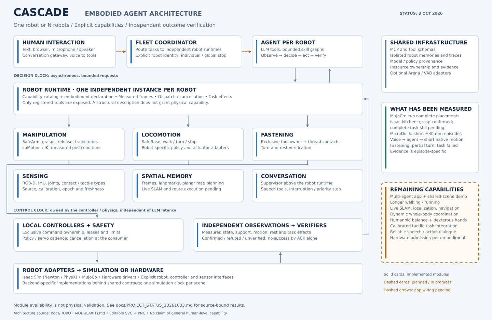

# CASCADE 🦾 — Cascaded Agentic Skill Control with Adaptive Dispatch and Execution

CASCADE is a **modular framework for agentic robotics**. Explicit robot
profiles compose manipulation, locomotion, fastening, passive sensing and
spatial tools; optional conversation translates speech into those same bounded
tools. Drivers, cameras, compute and LLM providers are replaceable. Each robot
exposes only its implemented capabilities, with its own controller, limits and
independent outcome checks. Supporting a new body requires a matching adapter
and validation; a structural description alone does not make it controllable.

The arm stack retains the cascade: routine commands resolve through reflex or
learned-habit tiers before calling an LLM. Robot policy and physics clocks run
independently of model latency. See the [architecture diagram and capability
boundaries](docs/ROBOT_MODULARITY.md) for the implemented modules and proposed
multi-robot layer.

[Current capability and acceptance status](docs/PROJECT_STATUS_20261003.md)
separates implemented features, source-bound measurements and pending validation.
Local results do not establish complete kitchen or Spark runtime acceptance,
hardware fastening or calibrated preload. See the
[manipulation and assembly evidence](docs/MANIPULATION_ASSEMBLY_20261002.md) and
[local validation history](docs/LOCAL_RTX_VALIDATION.md) for retained successes
and failures, and [Architecture](docs/ARCHITECTURE.md) for the runtime design.

The optional [MicroDuck mobile runtime](docs/MICRODUCK.md) adds bounded base
commands, a native Newton policy loop, independent support verification and
MCP traces. It remains a candidate pending physical locomotion admission;
the mobile profile does not expose manipulation tools.

The opt-in [composed robot runtime](docs/ROBOT_MODULARITY.md) provides separate
manipulation, locomotion, fastening, sensor and spatial domains, controller
ownership checks, bounded skill graphs and optional Arena/VAB validation adapters. Start with
`--robot mixed_mock` for the synthetic integration example;
`--robot mobile_manipulator_mock` exercises the opt-in whole-body contract (a
mock arm mounted on a mock base, per-domain stop reset). Physical whole-body
coordination and additional humanoid drivers still require embodiment-specific
validation.

The [conversation gateway](docs/CONVERSATION.md) implements browser audio,
Realtime provider integration and an explicit robot-tool allowlist with priority
stop. Its recorded speech and motion episodes have separate source and outcome
bounds; general dialogue reliability and a public hosted service remain pending.

The read-only [spatial domain](docs/SPATIAL_PROVIDERS.md) adds capture-time
transforms, landmark memory and synthetic planar route proposals. The separate
[observed RGB-D path](docs/RGBD_SPATIAL_OBSERVATIONS.md) retains calibrated
surface annotations. An optional cuVSLAM provider estimates local RGB-D poses in
an isolated process; native localization validation and navigation execution
remain pending. Surface annotations do not constitute a collision map.
Coordinating twelve robots in one scene is an implementation target, not an
existing twelve-robot acceptance result.

<p align="center">
  <a href="https://github.com/johnnynunez/cascade/actions/workflows/ci.yml"></a>
  <a href="pyproject.toml"></a>
  <a href="LICENSE"></a>
  <a href="docs/ARCHITECTURE.md"></a>
</p>

The common skill API selects an arm through its driver and a
[profile](configs/arms/); its joint count,
home poses, tool-frame convention, reach and gripper travel come from that
profile, and the skills, safety harness and grasp planner read them. Backend
capabilities remain explicit: Isaac motion requires a physical clock, and its
observed-finger and held-object guards require bound capture metadata. The
[NV carry guard](docs/NVBLOX_CARRY_ATTACHMENT.md) stops transport when its
retained attachment is lost or unavailable; it does not cure mechanical slip. Model
device selection uses [`resolve_device()`](src/cascade/device.py), which probes the
host; required CUDA or learned-inference profiles fail when that capability
is unavailable rather than silently accepting a fallback.

The reference deployment drives a Seeed reBot DevArm B601 (RobStride build)
from an NVIDIA DGX Spark — that is *a* configuration this framework runs on,
not what it is. It is the agentic evolution of the
[reBot-DevArm-Grasp](https://github.com/Seeed-Projects/reBot-DevArm-Grasp)
baseline, designed after NVIDIA GEAR's
[ASPIRE](https://research.nvidia.com/labs/gear/aspire/) (curated skill API +
multimodal traces + skill library) and
[Agentic-VLA](https://arxiv.org/abs/2605.22896) (task decomposition + VLM
advisor + experience memory), in the same
service-oriented/composable spirit as [RPent](https://github.com/RLinf/RPent).

[PAAI staff guide](docs/BOOTH_GUIDE.md) · [DGX Spark setup](docs/DGX_SPARK_SETUP.md) · [Spark delivery](docs/SPARK_DELIVERY.md) · [Architecture](docs/ARCHITECTURE.md) · [Quickstart](docs/QUICKSTART.md) · [Physical rig runbook](docs/BOOTH_RUNBOOK.md) · [Roadmap](docs/ROADMAP.md) · [Agent guide](AGENTS.md)

The optional [OVRTX renderer](docs/OVRTX_RENDERER.md) can now supply the Isaac
bridge's live RGB-D and robot/prop masks from physics-owned snapshots. Rendering
runs in a separate SDK process; capture metadata binds pixels, joints, contacts
and body transforms to the same physical step.

The optional [cuMotion planner](docs/CUMOTION.md) now participates in ordinary
skills through the `isaac_cumotion` arm profile. SafeArm vets and streams its
native curves with the existing motion, contact and cancellation gates.
The [Factory fastening experiment](docs/FACTORY_THREAD_CONTACT.md) provides
physical thread and seating evidence using a mounted hex socket and a fixed
bolt fixture. The ordinary `turn_screw` skill still reports physical tightening
as unverified; its commanded wrist travel is not a thread measurement.

The [fixed LEAP hand runtime](docs/ARTICULATED_HAND.md) adds sixteen-joint
free finger motion with source-pinned MuJoCo models and observed retained-rest
verification. Loaded contact rejects this first recipe; dexterous grasping and
calibrated tactile sensing remain pending.

[](docs/ROBOT_MODULARITY.md)

[Download PNG](docs/assets/architecture.png). Dashed boxes mark work still in progress.

Motion skills report **confirmed, refuted or unverified postconditions**
from sim physics truth, perception or jaw width. A refuted claim downgrades
the skill's own `ok`. The verdict travels with the result into the
trace, into the planner's visual memory and to the off-line progress judge.
The [architecture doc](docs/ARCHITECTURE.md) details the arm runtime; the
[modular guide](docs/ROBOT_MODULARITY.md) maps the other domains and their limits.

## PAAI, Physical Agentic AI

PAAI is the initial **Build a Claw** event demo. Attendees use OpenClaw chat
to inspect a simulated kitchen and ask the arm to move prepared objects.
CASCADE connects those requests to robot skills in NVIDIA Isaac Sim 6.1.
Three camera views show the action; simulator physics readback helps check
the result.

The authenticated attendee page shows cameras. A separate `/staff/` page
explains the prompts, result checks and recovery steps. See the
[booth guide](docs/BOOTH_GUIDE.md) for the staff walkthrough.

## Roadmap

With the Sparks disconnected, source-bound validation continues on the local
dual-RTX Pro PC. Native proof and nvblox normal-campaign failures remain to be
resolved before five-object acceptance and the same-version restart. See [current status](docs/PROJECT_STATUS_20261003.md).

**Newton parity.** Installed Spark defaults to CUDA PhysX. Newton remains
explicit, with separate engine/asset validation.

**Cosmos 3 Edge.** Adoption follows when native tool calling through OpenClaw
passes attendee evaluation. Until then, Qwen remains the event path.

Optional **ovrtx** RGBD now runs on x86 and ARM with separate rendering evidence;
it is not included in the historical `477c88f` runtime baseline. Automatic
physics producers remain future work. [Jev/Kev](docs/JEV_DECISIONS.md) remains
offline decision research.

## Brev deployment

The kitchen demo runs on Brev.dev with an AWS `g7e.2xlarge`: one RTX PRO 6000
Blackwell Server Edition with 96 GB VRAM, eight vCPUs, 62 GiB RAM and a 1.7 TB
NVMe volume. It uses Isaac Sim 6.1 / CUDA PhysX and Qwen3.8-27B **Q8_0**, with
the vision projector and model fully on the GPU.

Select a matching instance with `brev create <name> --type g7e.2xlarge --flex-ports`.
GPU/VRAM and `--min-disk` search filters help check capacity; verify the actual
NVMe mount after boot. Brev SSH uses a managed relay that can close while the
VM remains healthy. Tailscale to the VM's own SSH server was the working
fallback; check both devices' key expiry. Put heavy data under
`/opt/dlami/nvme/paai-demo`. If bridge containers fail because `docker0` is
missing, `sudo systemctl restart docker` repairs that specific first-boot fault.

Prepare the external source/asset bundle and site profile using
[the deployment instructions](docs/BREV.md). For the first installation:

```bash
./deploy/brev/deploy.sh preflight --profile /srv/cascade/site.json
./deploy/brev/deploy.sh install --profile /srv/cascade/site.json
```

`install` prepares and starts the demo; `start` resumes a prepared installation.
The same entry point supports `status`, `restart` and `stop`. The demo and
public ngrok visitor use supervision across disconnects. The public page
shows authenticated cameras while OpenClaw administration and raw Isaac
control ports remain private. See [the deployment instructions](docs/BREV.md)
for preparation inputs, observed behavior and remaining certification limits.

## Chrome extension

The optional [camera companion](extensions/chrome) puts Kitchen, Worktop and
Side views beside the real OpenClaw chat. In `chrome://extensions`, enable
**Developer mode**, choose **Load unpacked**, and select `extensions/chrome`.
Open the private booth guide, click **Open OpenClaw**, and wait for **Ready**.
In the connected chat tab, click the extension, select **Connect cameras**,
allow the demo host, then choose **Side panel** or **Show in chat**.

The public camera page needs no extension. Real Chrome on Brev passed the
native side panel, host permission and three advancing camera feeds. The guide
also opened authenticated OpenClaw beside the native panel on Brev. The extension
does not handle gateway authentication or public visitor credentials.
See [installation details and tested limitations](docs/CHROME_EXTENSION.md).

A Firefox build of the same companion lives in
[`extensions/firefox`](extensions/firefox). Build it with
`python3 extensions/firefox/package.py`, then load the `.xpi` from
`about:debugging` as a temporary add-on. See the
[Firefox instructions](docs/FIREFOX_EXTENSION.md).

## What it runs on

**Robots.** Select a [composed profile](configs/robots/) for domain capabilities
and an optional [embodiment](docs/EMBODIMENT.md) for structure and sensor bindings.
An arm driver subclasses `ArmBase` (six methods) and uses a
YAML profile in `configs/arms/` — see
[the arm interface](src/cascade/control/arm_base.py). Register the backend in
explicit construction and validate its declared capabilities.

| profile | robot | DoF | transport | needs |
|---|---|---|---|---|
| `so101` | [The Robot Studio SO-101](https://github.com/TheRobotStudio/SO-ARM100) | 5 | Feetech STS3215 over USB serial | `pip install -e '.[arm-feetech]'` — **driver untested on hardware**, see [safety notes](#safety-notes-for-a-live-rig) |
| `so101_mujoco` | same, in MuJoCo physics (C engine) | 5 | — | `.[sim]` + `scripts/fetch_robot_assets.py so101` |
| `so101_mjwarp` | same, in [MuJoCo Warp](https://github.com/google-deepmind/mujoco_warp) (GPU runtime, CPU-capable) | 5 | — | `.[sim-warp]` + `scripts/fetch_robot_assets.py so101` |
| `so101_mock` | same, kinematic only | 5 | — | nothing |
| `so101_ros2` | same, over ROS2 (`ros2_control` + JTC bringup) | 5 | ROS2 topics | a sourced ROS2 env (`rclpy`) — **untested on hardware** |
| `so101_left` / `so101_right` | two SO-101s sharing a table | 5 each | — | nothing; see [multi-arm](#multi-arm) |
| `piper` | [AgileX PiPER](https://github.com/agilexrobotics/piper_ros) | 6 | ROS2 topics | a sourced ROS2 env — **untested on hardware** |
| `piper_mujoco` / `piper_mock` | same, MuJoCo physics / kinematic | 6 | — | `.[sim]` + `fetch_robot_assets.py piper` / nothing |
| `h1` | [Unitree H1](https://github.com/unitreerobotics/unitree_ros) right arm (gen 1: bare forearm, no hand) | 4 | ROS2 topics | a sourced ROS2 env — **untested on hardware** |
| `h1_2` | [Unitree H1-2](https://github.com/unitreerobotics/unitree_ros) right arm (7-DoF wrist, flange) | 7 | ROS2 topics | a sourced ROS2 env — **untested on hardware** |
| `h1_mock` / `h1_2_mock` | same, kinematic only | 4 / 7 | — | nothing |
| `h2_velocity_physx` (base profile) | [Unitree H2](https://github.com/unitreerobotics/unitree_ros) whole body: NVIDIA's public H2 USD + `Velocity-H2-History-v0` walking policy (14 of 31 joints), PhysX first — **candidate, no admission gate passed**; [design](docs/HUMANOID_H2.md) | 31 (14 commanded) | Isaac Sim 6.2 bridge (to build) | `scripts/h2_assets.py` (SHA-256 pinned policy) |
| `rebot_rs` | Seeed reBot DevArm B601 (RobStride) | 6 | RobStride over SocketCAN | `.[arm]`, `can0` up |
| `rebot_rs_mb` | same, via MotorBridge | 6 | MotorBridge | `.[arm]` |
| `isaac` | reBot in Isaac Sim | 6 | ZMQ bridge | Isaac Sim + NVIDIA GPU |
| `libero_panda` | Franka Panda in LIBERO | 7 | benchmark harness | LIBERO |
| `mock` | kinematic stand-in | 6 | — | nothing |
| `ros2_generic` | **template**: ANY robot a `ros2_control` bringup exposes | — | ROS2 topics | copy the file, fill in your robot's numbers, drop the `template: true` flag |

**Any ROS2 robot without writing Python.** `type: ros2`
([`control/ros2_arm.py`](src/cascade/control/ros2_arm.py)) speaks the two
interfaces every `ros2_control` deployment already has — `sensor_msgs/JointState`
in, `trajectory_msgs/JointTrajectory` (or `Float64MultiArray` for a forward
position controller) out, joints addressed **by name** so driver-defined
`JointState` order can never shift the mapping. Adding a robot = copying
[`configs/arms/ros2_generic.yaml`](configs/arms/ros2_generic.yaml) and filling
in its URDF, joint names, keyframes, gripper travel and workspace: the whole
stack above (safety harness, IK, grasping, skills, MCP tools) drives it
unchanged. The humanoid profiles drive the ARM of a standing H1/H1-2 for
tabletop skills — locomotion stays with Unitree's own controller, and a
handless arm declares `max_width_m: 0` so grasps are *refused honestly*
instead of mimed. See [`docs/ROS2_BACKEND_BRIEF.md`](docs/ROS2_BACKEND_BRIEF.md)
for the design rationale (QoS, streaming trade, stop semantics).

> **Scope, honestly:** ROS2 and the humanoid profiles drive **arms**. There
> is no mobile base, navigation, mapping or robot self-localization in
> cascade yet -- "localization" here means finding *objects*. The mobility
> layer (a `MobileBase` twin of `ArmBase`, Vesta's pixel-goal / turn / stop
> navigation verbs as skills with the visual memory harness spanning the
> walk, Nav2 or a Warp costmap planner behind one interface, Unitree G1/H1
> in Isaac Sim first) is designed in
> [`docs/MOBILITY_AND_NAVIGATION_DESIGN.md`](docs/MOBILITY_AND_NAVIGATION_DESIGN.md)
> and is the next structural addition on the [roadmap](docs/ROADMAP.md).

<a id="multi-arm"></a>
**Multi-arm.** `--arms a,b` builds an `ArmRig` (first = manipulation arm, the
same shape as the camera rig); every motion skill then takes an optional
`arm="<name>"` and `list_arms` reports the names. Each arm gets its **own**
`SafetyHarness`, because every limit in `SafetyLimits` belongs to a particular
robot on a particular table — merging the profiles would let whichever loaded
last define the envelope for both.

> **Inter-arm collision** is gated geometrically, not with meshes: an arm
> profile may declare `base_pose` (where the robot is bolted, in a shared
> TABLE frame — [`so101_left.yaml`](configs/arms/so101_left.yaml) documents the
> convention), and with it set on both arms each harness gates each sampled
> motion edge on the measured segment-to-segment distance between link
> capsules (`safety.link_radii_m`, measured per link on the SO-101 collision
> geometry) with `safety.neighbor_clearance_m` as the margin between link
> surfaces — measured against MuJoCo to be a lower bound on the mesh distance
> ([`tests/test_multi_arm_physics.py`](tests/test_multi_arm_physics.py)); the
> same pair runs on physics as `--arms so101_left_mujoco,so101_right_mujoco`
> (two prefixed copies of the robot in one generated world). Two
> caveats, both in that profile's header: an
> unreadable neighbour (a standby LazyArm) degrades to SKIP, not to block, and
> `base_pose` is a **measurement** — a wrong one makes the distance
> confidently wrong. Measure your own table before running two real arms.

**Compute.** Configs say `device: auto`; the host is probed at startup
(CUDA/ROCm → Apple MPS → CPU) and an explicit device the machine does not
have degrades with a warning rather than killing the run. Override
everything at once with `CASCADE_DEVICE=cpu`.

| host | perception | sim | notes |
|---|---|---|---|
| NVIDIA DGX Spark / DGX Station | CUDA | Isaac Sim or MuJoCo | the reference rig |
| Jetson Orin / Thor (aarch64) | CUDA | MuJoCo | CI covers linux-aarch64 |
| RTX workstation / generic CUDA server | CUDA | Isaac Sim or MuJoCo | |
| AMD ROCm | `torch.cuda` API, reported as `cuda:0` | MuJoCo | |
| Apple Silicon laptop | MPS | MuJoCo | CI covers macOS arm64 |
| CPU-only box | CPU | MuJoCo | slow but complete; nothing is GPU-gated |

The mock and MuJoCo stacks import no accelerator library at all, so
`--arm so101_mock` works on any of the above with base deps + `.[kinematics]`
(CI's `minimal-install` job enforces that).

**Two MuJoCo runtimes, one MJCF.** `so101_mujoco` runs the MuJoCo **C engine**
(`engine: mjc`) — the fast default everywhere: ~200k steps/s for one arm on an
Apple laptop, no accelerator. `so101_mjwarp` runs the same model on **MuJoCo
Warp** (`engine: warp`), the GPU runtime Google DeepMind + NVIDIA maintain under
the [Newton](https://github.com/newton-physics/newton) project, so the identical
control code exercises the path the DGX/Jetson accelerate. MJWarp is a *batched*
engine — its throughput is in simulating many worlds on a GPU — so for a single
arm on a machine with no CUDA (e.g. this Mac, where Warp falls back to CPU) it is
~650× slower than the C engine but still runs, which is what keeps the GPU path
developable on a laptop. Pick `so101_mujoco` to run a demo; pick `so101_mjwarp`
to work on the MJWarp path itself. `device: auto` resolves to CUDA when present,
CPU otherwise — the same profile runs on both.

## Install

Start with the [DGX Spark setup guide](docs/DGX_SPARK_SETUP.md) for host
checks, installation, startup and recovery.

The Spark installer prepares **Isaac Sim 6.1, real GraspGen-X CUDA inference,
Qwen Q4 with vision, OpenClaw and the kitchen assets**. The current source downloads the pinned
Cocina Asier room, verifies its asset hashes, and authors the original orange
and fruit platter. Model downloads remain automatic. The
[Spark setup guide](docs/DGX_SPARK_SETUP.md#2-install) pins the room and
implementation revision. After preparing the selected checkout, start with:

```bash
python3 scripts/desktop.py launch --repo "$PWD"
```

READY requires two native OpenClaw orders: green cube to green square,
then orange to open box, with a verified reset after each. Live simulation
state and advancing cameras verify both cases. Logs and screenshots remain
under `runs/.install/` and `runs/.launch/profile-cascade-demo/`.

The historical September source `9cf5402`
passed a fresh-destination installation and its first desktop READY proof on GB10:
**12 min 21 s** to install with reused download caches and **12 min 12 s**
for startup and both placement/reset checks. Real Chromium with the shipped
extension showed three advancing cameras and connected chat on an Xvfb display. These timings and successes do not
certify the current MAIN pin; see [current acceptance](docs/PROJECT_STATUS_20261003.md).
GNOME app-grid interaction and the visible Isaac editor were not tested.
The same installed stack then passed **5/5 kitchen objects through native
visitor chat**, with independent physical placement checks and resets.
A full stop and second launch reached READY again in **9 min 10 s**, with
the open browser recovering connected chat and all three cameras.
See the [receipt](benchmark/results/spark_clean_delivery_20260930.json)
and [UI screenshot](benchmark/results/images/spark_clean_three_cameras_20260930.png).

The presenter profile uses **PhysX on CUDA**, the three kitchen cameras and
learned GraspGen-X grasps. Occupancy/nvblox and JEv are separate experiments;
neither is required or enabled by this installation. Newton is an explicit
engine option, with separate validation. Use the
[presenter card](docs/PRESENTER_QUICKSTART.md) for the demo and recovery.
Scene reset keeps services running and does not repeat the startup tests.
Skipping startup proof reports `STARTED / UNVERIFIED`; it does not establish READY.

For development without Isaac or a local model:

```bash
git clone https://github.com/johnnynunez/cascade.git && cd cascade
uv venv && uv pip install -e '.[dev,kinematics]'
```

`kinematics` (Pinocchio) is not optional in practice — FK/IK back the safety
layer, so every run needs it. Everything else is opt-in, one extra per
capability, because none of them are wanted on all hosts:

| extra | brings | when |
|---|---|---|
| `kinematics` | `pin` (Pinocchio) | always |
| `perception` | `ultralytics` | real cameras / open-vocabulary detection |
| `llm` | `openai`, `anthropic` | any real brain over an API (also covers Nous Portal and local servers); the `codex_astra` profile needs no extra, only the Codex CLI |
| `sim` | `mujoco` | hardware-free physics on any host |
| `sim-warp` | `mujoco-warp`, `warp-lang` | the same MJCF on the MuJoCo Warp GPU runtime (`engine: warp`); CPU-capable, so it installs anywhere |
| `arm-feetech` | `pyserial` | SO-101 and other Feetech-servo arms |
| `arm` | `motorbridge` | RobStride over SocketCAN |
| `grasping` | `pyzmq`, `msgpack-numpy` | the GraspGen-X / HUG / nvblox **client** wire (`grasp.backend: graspgenx`, the default; `hug` is opt-in, see [docs/HUG.md](docs/HUG.md)). Model stacks stay in their own venvs and processes, so cascade never imports torch for them |
| `vla` | `websockets`, `msgpack` | the opt-in VLA policy **client** (`grasp.executor: vla`, openpi / LingBot websocket protocol; see [docs/VLA_EXECUTOR.md](docs/VLA_EXECUTOR.md)). The policy runs in its own environment on a GPU host |

**torch is deliberately not a dependency.** The right build is per-platform
(CUDA, ROCm, Jetson wheels, MPS, CPU) and pinning one here would fight the
host; install it however your platform prefers, then
[`cascade/device.py`](src/cascade/device.py) finds it.

Robot assets: URDF *text* is vendored (that is all kinematics and the safety
layer read), while meshes and MuJoCo MJCFs are fetched on demand from a
pinned upstream commit:

```bash
python scripts/fetch_robot_assets.py --list
python scripts/fetch_robot_assets.py so101      # ~17 MB, MJCF + meshes
python scripts/fetch_robot_assets.py piper h1   # PiPER + Unitree H1 (Menagerie, same pin)
```

Optional one-shot helpers, none of them required:

```bash
# Hermes agent host (this project's default) + register the robot with it
./scripts/install_hermes.sh --portal

# occupancy/collision-map backend deps (pyzmq, msgpack-numpy, scipy, Warp;
# nvblox_torch is added on NVIDIA GPUs where a wheel exists)
curl -fsSL https://raw.githubusercontent.com/johnnynunez/cascade/main/scripts/install_occupancy_backend.sh | bash

# Explicit CPU/laptop preparation; never installs Isaac or Cosmos:
bash scripts/install.sh --profile laptop --brain keep --prepare-only --dir "$PWD"
```

See the [installation notes](#setup-notes) below for pyrealsense2, YOLOE's
text encoder, and other rig-specific gotchas.

## One click

Use the installer above for a new Spark. `run.sh` launches an installed rig
or an explicit laptop development mode; its auto-detection is not the
Spark installation contract. Local MuJoCo/OpenAI tests and standalone
Newton CPU tests do not certify the Spark event flow.

```bash
git clone https://github.com/johnnynunez/cascade && cd cascade
./run.sh                 # Isaac Sim if installed (ISAACSIM_PATH or a standard
                         # install path), else MuJoCo on any laptop
python3 scripts/desktop.py launch --repo "$PWD"  # prepared Spark, full stack
./run.sh mujoco --brain keep  # Mac: keep an already authenticated OpenClaw brain
./run.sh check isaac     # preflight only -- lists what is missing, starts nothing
./run.sh down            # stop everything it started
./run.sh isaac --headless --no-open   # extra flags pass through to scripts/launch.sh
```

The Spark installer creates a private app environment, managed Isaac runtime,
OpenClaw CLI and model runtime. It downloads Qwen Q4, its vision projector,
robot assets and kitchen files. See [Spark delivery](docs/SPARK_DELIVERY.md)
for the pinned identities and isolation rules.

`./run.sh` is a thin wrapper: `scripts/launch.sh --setup --sim <mode>` when
setup is needed, `scripts/launch.sh --sim <mode>` afterwards. Before it
prints READY it proves the stack, not just the wiring: it builds the robot
runtime once with the exact environment the MCP server gets, lists the
tools through OpenClaw, gets a trivial answer from the brain, and in sim
modes runs physical orders and reset in one persistent chat session. Spark
requires green cube to green square and orange to open box; generic Isaac
uses the pink cube, and MuJoCo uses the red cube. A `proof.json` receipt must bind the
expected model/session/MCP runtime to the physical result and reset of the
manipulated prop. `--no-robot-turn` is **STARTED / UNVERIFIED**, never READY.
The banner names the components actually selected (sim bridge, occupancy
backend, grasp planner, tool count, chat URL, run log), so a shared machine
never runs a demo that is silently missing a piece. Every tool call the
chat host makes is logged to `runs/mcp_<pid>/server.log` -- OpenClaw only
reports a failure count.

The pre-delivery laptop launcher was exercised from a fresh export on
macOS: installed extras/assets, exposed the robot tools and completed a
physics-confirmed pick and reset. That historical result is not a Spark
certificate or evidence for a later edited launcher. Current evidence and
remaining target checks belong in [SPARK_DELIVERY](docs/SPARK_DELIVERY.md).
`./run.sh check <mode>` is read-only (it never installs or fetches) and
`./run.sh down` also reaps the per-session MCP servers the chat host leaves
behind.

The memory demo (two props, the planner must remember what it already
moved):

```bash
./run.sh mujoco --cameras mujoco_scene_two
# then, in the chat:
#   "Put both cubes in the drop zone, one at a time. Before each action call
#    task_memory to see what you already did, and when both are done tell me
#    how many cubes you moved and how you know."
```

Measured through OpenClaw in one gateway session (what the dashboard does):
2 `pick_and_place` calls, both `postcondition: confirmed` on the physics
channel, 0 tool failures, ~100 s, and the brain's answer cites the memory
frames' verdicts, not its intent. Asked afterwards "how many did you move
and how do you know?", it answers from `task_memory`.

Between visitors say **"reset the scene"** (or "start over"): arm home, sim
props back on their spawn pose, world model and task
memory cleared. CASCADE's own CLI has an offline reset reflex; in OpenClaw,
the host model still chooses the tool. The launcher invokes reset after its
proof turn so the first visitor starts from the spawn layout.

## Quick start

```bash
# offline wiring check: mock camera + mock arm + scripted LLM, no hardware,
# no GPU. Routine commands run on the REFLEX fast path (no LLM); a livestream
# dashboard with N camera streams + robot narration prints its URL.
python -m cascade.apps.demo --task "pick and place pink object"

# the same cascade on a 5-DoF SO-101 instead of the 6-DoF reference arm.
# `mock_small` is the matching synthetic scene -- the default one holds a 7 cm
# box, which this arm's 55 mm jaw correctly refuses.
python -m cascade.apps.demo --arm so101_mock --camera mock_small \
    --task "pick and place the red object"

# ...and in real physics, still no robot and no GPU (pip install -e '.[sim]').
# `mujoco_scene` is a camera RENDERED from the same MuJoCo world the arm
# steps (perception sees the physics prop, not a painted one), and the
# postcondition checker reads the prop's true pose from that world:
# `postcondition: confirmed (channel: physics)` instead of `unverified`.
python scripts/fetch_robot_assets.py so101
python -m cascade.apps.demo --arm so101_mujoco --camera mujoco_scene --interactive

# ...plus a WRIST camera rendered from the gripper body (moves with the arm,
# looks at the jaws). The runtime records its frames as wrist keyframes next
# to the front ones for every motion skill, and the outcome judge
# (scripts/judge_run.py) fills the GRM prompt's two wrist slots with them
# instead of repeating the front view. Evidence only: no hand-eye
# calibration is claimed and the view fuses no beliefs.
python -m cascade.apps.demo --arm so101_mujoco --cameras mujoco_scene,mujoco_wrist --interactive

# ONE CLICK: simulator (Isaac Sim if installed, else MuJoCo) + OpenClaw 2.0
# chat with the robot tools registered, probed, and a trivial brain turn
# proven before it prints the chat URL. Real hardware = OpenClaw only.
./scripts/launch.sh                                     # --sim auto
./scripts/launch.sh --sim isaac                         # Isaac bridge + editor window
./scripts/launch.sh --sim none --arm rebot_rs --cameras l515   # real arm: no sim
./scripts/launch.sh --dry-run                           # print the plan, touch nothing
./scripts/launch.sh --down                              # stop what it started

# two arms on one table: skills take arm="left"/"right", list_arms names them
python -m cascade.apps.demo --arms so101_left,so101_right --camera mock_small --interactive

# a different robot entirely, same cascade: AgileX PiPER, no hardware
python -m cascade.apps.demo --arm piper_mock --camera mock_small \
    --task "pick and place the red object"

# any ROS2 robot (needs a sourced ROS2 env + a ros2_control bringup):
python -m cascade.apps.demo --arm so101_ros2      # or piper / h1 / h1_2

# tests (unit/integration; live-hardware tests deselected by default)
python -m pytest tests/ -q
python -m pytest tests/ -m hardware -q     # needs a RealSense camera (profile: l515) + can0 up (read-only)

# learned grasps (the DEFAULT backend) need two things: the wire deps and a
# server. Without the deps the client cannot even be built, so every grasp
# silently falls back to the analytic OBB planner:
uv pip install -e '.[grasping]'            # pyzmq + msgpack-numpy

# ...then a server. The real one needs an NVIDIA GPU, its own venv and
# downloaded checkpoints:
scripts/serve_graspgenx.sh

# ...or, on a machine without CUDA (laptop, booth box, CI), a protocol-
# compatible stub that plans analytically. Same wire format, so the whole
# GraspGen-X client path runs anywhere -- but it is NOT the learned model and
# says nothing about grasp quality:
python scripts/serve_graspgenx_stub.py

# occupancy / distance-field map (`occupancy.enabled: true`, the default).
# ONE bridge, three backends: `nvblox` (real nvblox_torch TSDF+ESDF, P0 on
# NVIDIA GPUs), `warp` (hardware-agnostic TSDF with carving + exact EDT in
# Warp kernels -- CPU on this Mac, CUDA on Jetson/x86), `voxel` (numpy). The
# demo PROBES it at startup and prints which backend answered; a bridge nobody
# started shows as "occupancy=none (...)" in the banner and the run summary.
# Generic scripts/launch.sh profiles can start it; the Spark presenter profile
# explicitly disables occupancy. See docs/NVBLOX.md for camera fusion/status.
# By hand:
./scripts/serve_occupancy.sh            # auto: nvblox > warp > voxel

# real SO-101 over USB serial. CHECK THE JOINT SIGNS FIRST -- read-only scan,
# then a single-joint jog that tells you which wire_signs entry to flip:
python scripts/diag_so101.py --port /dev/ttyACM0
python scripts/diag_so101.py --port /dev/ttyACM0 --jog 1
python -m cascade.apps.demo --arm so101 --cameras d455f --interactive

# real rig, N cameras (first = manipulation camera), cloud LLM fallback
sudo ip link set can0 up type can bitrate 1000000
python -m cascade.apps.demo --interactive \
    --cameras d455f,uvc4k --arm rebot_rs --llm anthropic

# two D455F (serials pinned in the profiles: with identical hardware an
# unpinned profile binds to whichever unit enumerates first). The live
# window shows one row per camera, RGB beside its depth colormap.
python -m cascade.apps.demo --interactive \
    --cameras d455f_wrist,d455f_scene --arm rebot_rs --llm anthropic

# Isaac Sim instead of hardware (same demo, simulated reBot):
#   1. inside Isaac Sim's python:  python.sh scripts/isaac_bridge.py --usd <rebot.usd>
#   2. then:
python -m cascade.apps.demo --cameras isaac --arm isaac --interactive

# Hermes / Nous Portal as the brain (the default when NOUS_API_KEY is set)
export NOUS_API_KEY=...                 # or: hermes setup --portal
python -m cascade.apps.demo --arm so101_mock --camera mock_small \
    --task "tidy the table"             # --llm auto picks hermes

# real rig, a locally served Qwen3.6 (start the server first)
scripts/serve_qwen_llamacpp.sh          # or serve_qwen_vllm.sh (MTP spec decoding)
python -m cascade.apps.demo --task "..." --cameras d455f --arm rebot_rs --llm local_qwen

# talk to it through a chat host instead of the CLI loop
./scripts/launch.sh                     # OpenClaw 2.0: sim (if any) + skills + probe + web chat
./scripts/hermes_demo.sh                # Hermes: register + test + chat
./scripts/openclaw_demo.sh              # OpenClaw, local-brain variant (Cosmos3-Edge / Qwen servers)
```

`--llm` defaults to `auto`: Hermes/Nous Portal, then Anthropic, then OpenAI,
whichever has its key exported, else the offline mock. So a fresh clone runs
with no credentials and a configured machine gets a real brain from the same
command. Name a profile explicitly (`--llm mock`) to pin it, or set
`CASCADE_LLM` to override every invocation.

## How it fits together

- **[Perception](src/cascade/perception/)** is camera-agnostic: every
  backend yields `Frame` objects with float32 *metric* depth aligned to
  color. Cameras without depth fall through a strategy chain (sensor →
  optional mono-depth plugin → table-plane ray-casting), so an RGB-only
  webcam still grasps tabletop objects.
- **[Safety](src/cascade/safety/)** is a fail-closed `SafetyHarness` that
  vets every streamed waypoint (joint limits, velocity caps, workspace AABB,
  table-plane clearance, keep-out zones, perception watchdog, e-stop latch,
  and a measured-clearance gate against the [occupancy map](src/cascade/perception/occupancy.py)
  -- nvblox on NVIDIA GPUs, a Warp TSDF/EDT anywhere else, with the robot's
  own body masked out of the depth before integration),
  plus an ASPIRE-style multimodal trace (`trace.jsonl` + before/after
  keyframes) on every skill call.
- **[Grasping](src/cascade/grasping/)** uses learned 6-DoF grasps from a
  GraspGen-X ZMQ server. The Spark presenter profile starts the real CUDA
  server, checks diffusion inference and requires learned candidates; an
  unavailable model produces an error. Optional profiles report analytic
  OBB fallback and retry learned inference after a five-second cooldown.
  An opt-in second backend, [HUG](docs/HUG.md) (`grasp.backend: hug`,
  profile `isaac_kitchen_hug`), proposes human-hand grasps from the RGB-D
  frame. CASCADE maps them to parallel-jaw pinches and scores them by its
  own geometry, because HUG has no score. It follows the same
  required/optional contract.
  A second opt-in analytic backend, `grasp.backend: camera_frame`, ports
  Seeed's WRC / rebot_grasp mask planner (approach along the camera's line
  of sight; see [docs/WRC_PERCEPTION_PORT.md](docs/WRC_PERCEPTION_PORT.md)).
  Opt-in too, a different EXECUTOR: `grasp.executor: vla` serves label
  grasps from a language-conditioned policy over the openpi / LingBot-VLA
  websocket protocol (`vla` extra). Every action chunk is admitted by the
  safety harness before it moves and approved sample by sample while it
  moves; the same verifier judges the grasp; no policy server means no
  grasp, never a silent analytic fallback
  ([docs/VLA_EXECUTOR.md](docs/VLA_EXECUTOR.md); measured against its
  protocol stub only, no real weights yet).
  Candidates are re-ranked by a persisted grasp-outcome
  memory, then vetted against IK *and* the safety-harness geometry.
  The model is conditioned on the gripper as a **swept volume**, so an arm
  whose gripper differs from `demo.yaml`'s reBot default (90 mm jaw) must
  override `grasp.graspgenx.sweep` in its own profile — see
  [`configs/arms/so101.yaml`](configs/arms/so101.yaml) (55 mm). Inheriting the
  wrong sweep returns grasps too wide to close, and it looks like poor model
  quality rather than a config error.
- **[Control](src/cascade/control/)** is self-contained Pinocchio FK/IK on
  whichever URDF the arm profile names, damped-least-squares with random
  restarts, and min-jerk joint streaming with feedback-based settling —
  never `sleep(duration)` — over RobStride CAN, a Feetech serial bus,
  MuJoCo or Isaac. Joint count, limits and tool convention are the profile's,
  not the code's, so a 5-, 6- or 7-DoF arm needs no new control logic.
- **[Memory](src/cascade/memory/)** is a 10–15 s episodic window plus an
  object-permanence belief store, so "the mug you saw 10 seconds ago" is
  still actionable after occlusion -- and a task-scale **visual memory
  harness** (Vesta, arXiv:2606.20905 §2.4): the planner sees up to K
  captioned frames of what it already did (initial state, the view after
  each action, the physics verdict on it) next to the current view, on
  every LLM turn and, for a chat host, through the `task_memory` tool.
  Vesta's ablation is the reason it is images *and* text: a text-only
  history keeps "continuing the current task". Try it on the two-prop scene
  (`--camera mujoco_scene_two`): "put both cubes in the drop zone, then
  tell me how many are there" -- after the first pick the current view
  alone cannot say whether one cube moved or none.
- The **[agent](src/cascade/agent/)** dispatches through three tiers —
  reflex (regex, no LLM) → experience (learned habits) → LLM — so routine
  commands never wait on the model, with a VLM advisor kicking in on failure.
  An opt-in **[programs tier](docs/PROGRAMS_TIER.md)** (`agent.programs`, off
  by default) sits between experience and the LLM loop: one authoring turn
  writes a bounded list of registered tool calls (labels as parameters,
  positions only as perception queries re-grounded before motion), run step by
  step through the same `execute()`; the first unverified step hands the task
  to the LLM tier, and a program is reused only after it was verified in two
  distinct tasks. MCP chat hosts get the same tier as `list_programs` /
  `run_program` when it is on, and with a `memory.embedder` programs are
  ranked by text embedding instead of keyword overlap. Measured on the mock
  stack with scripted brains only.
- **[Retry evidence](docs/DREAM_RSI_ADAPTATION.md)** gates new ASPIRE library
  notes: a later success must match the failed action's goal, resolved arm
  and held-object context, with a measured, confirmed postcondition and no
  intervening reset or task end. A note reaches the agent only after it
  recurs in two distinct tasks (upstream ASPIRE's promotion rule); a single
  task's repair stays a stored candidate. This filters unsupported learning; it does
  not change robot control or establish that a retry caused an improvement.

cascade works with hosted and local [LLM backends](#llm-backends) and is
exposed as an [MCP server](#run-it-under-any-mcp-agent-platform) any
MCP-capable host can drive.

## LLM backends

| profile | backend | notes |
|---|---|---|
| `codex_astra` | **GPT-6-Astra through the Codex CLI** (`codex exec` subprocess on a ChatGPT/Codex subscription) | no `OPENAI_API_KEY` and no HTTP from cascade: one `codex exec --ignore-user-config --ephemeral -s read-only --output-schema …` per step, prompt on stdin, current-view JPEGs via `-i`, strict-JSON final message → tool call. **`--llm auto` picks it first when Codex is logged in** (`codex login`); pin another with `--llm hermes` / `CASCADE_LLM=…`. Measured 2026-10-07 (codex-cli 0.160.1, medium effort): 7–9 s per step, text or with an image. `--ignore-user-config` keeps your own Codex MCP servers out of the brain's session; vision + tools |
| `hermes` | [Hermes / Nous Portal](https://hermes-agent.nousresearch.com/) (cloud gateway, 300+ models) | `NOUS_API_KEY`; OpenAI-compatible. **Default** via `--llm auto` when Codex is not logged in. Text-only |
| `anthropic` | Claude (cloud) | `ANTHROPIC_API_KEY`; vision + tools |
| `local_qwen` | local Qwen via llama.cpp / vLLM | OpenAI-compatible; MTP speculative decoding (~1.4–2.2× decode) measured on a DGX Spark |
| `local_cosmos` | NVIDIA Cosmos3-Edge Reasoner via vLLM | `scripts/serve_cosmos_vllm.sh` (:8082); 2.44B MoT, thinking on by default — see the script header for the day-one serving pitfalls it works around |
| `local_cosmos_sglang` | same Cosmos3-Edge Reasoner via SGLang instead of vLLM | `scripts/serve_cosmos_sglang.sh` (:8083); same `type: cosmos3` client (chat template is a property of the checkpoint, not the engine) — **UNVERIFIED**, first booth run against it is the verification pass |
| `openai` | any OpenAI-compatible cloud endpoint | `OPENAI_API_KEY` |
| `mock` | scripted | tests / wiring checks |

> **Keep the profile in sync with the server:** `configs/llm/local_qwen.yaml`
> pins `model: Qwen/Qwen3.6-27B`, matching what both serve scripts load.
> llama.cpp ignores the request's model name (vision comes via the mmproj
> projector its script downloads); vLLM rejects a mismatch — if you change
> the script's `MODEL`/`HF_REPO`, update the profile's `model:` (and
> `supports_vision:` if the server lacks a vision path) to match.

## Run it under any MCP agent platform

The whole skill runtime is also exposed as an **MCP stdio server**
(`cascade/apps/mcp_server.py`) — so instead of the built-in loop, any
MCP-capable agent platform can drive the arm. The agent gets the same 37
safety-gated skills (only the loop-internal `task_done` is excluded) plus
eight gateway extras — `camera_snapshot` (returns a live JPEG the agent can
*see*), `world_state`, `live_view_url`, `robot_knowledge`,
`verify_last_action`, `task_memory` (the visual memory harness, as images),
and `emergency_stop`/`reset_stop` — and, only with the opt-in
[programs tier](docs/PROGRAMS_TIER.md#mcp-chat-hosts) on, `list_programs` and
`run_program` — 47 tools total (45 with the programs tier off, its default;
re-derive with
`openclaw mcp probe cascade --json`; see [The 37 skills](#the-37-skills) below
for what each one does). That is the full catalog; what a given rig is
offered is this minus the tools its capability matrix (described below)
withholds (the default single-arm mock rig lists 44: `list_arms` needs two
arms). Safety harness, tracing and memory are identical —
only the brain swaps.

One registrar for every host — prints what each platform needs, `--write`
applies the file edits (preserving unrelated entries):

```bash
python scripts/setup_agents.py                     # show all hosts
python scripts/setup_agents.py --host codex --write
python scripts/setup_agents.py --camera d455f --arm rebot_rs --write
```

> **Host and brain are different roles**, and Hermes can be either. As a
> **host** (this section) Hermes runs the agent loop and cascade is a tool
> server: Hermes owns the conversation and cascade's reflex/experience tiers
> are bypassed — `mcp_server.py` pins `llm='mock'` so there is never a second
> brain arguing with the first. As a **brain** (`--llm hermes`) cascade runs
> its own loop and calls Portal only for reasoning, keeping the LLM-free tiers
> and the full `trace.jsonl`. Use the host when the robot should be one tool
> among many in a wider session; use the brain for a reproducible run.

| platform | mechanism | setup |
|---|---|---|
| **Hermes** *(default)* | `~/.hermes/config.yaml` `mcp_servers` | `./scripts/install_hermes.sh --portal` (installs the CLI, logs into Portal, registers this robot), then `./scripts/hermes_demo.sh` (register + test + chat) |
| **Claude Code** | project `.mcp.json` (ships in this repo; interpreter path is machine-specific, and it pins the Isaac camera/arm profiles) | if your checkout lives elsewhere, regenerate with the profiles you want: `setup_agents.py --host claude --camera isaac,isaac_side --arm isaac --write` (add `--python <interpreter>` if your venv is not at `<checkout-parent>/.demo`); user-scope: `--host claude` prints the `claude mcp add` one-liner |
| **Claude Desktop** | `claude_desktop_config.json` | paste the JSON block from `setup_agents.py --host claude` |
| **Codex CLI** | `$CODEX_HOME/config.toml` `[mcp_servers.cascade]` — or, with `--codex-profile robot`, the layer `$CODEX_HOME/robot.config.toml` that only `codex -p robot` loads, so the robot tool server is not in every coding session | `setup_agents.py --host codex --write` (base config) or `setup_agents.py --host codex --codex-profile robot --write` then `codex -p robot`; verify with `codex mcp list` (add `-p robot`). Codex as a **brain** instead is the `codex_astra` profile above |
| **OpenClaw** | native `mcp.servers` (2026+) or [mcporter](https://docs.openclaw.ai/cli/mcp) | `./scripts/launch.sh` (one click, verified on OpenClaw 2.0 = 2026.9.3: brings up the simulator if there is one, registers the server idempotently with `openclaw mcp set`, restarts the gateway, checks the robot tools are listed via `mcp probe --json` and that the brain answers a turn, then opens the web chat; `--brain auto` keeps whatever auth OpenClaw already has unless a local model server is answering) · `./scripts/bootstrap.sh` (fresh Spark: installs Isaac, Qwen Q4, OpenClaw and verified kitchen assets) · `./scripts/openclaw_demo.sh` (local-brain variant when the servers are already up); `setup_agents.py --host openclaw` prints the `openclaw mcp add` one-liner + JSON block. OpenClaw blocks the `PYTHONPATH` env — the package must be editable-installed in the venv (the scripts handle it). On macOS the server is launched under `mjpython` so the MuJoCo viewer can open (plain python refuses `launch_passive` there) |

The server pre-warms perception at startup (cameras + detector + world
model) while the ARM stays unpowered until the first motion command
(LazyArm) -- so "pick and place pink object" from the chat is a single
`pick_and_place` tool call that starts moving immediately. Stopping is
never queued behind a running motion: `emergency_stop` frames are handled
out-of-band by the stdin reader, Esc/cancellation in the host mid-motion
freezes the arm, first Ctrl+C on the server latches the e-stop (no
free-fall), and the dashboard STOP button works from any browser on the
LAN. For attendee-facing sessions, `CASCADE_HIDE_TOOLS=reset_stop` makes
clearing a stop staff-only. The catalog is also trimmed by a **capability
matrix** derived from the built rig (`apps/capabilities.py`): the depth chain
each camera really produces (sensor / mono / table-plane / none), which
sidecars answered their startup probe, how many arms the `ArmRig` has, and
whether the verifier and memory are attached (with the programs tier on, also
whether its library opened: `list_programs` needs it, `run_program` needs it
and the verifier). A tool whose precondition the
rig cannot meet is withheld and rejected if called — on an RGB-only camera
the 3D tools go, on a single-arm rig `list_arms` and the injected `arm`
parameter go — with the reason in `world_state.tools_withheld`, the dashboard
`/state` and the `[cascade] capabilities:` banner line. A fallback is
reported, never hidden: GraspGen-X down means the grasp tools run on the
analytic OBB planner and the matrix says so. Nothing is withheld before the
runtime is probed; a catalog listed before that is refreshed via
`notifications/tools/list_changed`. `CASCADE_HIDE_TOOLS` stays the explicit
operator override on top. Env knobs:
`CASCADE_CAMERAS` (comma list, first = manipulation camera), `CASCADE_CAMERA`
(single-camera fallback), `CASCADE_ARMS` (comma list, first = manipulation
arm, builds the `ArmRig`), `CASCADE_ARM` (single-arm fallback), `CASCADE_DETECTOR_MODEL`,
`CASCADE_DETECT_CLASSES`, `CASCADE_HIDE_TOOLS`, `CASCADE_VIEW` (cv2 camera window),
`CASCADE_MJ_VIEW` (MuJoCo physics window; the launcher sets it in sim modes),
`CASCADE_PREWARM`, `CASCADE_STREAM`, `CASCADE_STREAM_PORT`, `CASCADE_RUN_DIR`
(trace dir), `CASCADE_OCCUPANCY` (`0` skips the bridge probe), `DISPLAY`.
`CASCADE_BRIDGE_PORT`, `CASCADE_GRASPGENX_PORT` and `CASCADE_OCCUPANCY_PORT` move the
Isaac bridge and the two sidecars off 8611 / 5556 / 5557: the launcher starts them there
and `load_demo_config` applies the same values last, over every config layer and every
arm's resolved view (empty = unset; a malformed value is refused, naming the variable). The Isaac bridge
side has its own knobs (`CASCADE_USD`, `CASCADE_PHYSICS_DEVICE` — `cpu` is the
escape hatch for GPU-PhysX boot NaNs —, `CASCADE_BRIDGE_BIND`,
`CASCADE_BRIDGE_NO_TARGETS`, `CASCADE_COMPANION_EXTS`); see `scripts/isaac_bridge.py`.

## The 37 skills

One schema source (`TOOL_SPECS` in `src/cascade/skills/runtime.py`) feeds
every consumer — the built-in `AgentOrchestrator`, the OpenAI/Anthropic
LLM backends, and the MCP server — so this list is exactly what any brain,
built-in or external, can call. "moves arm" marks the 19 skills in
`_MOTION_SKILLS`, the only ones that pause `WorldWatcher` belief fusion while
they run (and the ones that record a memory frame + verdict afterwards).
Every result carries `outcome: ok | failed | stuck`; `stuck` (always
`ok: false`) means the robot exhausted what it can do on its own and its
`ask` names what the human should change in the scene or the instruction —
the orchestrator relays it verbatim and does not retry the step.

**Perception (no motion)**

| skill | what it does |
|---|---|
| `get_observation` | Fresh camera capture and tracking update. MCP returns the image, frame freshness, configured destinations and robot state; use `localize_object` for measured object positions |
| `list_objects` | Tracked detections and remembered entries with last-known position and age; labels are tentative and the list is not an exhaustive scene inventory |
| `describe_scene` | Fresh scene observation without motion. MCP returns an image and scene metadata for visual inspection; configured destinations do not establish visibility or occupancy |
| `analyze_scene` | Full perception report: per-camera detections, depth quality, scene description, numbered object key |
| `annotated_view` | Fresh annotated image and numbered-object key in MCP, with a 5 cm grid. Badges are tracked estimates; off-frame entries are flagged. Display bands do not verify reachability |
| `count_objects` | Count known objects, optionally filtered ("red", "cube", "pink object") |
| `localize_object` | Localize a named object from camera depth: base-frame position and size in meters. Configured-zone names return their configured XY center, with configuration provenance |
| `probe_point` | Measure a pixel's depth, 3D position, nearby tracked object, workspace membership and offset from the gripper. Does not solve IK or validate a grasp |
| `locate_pixel` | Inverse of `probe_point`: given a tracked object, where is it in the image right now |
| `preview_grasp` | Plan a grasp and report the proposed waypoint (position, approach, confidence) **without** moving |
| `open_live_view` / `close_live_view` / `live_view_status` | Open/close/check the browser dashboard (closed by default — chat is the interface) |

**Manipulation (moves arm)**

| skill | what it does |
|---|---|
| `grasp_object` | Full pipeline on a named object: localize → plan top-down grasp → approach → material-aware close → lift → verify |
| `grasp_at_pixel` | Grasp whatever is at a pixel, without needing to name it |
| `pick_and_place` | Fast path: complete pick-and-place in one call |
| `place_at` | Place the held object at base-frame coordinates |
| `place_on_object` | Place the held object on/in another named object |
| `push_object` | Push a named object along the table (too wide to grasp, or to reposition it) |
| `move_relative` | Nudge the gripper a few centimeters (forward/back/left/right/up/down) |
| `open_gripper` / `close_gripper` | Open (drops what's held) / close with the default grip profile |
| `move_home` | Return to the home configuration; also clears the camera view |
| `turn_screw` | Command harness-vetted wrist-roll strokes; actual thread advancement and tightening torque are not verified. [Assembly research](docs/SCREW_MANIPULATION_RESEARCH.md). |
| `halt_motion` | Stop the in-flight motion because it's no longer the right action (wrong object, scene changed, subgoal already met) -- no motion itself |

**Social / gesture (moves arm)**

| skill | what it does |
|---|---|
| `point_at` | Point at a named object (hover the gripper above it) |
| `wave` | Wave at the audience, around the home pose |
| `handover` | Grasp (if needed), present at the handover pose, hold until `open_gripper` |
| `sort_by_color` | Sort every known object into per-color zones along the table edge |
| `throw` | Grab (if needed) and throw via a harness-vetted wind-up-and-release swing |

**Memory**

| skill | what it does |
|---|---|
| `recall_memory` | Recent events (~15 s) and, optionally, where a named object was last seen (plus remembered `looks_like` matches when an opt-in image-text `memory.embedder` is configured) |
| `recall_step` | Look back at one executed step by index (`n`, negative = from the end): skill, args, outcome/ask, the postcondition verdict recorded at the time, dispatch tier, and its BEFORE/AFTER keyframes (served as images over MCP). Read-only; an invalid `n` is an explicit error, never an old frame |
| `list_arms` | Names the arms of a multi-arm rig (skills take `arm="<name>"`; `""`/`default` mean the primary) |
| `snapshot_scene` | Memorize the layout under a name: the confirmed objects' labels, colours and centroids as ADVISORY data in the belief store (Pigey "memorize"). No motion; also the reflex phrases "memorize the scene" / "memoriza la escena" |

**Scene memory (moves arm)**

| skill | what it does |
|---|---|
| `restore_scene` | Put the table back the way a snapshot memorized it: only objects displaced beyond a tolerance move, blocker-first (an object on another's remembered spot goes first; a swap parks one on free table), each move a harness-vetted grasp + `place_at`, bounded by `max_moves` and the task budget. "Restored" is only what the postcondition confirms (physics when available; belief-only stays unverified). Reflex: "put everything back" / "restaura la escena" |
| `search_for_object` | Pigey occlusion search: when the named object is not visible, lift the largest hollow/large occluder, park it ~0.2 m away on free reachable table inside the workspace, re-perceive, repeat up to `max_occluders`. Found → `task_complete: false`, resume the ORIGINAL task; not found → `ok: false`, `stuck: true`. Reflex: "find the red cube" / "busca el cubo rojo" |

**Session (moves arm)**

| skill | what it does |
|---|---|
| `reset_scene` | Between visitors: arm home, sim props back on their spawn pose, world model + task memory cleared, one fresh observation. Also the reflex phrases "reset the scene" / "start over" |

`task_done` (declare success/failure with a summary) is the 38th spec but
is loop-internal — excluded from the MCP tool list, since an external host
ends its own turns its own way. The MCP server adds eight host-side extras
(`camera_snapshot`, `world_state`, `live_view_url`, `robot_knowledge`,
`verify_last_action`, `task_memory`, `emergency_stop`, `reset_stop`), and
two more only when the opt-in programs tier is on (`agent.programs: true` /
`CASCADE_PROGRAMS=1`, arm servers):

| tool | what it does |
|---|---|
| `list_programs` | The PROMOTED programs (verified end to end in ≥ 2 distinct tasks), ranked for `query` by keyword overlap — or by text embedding when `memory.embedder` is set — each with its parameters, steps, evidence and a ready `run_with`. Candidates are never listed |
| `run_program` | Runs a promoted program by name, or a host-written `spec` once, through the CLI's own runner: every step a top-level skill call with its own trace row and verdict, positions only as `localize_object(label)+offset` re-grounded before motion, the first unverified step stops it with a `next_action`. A spec is stored as a candidate only from a fully CONFIRMED run. A cancel or `emergency_stop` latches the e-stop and nothing after it runs |

## Safety notes for a live rig

- The safety harness fails closed; motions abort mid-stream on violation.
- Hand-eye extrinsics in the camera profiles are placeholders — calibrate
  on-site with `scripts/calibrate_handeye.py` (ArUco, eye-to-hand and
  eye-in-hand, every motion through the safety harness; procedure in
  [docs/HANDEYE_CALIBRATION.md](docs/HANDEYE_CALIBRATION.md)) and point the
  profile's `extrinsics.hand_eye_json` at the record. A missing, rejected or
  other-serial record leaves that camera streaming without 3D fusion. The
  baseline repo's `collect_handeye_eih.py` output still loads via
  `hand_eye_npz`.
- Each arm has a limited **top-down envelope**, much smaller than its total
  reach, and grasp heights + hover offsets are configured per profile
  accordingly: below z ≈ 0.15 m on the B601-RS, and on the SO-101 an annulus
  of r ≈ 0.12–0.28 m under a *hard* z ≈ 0.09 m ceiling (measured; see the
  tables in `configs/arms/so101.yaml`). A reBot-sized 0.12 m pregrasp offset
  on the SO-101 would put every approach out of reach.

**SO-101 (`--arm so101`) — the serial driver has never been run on
hardware.** The protocol framing is unit-tested against a fake port, but the
register map, the count↔radian mapping and every `wire_signs` entry are
derived from documentation and the vendored URDF, not measured. Before the
first motion:

1. `python scripts/diag_so101.py --port <port>` — read-only: scans ids,
   prints angles/voltage/temperature, flags any joint already outside the
   URDF limits.
2. `python scripts/diag_so101.py --port <port> --jog 1` — moves *one* joint a
   few degrees and tells you which `wire_signs` entry to flip. A wrong sign
   drives a joint the wrong way on the first command, and printed PLA links
   reach a hard stop well before an STS3215 gives up pushing.
3. Re-measure the gripper travel and set `gripper.*` from the arm.
4. Park it (`move_home`) before disconnecting: `disconnect()` cuts torque and
   a loaded arm drops. Same applies to the reBot.

**reBot B601 (`--arm rebot_rs`)**

- Gripper travel in `configs/arms/rebot_rs.yaml` was re-measured on the RS
  build (0 → +6.39 rad, closed at 0), but its angle↔width scale disagrees with
  Seeed's WRC rig — **re-verify jaw width and stall on the RS gripper before
  the first grasp**. Latched motor faults are cleared on connect; the
  remaining onsite checks are listed in
  [docs/WRC_CONTROL_PORT.md](docs/WRC_CONTROL_PORT.md).
- Do not run `motorbridge-gateway` / MotorBridge Studio while the demo runs
  (host-id 0xFD conflict on the CAN bus).

## Setup notes

These apply only when you attach a real camera; none of them are needed for
the mock or MuJoCo stacks.

`scripts/setup_env.sh` installs into a shared uv venv (pass
`PY=/path/to/python` — its default is a rig-specific path). pyrealsense2 comes
from the local [librealsense fork](https://github.com/johnnynunez/librealsense)
build -- shared by every RealSense profile (D455F, D435i, ...), not just one
model. Open-vocabulary text prompts (YOLOE/YOLO-World) additionally need
`uv pip install git+https://github.com/ultralytics/CLIP.git`; the closed-set
`yolo11n.pt` works without it.

YOLOE also needs a MobileCLIP text encoder — for the shipped
`yoloe-11s-seg.pt` that is `mobileclip_blt.ts` (~572 MB, too big for
GitHub, so it is gitignored; this checkout carries it at
`models/mobileclip_blt.ts`). Ultralytics resolves it **relative to the
working directory** and auto-downloads it there on first use — launch from
`models/` (or copy the `.ts` next to your CWD), otherwise every detection
silently vanishes.

## Docs

- [Detector preparation and GPU comparison](docs/DETECTOR_MODEL_REUSE.md) — bounded model/vocabulary reuse, unchanged image expiry and retained comparison results.
- [Frame encoding measurements](docs/ISAAC_FRAME_ENCODING.md) — passive observer timings, CPU replay and native acceptance limits.
- [Isaac bridge profiling](docs/ISAAC_BRIDGE_PROFILING.md) — optional Python zones, clock binding and limits of retained CPU/GPU measurements.
- [Local conversation gateway](docs/CONVERSATION.md) — browser audio, HF-compatible Realtime transport and bounded typed robot tools; protocol tests use synthetic audio and sensors.
- [MicroDuck design and conversation review](docs/MICRODUCK_DESIGN_REVIEW_20261002.md) — external implementation snapshot, open findings and a proposed hosted voice interface; physical acceptance remains pending.

Browse the [documentation index](docs/README.md) for all operating guides,
runtime contracts, historical measurements and research notes.

- [Current source and acceptance](docs/PROJECT_STATUS_20261003.md) — merged
  changes, per-profile defaults, historical failures and current physical stages
- [docs/ARCHITECTURE.md](docs/ARCHITECTURE.md) — the runtime end to end
  (tiers, the `execute()` choke point, verification channels, sim as an
  instrument, memory stores), module map, decisions, verification status
- [docs/QUICKSTART.md](docs/QUICKSTART.md) — launch the demo, use the chat host,
  CLI and cameras, stop services and troubleshoot failures
- [docs/SPARK_DELIVERY.md](docs/SPARK_DELIVERY.md) — default Spark install,
  license consent, isolated services, proof receipts and GPU acceptance gate
- [docs/BOOTH_RUNBOOK.md](docs/BOOTH_RUNBOOK.md) — the 15-minute hands-on
  booth session: script, safety rules, fallback ladders, reset procedure
  (`scripts/booth_up.sh` / `scripts/booth_reset.sh`)
- [docs/ROADMAP.md](docs/ROADMAP.md) — what landed when and why (dated
  sections with the SOTA delta each time), the audit findings, what was
  deliberately not built, and what is next
- [docs/BENCHMARKS.md](docs/BENCHMARKS.md) · [docs/LAYER_ATTRIBUTION_LIBERO.md](docs/LAYER_ATTRIBUTION_LIBERO.md)
  — LIBERO numbers and which layer of the stack each point of success comes from
- [docs/AGENTIC_UPGRADES.md](docs/AGENTIC_UPGRADES.md) — the Pigey/Harness-VLA/
  Claude-plays-robotics mechanisms (verification, envelope, cursor) and the
  pitfalls each one cost
- [docs/DREAM_RSI_ADAPTATION.md](docs/DREAM_RSI_ADAPTATION.md) — scoped retry
  admission, trace context, offline learning commands and verification limits
- [docs/JEV_DECISIONS.md](docs/JEV_DECISIONS.md) — Jev and Qwen-based decision
  models, an offline routing pilot, and measured local Kev results
- [docs/MOBILITY_AND_NAVIGATION_DESIGN.md](docs/MOBILITY_AND_NAVIGATION_DESIGN.md)
  — design for mobile bases, humanoid locomotion and navigation (`MobileBase`,
  Vesta's nav verbs, Nav2 / Warp planner backends, G1 in Isaac first); not code yet
- [docs/ROS2_BACKEND_BRIEF.md](docs/ROS2_BACKEND_BRIEF.md) · [docs/NEWTON_ENGINE.md](docs/NEWTON_ENGINE.md)
  · [docs/BRIDGE_DEGRADATION.md](docs/BRIDGE_DEGRADATION.md) — backend briefs
- [docs/VLA_EXECUTOR.md](docs/VLA_EXECUTOR.md) — the opt-in VLA executor
  behind `grasp_object`: protocol, harness gating, deadlines, stop latch,
  what is measured (stub only) and the live steps owed with real weights
- Research notes: [SOTA_PERCEPTION_AND_EVALUATION](docs/SOTA_PERCEPTION_AND_EVALUATION.md),
  [COMPARISON_TO_PUBLISHED_WORK](docs/COMPARISON_TO_PUBLISHED_WORK.md),
  [PERCEPTION_AND_EXECUTION_RESEARCH](docs/PERCEPTION_AND_EXECUTION_RESEARCH.md),
  [SOTA_CONTRIBUTION_ANALYSIS](docs/SOTA_CONTRIBUTION_ANALYSIS.md),
  [SYNTHETIC_RGBD_PIPELINE](docs/SYNTHETIC_RGBD_PIPELINE.md)
- [AGENTS.md](AGENTS.md) — working guide for AI coding agents (commands,
  invariants, gotchas, doc status)

## Naming note

The GitHub repo, Python package/import path, CLI entry points
(`cascade`, `cascade-record`, `cascade-mcp`, `cascade-view`), and env var
prefix (`CASCADE_*`) are all **cascade** (github.com/johnnynunez/cascade) —
renamed together from the original `wrc_demo`/`WRC_*` naming so the codebase
has one consistent identifier throughout. If you have an older checkout or
external tool config (Hermes/OpenClaw/Claude/Codex MCP registration,
`~/.wrc_demo/` persisted grasp/experience memory) still pointing at the old
name, re-run `scripts/setup_agents.py` for the former and copy
`~/.wrc_demo/*` to `~/.cascade/` for the latter.
