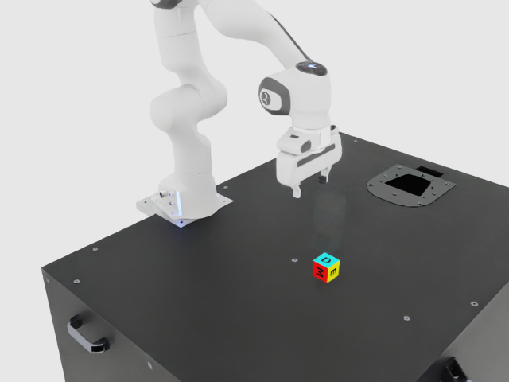

# Real Arena foundation and cancellation preflight

On 2 October 2026, the optional Arena adapter ran a real, bounded native
PhysX episode through CASCADE's ordinary composed runtime. The
[receipt](evidence/arena-native/20261002.json) records the result and retained
artifact hashes. This validates framework integration and final-consumer
cancellation, **not manipulation success, motion tracking or physical braking**.

`RobotRuntime.execute("arena_policy.run_policy_steps", {"steps": 20})` dispatches
to a benchmark-local owner of one Franka environment. The actual Arena
`PolicyBase` adapter calls upstream `ZeroActionPolicy`, then the final consumer
checks its generation, stop latch and local deadline before `env.step`. The
owner permits one call of at most 20 steps. It does not supply a general SafeArm
or whole-body controller, and does not enter normal robot profiles.

| Native episode | Control steps | PhysX solves | Physical interval | Result |
|---|---:|---:|---:|---|
| Foundation |20|160|1.3333s|Finite solved states; cube gravity response |
| Stop before ninth step |8|64|0.5333s|Ninth action computed but never consumed |

The independent observer reads real robot joint/body tensors and cube
pose/velocity after each completed `env.step`. The cube falls from 0.200000m to
0.0209997m; observed vertical velocity reaches −1.30800m/s. Held joint positions
remain exactly constant. The initial sample is post-reset, before the first
solve; subsequent samples advance by 8 solves at 1/120s. Distinct episode IDs,
source/config digests and snapshot hashes bind the two observation streams.
The native runner writes no object pose or joint state after normal upstream
reset. It does not use task-oracle poses to control the policy.

Both `task_done(success=true)` calls correctly return `success=false`, and both
repeat commands are refused. Stop serializes with the final step consumer: an
already admitted step may finish before acknowledgement. The cancellation case
proves **no additional admitted steps**, not braking while time continues. It
has no periodic transport lease or continuous physical rest measurement.

## Exact tested variant

- Arena [`c8d04e2`](https://github.com/isaac-sim/IsaacLab-Arena/tree/c8d04e2199b86abbbb301bb22cec0effd83c4e63),
  with its Isaac Lab submodule [`ae37b02`](https://github.com/isaac-sim/IsaacLab/tree/ae37b028ea415c91ea2bc32609efcd759ed2b974).
- Existing Isaac Sim 6.1.0-rc.26, Kit110.3.0/210.3.2, PhysX, Torch 2.12.0+cu130,
  Warp 1.17.0, NumPy 2.3.1 and gymnasium 1.3.0. Arena's committed lock instead
  selects Isaac 6.1.0.0, Torch 2.11.0+cu128, Warp 1.16.0 and Newton 1.5.2.
  This run establishes no locked-recipe parity or Newton execution.
- Real `cube_goal_pose`, default `franka_ik`, seed 42, one environment, original
  randomization/action/reset/task configuration. An added fixed 640×480 RGB
  observer camera is the explicit capture variant; policy observations are unchanged.
- Eighteen private packages (431MiB) satisfy eager optional imports. Their
  [exact requirements and hashes](../benchmark/arena/private_dependencies.txt)
  come from the upstream lock; NumPy, Torch and the existing SDK were not replaced.
- Owned GPU1 UUID`4c811d02-a79b-2837-425e-5f62ac3c578a`; one process scope,
  host memory 24GiB, CPU quota 400%, timeout 240s/15s grace. All recorded process
  births were absent afterward, the scope was inactive and exit status was 0.
  SDK close exits Python, so the external lifecycle receipt is authoritative.

Source inventories agree for 4295 CASCADE/Arena/Lab Python/config/lock files.
The flattened scene, package versions, runner and observation artifacts are
hashed. This is not a hash of every SDK binary, remote texture or dependency.
The two episodes use an explicit reset; no completed official Arena benchmark
result is fabricated for these short, unterminated episodes.

## Reproduce in an isolated, already admitted SDK

The core CASCADE installation does not install Isaac. Supply independent
checkouts at the pins above, an existing reviewed 6.1rc26 SDK and a private
Python 3.12 dependency directory. Do not install these additions into a shared
SDK. Example shell setup (paths are operator parameters):

```sh
export ISAACSIM_PATH=/path/to/existing/isaac-sim
export ISAACLAB_PATH=/path/to/private/IsaacLab
export ARENA_SOURCE=/path/to/private/IsaacLab-Arena
export PYTHON_DEPS=/path/to/private/python-deps
export TASK_STATE=/path/to/private/arena-state
mkdir -p "$TASK_STATE"/{cache,data,config,tmp,stores}
export XDG_CACHE_HOME="$TASK_STATE/cache" XDG_DATA_HOME="$TASK_STATE/data"
export XDG_CONFIG_HOME="$TASK_STATE/config" TMPDIR="$TASK_STATE/tmp"
export CUDA_CACHE_PATH="$TASK_STATE/cache/cuda" WARP_CACHE_PATH="$TASK_STATE/cache/warp"
export CASCADE_BELIEFS_PATH="$TASK_STATE/stores/beliefs.json"
export CASCADE_GRASP_MEMORY_PATH="$TASK_STATE/stores/grasp.json"
export CASCADE_ENVELOPE_PATH="$TASK_STATE/stores/envelope.json"
export PYTHONNOUSERSITE=1 PYTHONDONTWRITEBYTECODE=1 PYTHONUNBUFFERED=1
export OMP_NUM_THREADS=2 OPENBLAS_NUM_THREADS=2
export PYTHONPATH="$ARENA_SOURCE:$PYTHON_DEPS:$PWD/src"
for package in "$ISAACLAB_PATH"/source/*; do
  if [ -d "$package" ]; then export PYTHONPATH="$PYTHONPATH:$package"; fi
done
# Install only the reviewed private additions; existing SDK supplies its own stack.
uv pip install --python /path/to/private/python3.12 --target "$PYTHON_DEPS" \
  --no-deps --require-hashes -r benchmark/arena/private_dependencies.txt
export CUDA_VISIBLE_DEVICES=GPU-YOUR-OWNED-UUID
timeout --kill-after=15s 240s "$ISAACSIM_PATH/python.sh" \
  benchmark/arena/native_preflight.py --out "$TASK_STATE/run01" \
  --arena-source "$ARENA_SOURCE" --lab-source "$ISAACLAB_PATH" \
  --sdk-version-file "$ISAACSIM_PATH/VERSION" --python-deps "$PYTHON_DEPS" \
  --expected-gpu-uuid "$CUDA_VISIBLE_DEVICES" --capture
```

Run under an owned resource-limited supervisor and retain its process-birth and
closure receipt. The output directory must be new. The runner returns failure
on pin/version/device mismatch, blank capture, changed source, unexpected
termination, failed close or missing native gravity response.

## Retained failures and visual limits

Foundation attempts 01–03 retain missing sparse-module, missing Pinocchio and
removed-clock-API failures; foundation04 passed physics-only API checks.
Native01 completed the first 20 steps but failed its next reset because an
inference-created progress buffer was reset outside PyTorch inference mode.
Its initial observer rotation also used the wrong quaternion order. The fixed
runner uses the pinned Lab API's **XYZW** and rejects blank frames; native02 is
the complete passing result. No control, physics or safety thresholds changed.



The [short video](evidence/arena-native/foundation-20261002.mp4) contains native
frames 1–20 at 15fps. All raw frames, including post-reset frame 0, remain outside
Git. Frame 0 shows a stale robot render pose before the first solve; it is omitted
only from this presentation copy. RGB is illustrative and is not independently
attested pixel-to-pose evidence. The numerical observer determines the native
state results. The first/middle/final presentation frames were visually checked.

The generic Isaac static validator rejects its literal `SimulationApp` check
because the reviewed upstream entry point uses `AppLauncher`. Its generic 3s
settling rubric is also outside this deliberately shorter foundation scope;
no full validator or settled-contact pass is claimed. Software owner/adapter
regressions cover stop after action return, expiry, invalid output, terminal
flags, resource ownership during close, and refusal to promote foundation to
successful task completion.
