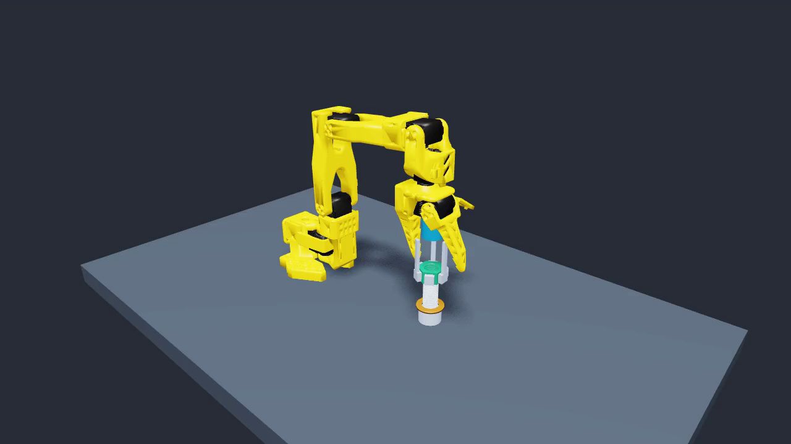
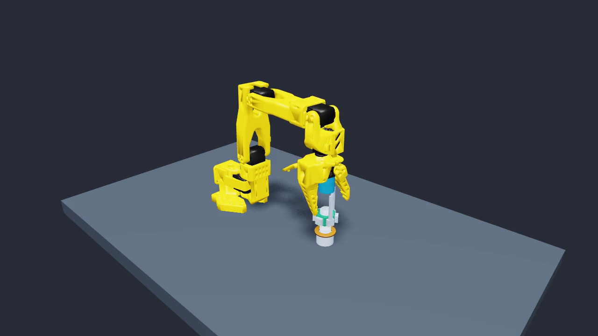
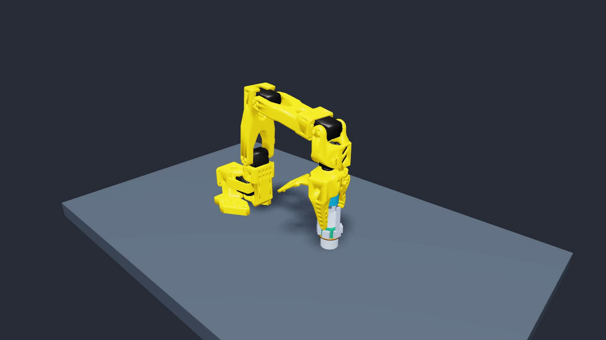

# Robot-driven Factory thread contact

`scripts/validate_screw_contact.py` runs an isolated SO-101 with a mounted,
motor-driven hex socket. The nut is a free dynamic body; the bolt is a static
fixture. The original NVIDIA Factory M20 loose meshes form both threads, with
Newton SDF collision at resolution 512. Nut motion results from contact forces.
There is no helical constraint, fastener motor, injected fastener torque,
attachment or runtime object-pose assignment.

The initial state has the socket around the nut. This is an assembly fixture
experiment, not a pick, vision-localization, seating or hardware claim. It does
not silently replace a CASCADE arm backend or the ordinary `turn_screw` skill.
The controller moves only SO-101 position actuators and the socket spindle's
torque actuator. After one measured nut turn it commands a velocity brake.

The independently read body poses and solved nut/bolt and nut/socket contact
forces feed `sim/threading_verification.py`. The spindle speed servo targets
1.5 rad/s with an illustrative 0.05 N m torque limit. Every physical substep is
checked for finite state, solver overflow and the nut's angular speed. A result
above the declared sampling bound remains unverified. Seating and preload are
always unverified by this one-turn experiment.

## Reproduce

Use an isolated Python 3.12 environment with `newton[sim]==1.6.0`,
`warp-lang==1.17.0`, `mujoco==3.12.0`, `mujoco-warp==3.12.0`,
`numpy==2.5.3`, `scipy==1.18.1`, and `trimesh==4.12.2`.

```bash
python scripts/fetch_factory_assets.py
python scripts/fetch_robot_assets.py so101
CUDA_VISIBLE_DEVICES=0 python scripts/validate_screw_contact.py \
  --robot-asset "$PWD/assets/mjcf/so101/so101.xml" \
  --output "$PWD/runs/thread-contact/positive" \
  --cache "$PWD/runs/thread-contact/sdf-cache"
```

Use a new output directory for each run. `--no-drive` commands exactly zero
socket actuator torque (the authored spindle viscous damping remains).
`--misaligned` moves the socket 60 mm off the bolt axis. `--substeps 20` halves
the 1/600-second physics timestep. Negative controls intentionally exit nonzero
when they do not verify the requested threading task. Failures preserve raw
observations; constructor errors produce a terminal error report.

For a replay of measured physical states, install `pyglet==2.1.16` and Pillow,
and use `scripts/render_screw_contact.py` with `--evidence`, `--robot-asset`,
`--cache`, and optionally `--video` (requires ffmpeg). Its three PNG frames and
MP4 render saved solver poses through Newton's viewer; the render buffer is
never passed to a simulation step.

## Local evidence, 2026-10-02

On one RTX PRO 6000 Blackwell GPU, the source-bound positive run measured
1.004155 clockwise turns and 2.508275 mm axial advance. Maximum pitch residual
was 0.009285 mm, radial offset 0.141841 mm, and axis tilt 0.006581 rad.
Both solved contact types witnessed 96.751% of angular travel. The verifier
confirmed threading and left seating unverified.

The exact-zero-drive control measured only 0.197470 turns / 0.490479 mm over
the same 7.2-second observation window and correctly failed the one-turn task.
All recorded motor torque values were zero. This small passive motion is
expected in a gravity-loaded low-friction thread, so rotation alone is not
evidence of commanded work. The displaced-tool control had zero tool contacts
and was refused (its free nut also exceeded the sampling speed bound).

A separate half-timestep run measured 1.004315 turns / 2.509058 mm, with a
0.007221 mm maximum pitch residual. It used the same physical geometry and
controller before terminal-report hardening and visual-only color changes;
its source hashes are retained separately. This is timestep sensitivity
evidence, not an assertion of identical source.

Compact summaries and source/asset bindings are under
`docs/evidence/factory-thread-contact/`. Full raw body states, the final video,
and start/middle/end frames are retained in the evidence locations listed in
that directory's artifact manifest. The original reduced Newton screw demo
remains an explicitly different mechanism using an ideal helix.

## Contact seating fixture

`scripts/validate_screw_seating.py` extends the physical experiment to an
annular seating face. The unmodified bolt's thread runout prevented the nut
from reaching the bare head: an exploratory run stalled at the 0.05 N m motor
limit with a 1.061 mm gap and zero shoulder contacts. That is retained as a
real negative counterexample; motor stall alone does not establish seating.

The seating fixture therefore includes a fixed annular spacer on the bolt
head: inner radius 11 mm, outer radius 18 mm, thickness 3 mm, and top at
world Z = 23 mm. It has its own collision shape and contact identity, separate
from the original bolt. The official threaded meshes are unchanged. The
spacer is fixed as part of the fixture; this does not test inserting or holding
a loose washer.

The extended socket clears the robot's original jaw by 4.25 mm. Six passive
radial inserts maintain contact with the nut flats: 2 g each, 2000 N/m spring
stiffness, 4 N s/m damping, -0.35 mm spring reference, and travel from -0.6 to
+0.8 mm. Nominal contact preload is 0.1 N per insert. Native imported spring
parameters and actuator count are checked; no insert motors are added. The
spindle targets 3 rad/s and remains limited to 0.05 N m. Thread friction is
declared as 0.1 and is not a calibrated material measurement.

The observer records physical poses and solved contacts at every 1/600-second
substep for threading verification, while retaining all body poses at 60 Hz
for replay. Tool interference with the fixture or robot mount is latched at
every substep and terminates the experiment. The geometric contract requires
at least 15 turns over the nominal 38 mm approach to the spacer.

Seat acceptance additionally requires half a second of actual nut/spacer
support contacts on the annulus under at least 0.045 N m motor effort and low
nut velocity, followed by two seconds with exactly zero spindle actuation.
The final second must retain support and low velocity. These checks establish
an illustrative simulated seat; they never establish calibrated preload.

```bash
CUDA_VISIBLE_DEVICES=0 python scripts/validate_screw_seating.py \
  --robot-asset "$PWD/assets/mjcf/so101/so101.xml" \
  --output "$PWD/runs/thread-contact/seating" \
  --cache "$PWD/runs/thread-contact/sdf-cache"

CUDA_VISIBLE_DEVICES=0 python scripts/validate_screw_seating_control.py \
  --robot-asset "$PWD/assets/mjcf/so101/so101.xml" \
  --output "$PWD/runs/thread-contact/seating-zero-drive" \
  --cache "$PWD/runs/thread-contact/sdf-cache"
```

The control script uses the identical physical fixture with motor torque
disabled from the start. Its separate result distinguishes a correctly
refuted one-turn task from a verified positive experiment. All output paths
must be new; source hashes before and after each run must match.

The source-bound full run completed in 39 simulated seconds: 15.365321 turns,
38.154768 mm axial advance, and 99.4097% contact-witnessed angular travel
measured at every physical substep. Maximum pitch residual through the loaded
seat was 0.258536 mm, within the declared 0.3 mm tolerance. All seat gates
passed. The motor switched to exactly zero at 36.983333 s, followed by more
than two seconds of retained support. Final nut/spacer geometric gap was
-0.015917 mm (the model's small contact penetration).

The loaded acceptance window had 0.05 N m motor effort and 5.870–7.625 N
summed solved spacer-normal force. During the final second with motor off,
support remained at 4.738–5.843 N, nut angular speed stayed below
0.003634 rad/s, and axial position varied by 0.000250 mm. These are outputs of
this uncalibrated contact model, not measured hardware preload. No tool/fixture
interference or other tool/mount contact was observed. Ten focused verifier
tests include thread-friction stall without shoulder support, wrong contact
height/normal, retained interference, nonzero braking and lost support.

The same final fixture with exactly zero motor torque advanced only
0.000395 turns / 0.000730 mm over 7.215 s. Its one-turn task was correctly
refuted; source/asset bindings and raw substep observations are retained beside
the positive run. The pre-seat approach of the positive run alone measured
15.251113 turns / 38.116448 mm, with 0.025638 mm maximum pitch residual and
100% contact-witnessed travel. The larger full-run residual above includes
loading against the seating surface and is reported separately rather than
hidden by trimming that window.

An eight-second sensitivity probe with the final fixture and a 1/1200-second
physics step measured 3.102183 turns / 7.748768 mm, 0.013640 mm maximum pitch
residual, and 100% contact-witnessed travel. The existing one-turn contract
confirms this threading probe. Its full-seat runner summary correctly remains
refuted because eight seconds do not complete the predefined 15-turn seating
approach; the full seat was validated at 1/600 s, not repeated at 1/1200 s.

The complete 39-second, 1280 × 720, 60 fps replay renders saved solver body
poses without stepping physics. Model hashes and body ordering must match the
recording. Decoded start/middle/end video frames were inspected: the robot,
nut, bolt and spacer remain visible, without startup or black-frame artifacts.

These are decoded frames from that same solver-state replay, not a separate
animated demonstration. Their hashes are recorded in the
[artifact manifest](evidence/factory-thread-contact/artifacts.json).

| Start (frame 0) | Middle (frame 1170) | Seated (frame 2339) |
| --- | --- | --- |
|  |  |  |

## Configured shoulder-seating task

The opt-in `factory_m20_shoulder_seating` profile exposes
`fastening.seat_fastener({})` through the ordinary robot/MCP runtime. Its initial
state is the mounted socket and pre-engaged nut at the declared initial height;
it refuses reuse after a prior turn has consumed the required approach. The
shipped profile has no device or model pin, so discovery cannot start an owner.
An exact model must be prepared against the selected SDK before execution.

This distinct task admits at most 45 simulated seconds / 1,200 wall seconds.
It requires the measured 15-turn threading approach, then a continuous 0.5
simulated seconds of shoulder support under spindle effort. Positive support
comes from the fastener side of the complete solved contact ledger, with the
declared annulus, surface normal and gap checks. Motor stall alone is insufficient.
The same single writer and stop generation guard every upload; the existing
one-turn task retains its 4 simulated / 40 wall-second limits.

After the stop ACK, spindle effort must be exactly zero for two observed
simulated seconds. The last second must retain shoulder support and quiet arm,
socket and nut measurements; a lost support sample cannot be repaired by a
later quiet frame. Threading is rechecked from the original post-ACK baseline,
and post-stop travel cannot supply missing approach credit. The rest deadline
is 3 simulated / 90 wall seconds, including final verification.

CPU fixtures exercise ordinary dispatch, contact-vector identity, interrupted
streams, stop revocation, late results and lost retention. They do not admit
native seating on this runtime. The standalone measurements above remain bound
to their original source and episode. Tool acquisition, engagement, withdrawal,
calibrated preload and hardware validation remain separate work.

The first configured native seating episode on source `54ba9a9` was rejected
at solve 391: the observation was 353.581 ms old against the unchanged 200 ms
limit. All 107,193 contact candidates remain recorded. A 347.699 ms generation-2
GC callback interval occurred on the same thread inside contact extraction;
the responsible heap allocations were not measured. No loaded shoulder window
was reached. The owner uploaded zero and acknowledged stop, but no later solve
established physical rest. The process scope closed ordinarily with no signals
or remaining children; the runtime retained its freshness fault.

A separate CPU decoder change (`6525ce0`) replaces per-contact constraint index
copies and row-list/set construction with contiguous views and local coverage.
Its 398 differential cases preserve outputs and refusals, plus two complete
Factory public API comparisons. For synthetic 293-candidate buffers, 32 paired
samples measured median 4.601 to 4.193 ms, but the candidate maximum was worse:
11.023 versus 5.226 ms, including an observed 6.796 ms gen-2 interval. All samples
are retained with normal GC settings. This does not establish a remedy for the
native pause or admit seating; a changed decoder requires a new native pin.
The [compact receipt](evidence/factory-seating-20261004.json) binds both scopes
and preserves the negative native result separately from CPU equivalence.

The following private archive change (`33b8fd4`) keeps completed contact columns
and raw float channels in owned immutable bytes until public records are read.
The live verifier still receives every typed contact, and the owner archives
each solve before acceptance, including later refusals. Only the exact native
backend uses this path; public readers and custom backends retain their ordinary
dict/list contract. Private envelopes are trusted in-process values, not an
external pickle format. All 391 retained rows and 107,193 contacts round-trip to
identical JSON bytes; the 398 decoder cases and two public API comparisons also
remain equal. The original freshness refusal is unchanged.

In 32 paired CPU archive samples, median archive time fell from 0.704 to
0.110 ms, while expansion rose from 0.105 to 0.731 ms (private maximum 1.151 ms).
These timings start from already captured rows and exclude native extraction.
All samples and normal-GC callbacks are retained in the same compact receipt.
Materialization during journal draining can still hold the GIL or trigger GC;
neither this measurement nor the 354 selected passing CPU tests establish a
remedy for the native pause, physical rest or seating admission.
