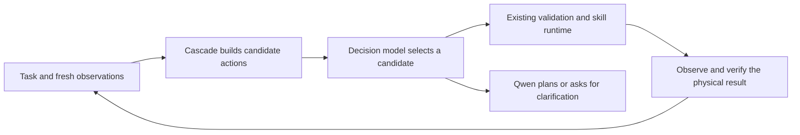

# Decision models in Cascade

Jev can complement Cascade's Qwen planner by choosing among explicitly supplied
options. The initial experiment evaluates tool selection from handwritten
synthetic text states; it does not execute robot actions. The anticipated benefit is less time
spent generating answers for small decisions. Improved grasp accuracy, reliable
autonomous recovery, and faster complete demonstrations remain hypotheses to test.

Research checked on 30 September 2026 against Cascade `c93b030`.

| Model or system | What is available | Relevance to Cascade |
| --- | --- | --- |
| TypeSafe Jev 1.13 | Hosted native System One API; text input; Choice, Noul and Score outputs | Remote decisions over task state and known alternatives. This is a separate interface from chat completions. |
| Kev 4B | Independent open decision model on Qwen3.5 4B Base, with an adapter and pointer head | A local candidate for frequent skill selection and evidence ranking. |
| Kev 27B v2 | Full decision checkpoint based on Qwen3.8 27B, released on 30 September | A larger local candidate to compare on exactly the same decisions. |
| Together Tev1 | Experimental classifier based on Qwen3.5 4B | Another implementation to evaluate later; not exercised by this pilot. |
| Jev Mem | Research memory architecture using a decision controller plus a generative answer model | A possible later memory extension, rather than the definition of Jev itself. |

Sources: [TypeSafe model contract](https://docs.typesafe.ai/models),
[Kev 4B model card](https://huggingface.co/jaredpalmer/kev-4b),
[Kev 27B model card](https://huggingface.co/jaredpalmer/kev-27b),
[Together Tev1 introduction](https://www.together.ai/blog/how-to-train-your-own-jev),
and [Jev Mem paper](https://arxiv.org/html/2609.23986v1).
Kev and Tev1 have their own weights and evaluations; compatibility with Jev's
request format does not establish equivalent behavior.

Cascade already separates fast command handling from deliberation.
`FastPlanner.plan()` first tries the reflex grammar, experience recall and
routine task decomposition. `AgentOrchestrator` calls the language model when
those paths cannot handle the task. An eventual decision stage could help in
that remaining gap: selecting a skill, identifying which known object a request
refers to, choosing relevant evidence, or deciding to obtain a new observation.
Existing deterministic commands are the latency baseline to preserve.

The proposed execution flow is:



This is a proposed integration, not the behavior of the current default launch.
The first experiment checks the decision interface independently of actuation.
Producing a valid tool name does not supply valid arguments or establish that
the tool is appropriate for the current physical state. A motion integration
also needs fresh sensor evidence, argument construction, and the existing
kinematic, contact and collision checks. Emergency stop stays deterministic.

The existing code offers several concrete insertion points:

| Cascade component | Potential decision task | Required boundary |
| --- | --- | --- |
| `agent/orchestrator.py` | Select among prepared next steps after the fast path misses | Qwen handles tasks outside the available choices; the runtime validates every action. |
| `apps/mcp_server.py` | Expose a decision result to OpenClaw | The MCP host remains responsible for its plan; the client never directly moves the arm. |
| `skills/library.py` and `agent/aspire.py` | Rank relevant previous strategies | Historical advice retains provenance and is not a current observation. |
| `memory/episodic.py` and `memory/beliefs.py` | Select useful context for the planner | Scene reset and observation age are enforced in code. |

The literature supports investigating this architecture, with different scopes.
[Jev Mem](https://arxiv.org/html/2609.23986v1) reports a LoCoMo score of 0.777
against 0.700 for MAGMA using GPT-4o-mini as the answer model. Its conversational
memory result does not measure robot control. The
[edge service orchestration paper](https://arxiv.org/html/2609.22753v1) studies
bounded intent extraction and service deadlines, including a Qwen comparison;
its different called-request subsets prevent treating the reported model-call
medians as a paired speed comparison. The
[probability coherence study](https://arxiv.org/html/2609.33209v1) finds that
answers to logically related questions can disagree. For mutually exclusive
next actions, use one Choice distribution instead of treating independent
yes/no probabilities as if they summed to one.

TypeSafe also documents limitations in numerical precision, indirect reasoning,
and adversarial input. Geometry, elapsed-time comparisons and collision margins
therefore remain calculated by Cascade. Confidence thresholds need evaluation on
the intended workload. [Jev limitations](https://docs.typesafe.ai/model-jaggedness/jev-1.13).

## Local pilot: RTX PRO 6000 Blackwell

Both Kev checkpoints ran real GPU inference with PyTorch **2.14.1+cu132**,
CUDA **13.2**, Transformers **5.18.0**, and bf16 weights. CUDA graphs were
disabled. Other workloads shared the GPU, so these are observed request times,
not isolated serving benchmarks. Kev's package currently declares `torch<2.9`;
installing it with `--no-deps` preserved the newer runtime for this compatibility
experiment. This does not establish upstream support for every Kev operation.

The [frozen fixture](../benchmark/diagnostics/fixtures/cascade_decision_v1.json)
contains 32 authored situations, 16 English and 16 Spanish, with 11 available
next-step labels including `defer_to_planner`. Each request asks one Choice for
the next skill and one Noul for whether the goal is verified complete. Expected
answers are kept out of the model input. No prompts, labels or thresholds were
tuned after reading the results.

| Model | Correct next skills | Request errors | Repeat median / p95 | Completion Brier |
| --- | ---: | ---: | ---: | ---: |
| Kev 4B | 24/32 | 0/32 | 81 / 91 ms | 0.1201 |
| Kev 27B v2 | 27/32 | 0/32 | 300 / 307 ms | 0.0153 |

Each unchanged fixture was run twice; predictions and probabilities were
identical between those runs. Repeating it measures warm latency, not 32 new
independent examples. The initial 4B warm-up request took **79.1 seconds**;
27B's first pilot request took **58.0 seconds**, including first-use kernel
compilation. Those costs must be handled before a presentation.

The 4B model selected a grasp for ambiguous object identities and sometimes
selected movement from stale evidence. The 27B model fixed those cases but still
selected `pick_and_place` when the destination was unspecified and when the
previous placement needed an undefined recovery. Both therefore remain
experimental decision candidates, with no default actuation integration.

Completion has only **two positive examples**. At the fixed 0.5 threshold, 4B
produced 2 true positives, 24 true negatives and 6 false positives; 27B produced
2 true positives and 30 true negatives. Always answering incomplete already
achieves 30/32 accuracy and Brier 0.0625. These cases do not establish calibration
or reliable completion verification. The same small pilot also cannot prove
better robot performance or a speed advantage over Cascade's existing fast
path or its Qwen chat planner, neither of which was timed here.

The [manifest](../benchmark/results/decision_pilot_manifest.json) records exact
checkpoint revisions, server metadata, runtime versions, frozen input hashes,
and the four result files with per-case probabilities. The server responds with
the alias `kev-latest`; the checkpoint identity comes from the pinned launch and
server metadata. **Official TypeSafe Jev was not tested:** no API credential was
available. Local Kev measurements are not measurements of Jev.

## Run the diagnostic

The client in `cascade.agent.decision` uses the native `/v1/systemone` contract
and Python's standard library. This prototype implements Choice and Noul with
text instructions. It does not implement Score or structured rubrics, load model
weights, or execute skills. It rejects malformed responses and records request
failures without retrying or silently substituting another model. It retains
received probabilities unchanged, allowing only the sum error consistent with
rounding each of N values to four decimals (`N * 0.00005`).

Run Kev in a separate environment following its
[serving instructions](https://github.com/jaredpalmer/kev), using the revisions
and package versions in the manifest. The measured server command, with GPU 0
available, was:

```bash
CUDA_VISIBLE_DEVICES=0 KEV_CUDA_GRAPHS=0 python -m kev.serve \
  --run jaredpalmer/kev-27b@28be62e9c5ae0471bda2b7c636a55224b4f4b887 \
  --port 28009
```

For the smaller model, replace `--run` with
`jaredpalmer/kev-4b@139fdd94f1b6a6ad80cc15e08fcb99cac885a101`.
Keep model loading and first-use compilation outside timed warm requests.
Then, from Cascade's environment:

```bash
PYTHONPATH=src python benchmark/diagnostics/decision_probe.py \
  --base-url http://127.0.0.1:28009 --model kev-latest \
  --timeout 120 --output runs/kev-decisions.json
```

For official Jev, configure `TYPESAFE_API_KEY` in the process environment and use
`--base-url https://api.typesafe.ai --model jev-latest`. The diagnostic reads that
credential only for the official HTTPS origin. Local endpoints do not receive
it. Credentials and complete untrusted response bodies are excluded from error
messages. An HTTP timeout is not a real-time control deadline.

The next useful experiment is a separate set of captured Cascade task states,
with human-reviewed candidate actions and arguments, compared against the
existing planner. Evaluate decision quality and latency before considering an
opt-in runtime integration. Geometric grasp refinement and nvblox mapping remain
separate perception and motion work.
