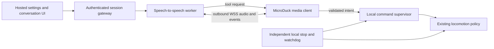

# MicroDuck conversation design

Research snapshot: 2 October 2026.

This is the earlier documentation-only snapshot. The later
[mobile implementation](MICRODUCK.md) is now present as a candidate, with
[source-bound native results](MICRODUCK_CONTINUATION_20261002.md). The later [conversation gateway](CONVERSATION.md) implements browser media and
provider/tool protocol integration. Later [local speech inference](CONVERSATION_NATIVE_20261002.md)
and a [synthetic-input native-motion recording](PROJECT_STATUS_20261003.md#rgb-d-geometry-speech-and-evaluation)
have separate, bounded results. General speech/action reliability, hardware
audio and a public hosted service remain unvalidated; the historical pins and
proposed requirements below describe this earlier review, not current feature absence.

The Reachy voice interface can be adapted through a MicroDuck media client and mobile command supervisor. This is a design proposal: the documentation branch adds no runtime or deployment, and this review performed no speech session, robot command or latency benchmark.

The [MicroDuck design review](MICRODUCK_DESIGN_REVIEW_20261002.md) records the external implementation snapshot, three open findings and retained physical evidence. Its [source and receipt manifest](evidence/microduck-review/source-receipt-hashes.json) identifies the reviewed bytes. MicroDuck code paths below name that external corpus, not files present in this documentation branch.

The inspected Hugging Face application revision is `ddc309630448a664b0283812ff80048c36966c35`, app version `1.0.1`; its lockfile selects Reachy Mini SDK `1.10.0rc5` and OpenAI Python client `2.28.0`. The locked SDK release tag resolves to `221b3c3ce1aadae3c0eed97a8712d83bd205e13e`. The separate allocator-proxy revision is `6a2c558d205ee8ca144fdc6d702dfe9e857d911c`. The speech backend/browser-demo revision is `411399d34555b2169823a6eaeb7f8ff192db89db`. [Application metadata][app-meta], [application package][app-package], [lockfile][app-lock], [proxy metadata][proxy-meta], [backend source][s2s].

**What the supplied Space hosts.** Its SDK is `static`; root `index.html` is an installation/source landing page. The conversation runs in Python beside a Reachy daemon. Its optional FastAPI UI displays settings and conversation state: `talk.js` leaves audio I/O to Python, the orb mutes the robot microphone, and `/rpc` carries JSON-RPC settings, status and transcripts. The Space itself supplies neither browser microphone capture nor inference. [Landing page][landing], [talk view][talk], [RPC client][rpc], [application startup][app-main].

**Deployed path.** Default mode `deployed` POSTs to `https://pollen-robotics-reachy-mini-realtime-url.hf.space/session`, receives `connect_url`, then connects directly using an OpenAI-compatible Realtime WebSocket. The client library does not identify the inference provider. The separate proxy is a Docker Space on CPU Upgrade, forwarding to configured allocators with optional A/B routing. A read-only GET of `/session-url` returned an `endpoints.huggingface.cloud/session` address; no session was allocated or compute worker identified. [Configuration][app-config], [Realtime handler][handler], [proxy configuration][proxy-readme], [allocator configuration][allocator-config].

The maintainers identify `huggingface/speech-to-speech` as Reachy's conversation backend. It is a modular **VAD → STT → LLM → TTS** cascade. Its common speech components are Silero VAD, Parakeet TDT and Qwen3-TTS; the LLM can be hosted or local. The public app does not pin the production allocator's current LLM, provider, model weights, deployment region, price or retention policy. Do not equate repository defaults or the app's compatibility field `gpt-4o-transcribe` with an observed production model. [Maintainer explanation][local-blog], [backend README][s2s-readme].

**Audio and robot transport.** `LocalStream` obtains microphone frames from `robot.media`, forwards them to the Realtime handler and pushes generated audio back through the same SDK. The handler uses native 16 kHz mode, converts to mono PCM16 and base64-encodes input chunks; the SDK media/sample-rate contract must be replaced explicitly for MicroDuck. Server VAD speech-start events flush queued playback, enabling interruption. Reachy's SDK chooses local GStreamer media/IPC when colocated or WebRTC media for remote clients; that robot-media leg is separate from the app-to-inference WebSocket. The camera tool supplies a JPEG snapshot through the conversation, rather than streaming robot video continuously to the model. [Audio loop][console], [Realtime handler][handler], [SDK media architecture][media], [camera tool][camera].

**A closer starting point for the hosted browser UX.** The speech-to-speech repository includes `demo/`, an actual browser voice client: Docker/FastAPI host, microphone capture, orb, transcripts, settings and interruption. Its default WebSocket path streams PCM16 24 kHz mono in approximately 40 ms chunks. Optional WebRTC uses a same-origin SDP proxy and direct media; internet deployment requires appropriate ICE/TURN networking. Browser microphone permission requires HTTPS or localhost. `SPEECH_TO_SPEECH_URL` pins a reachable backend but disables that demo's allocator/login/metering mode, so it does not provide an authenticated public service by itself. The separate `LOAD_BALANCER_URL` mode supports HF OAuth attribution. [Browser demo][browser].

**Credentials and operation.** Reachy's deployed client forwards an explicit `HF_TOKEN`, falling back to cached `hf auth login`, as `X-Reachy-Mini-Authorization` to the allocator; it also supplies daemon `hardware_id` when available. It can attempt allocation without them, but its README's no-key default is not proof that MicroDuck has unrestricted or durable access. Direct mode uses `HF_REALTIME_CONNECTION_MODE=local` plus `HF_REALTIME_WS_URL`; it forwards only an explicitly configured token and does not send the cached login or Reachy hardware ID. An independent MicroDuck deployment should use its own endpoint and device credentials; a Reachy hardware identity must not be fabricated. [Client allocation logic][handler], [environment example][app-env].

For hosting, keep provider keys and allocator credentials on the server. The browser demo additionally supports optional `SERPER_API_KEY` for search and, in its allocator mode, `LB_HF_TOKEN` and `USAGE_HASH_SECRET`; these are distinct from robot-control authorization. The standalone speech server needs an authenticating/rate-limiting gateway for public use; its optional LLM proxy explicitly supplies neither. [Browser deployment modes][browser], [backend operation][s2s-readme].

**Self-hosting requirements.** The Reachy app requires Python ≥3.11 and recommends 3.12 plus its SDK/media setup; the speech backend requires Python ≥3.10 and recommends 3.11. They should have independently pinned environments. Upstream estimates, for one conversation, approximately 24 GB NVIDIA VRAM for its unquantized all-local example, or 16 GB unified memory on Apple Silicon; these are planning estimates, not measured MicroDuck minima. A hosted LLM can reduce speech-host memory needs, but changes the data destination and incurs provider costs. First-run model downloads and warmup are required. The default Linux Qwen3-TTS wheel targets CUDA 12.8/glibc 2.39, so deployment must select a compatible image or alternate build. Use `serve` for a device/backend connection, not the packaged `local` microphone client. [Installation and hardware estimates][s2s-readme], [backend package][s2s-package].

**Proposed integration.** A hosted service can use the following separation:

Choose one microphone/speaker owner: robot audio for embodied interaction or browser audio for a remote operator. Pair each authenticated session to one robot. With robot audio, the outbound WSS connection avoids exposing a robot control port publicly. The browser demo and Reachy UI provide alternative frontends; MicroDuck still needs the bridge.

The concrete reuse seam is the Realtime tool contract, `response.function_call_arguments.done` followed by a structured `function_call_output`, together with a `MediaIO` abstraction for capture, playback and flush. The backend's packaged Python client already supports an explicit `--tool-module` with `TOOLS` and async `execute_tool`; Reachy's counterpart is `Tool`/`ToolDependencies`. Reusing Reachy's personalities/UI instead requires replacing `LocalStream`'s media dependency, the injected device/tool dependencies and the startup/lifecycle wiring. [Realtime/tool contract][protocol], [Reachy tool interface][tools].

Reachy's `MovementManager` is unsuitable as a second MicroDuck motor writer: its actual configured rate is 60 Hz despite stale 100 Hz comments, and it issues `ReachyMini.set_target(head, antennas, body_yaw)`. Startup also enables the Reachy daemon's audio-driven head wobble. MicroDuck's policy owns all 14 action targets, including `neck_pitch`, `head_pitch`, `head_yaw`, `head_roll` at zero-based slots 5–8. Mouth is excluded. Its 13-value command block already has head/body command slots, but the current stepper fills only the first three velocity slots and leaves the rest zero. Future gaze could use bounded command slots only after the selected policy's semantics and behavior are admitted; it must never overwrite the 14 output joint targets. There is no public head/mouth tool or independent mouth controller in this implementation. Mouth animation remains a future separate capability with one owner, limits and neutral behavior. [Reachy movement][moves], [startup wobble][app-main]. MicroDuck source: `cascade/src/cascade/control/microduck_policy.py` and `cascade/src/cascade/sim/microduck_stepper.py`, identified in the [review manifest](evidence/microduck-review/source-receipt-hashes.json).

The reviewed `MobileSkillRuntime.execute(...)` exposes `walk_velocity(vx, vy, wz, duration_s)`, `turn(angle_rad)`, `stop_navigation()`, `emergency_stop()`, `reset_stop()`, `get_base_state()` and `get_observation()`, with optional base selection. Turn speed comes from the safety profile. Its transport is loopback TCP JSON. Stop requests zero twist while preserving balance; ACK does not establish rest. Reset clears permission without replay or fault recovery; faults require owner lifecycle restart and a fresh epoch. Source: `cascade/src/cascade/skills/mobile_runtime.py` in the [manifest](evidence/microduck-review/source-receipt-hashes.json). Physical locomotion acceptance remains pending.

Proposed voice-command admission belongs locally: allowlisted intents, argument bounds, robot/session identity, request IDs, deadlines, cancellation generation and actual completion/error acknowledgements. It must reject stale or duplicate movement after interruption or reconnect. Begin with read-only status and media; enable movement tools only after the MicroDuck command/stop audit is resolved. Do not stream LLM joint targets, place inference/audio work in the locomotion loop, or treat an LLM-generated `stop` tool as the emergency-stop path. Voice interruption cancels speech; the independent local stop must remain able to act during a stalled or disconnected conversation. These requirements remain unvalidated for voice-to-MicroDuck integration.

MicroDuck claims refer to the manifest's `feat/microduck-isaac` snapshot, HEAD `5359405a607a14e9d30182309c40d30c3b95f80b` plus uncommitted bytes. Later changes require a new comparison; this review does not rebind earlier receipts.

**Licensing and remaining evidence.** Conversation-app code, Reachy SDK and speech-to-speech code declare Apache-2.0. Preserve their license/notice obligations and mark modifications; the demo credits a separate original UI source. Model licenses are separate: the inspected Parakeet v3 card declares CC-BY-4.0, while Qwen3-TTS CustomVoice declares Apache-2.0. Selecting other model or motion assets requires checking their own terms; the app's license does not cover all downloaded content. [Application license][app-license], [SDK license][sdk-license], [backend license][s2s-license], [Parakeet model][parakeet], [Qwen TTS model][tts].

No source inspection proves live latency, acoustic echo cancellation on MicroDuck, reconnect recovery, concurrent-session capacity, control isolation or physical safety. Before deployment, validate audio-only turn-taking and barge-in on the intended microphone/speaker, then simulated tool admission including duplicate/stale requests and disconnect/stop, and only then authorized physical actions. Measure speech-end-to-first-audible-output and interruption-to-silence separately from policy cadence and stop latency. Remaining product inputs are the actual MicroDuck audio hardware, desired microphone location, hosting region/data policy, expected concurrent robots and approved model/provider budget.

[app-meta]: https://huggingface.co/api/spaces/pollen-robotics/reachy_mini_conversation_app
[app-package]: https://huggingface.co/spaces/pollen-robotics/reachy_mini_conversation_app/blob/ddc309630448a664b0283812ff80048c36966c35/pyproject.toml
[app-lock]: https://huggingface.co/spaces/pollen-robotics/reachy_mini_conversation_app/blob/ddc309630448a664b0283812ff80048c36966c35/uv.lock
[landing]: https://huggingface.co/spaces/pollen-robotics/reachy_mini_conversation_app/blob/ddc309630448a664b0283812ff80048c36966c35/index.html
[talk]: https://huggingface.co/spaces/pollen-robotics/reachy_mini_conversation_app/blob/ddc309630448a664b0283812ff80048c36966c35/src/reachy_mini_conversation_app/static/js/views/talk.js
[rpc]: https://huggingface.co/spaces/pollen-robotics/reachy_mini_conversation_app/blob/ddc309630448a664b0283812ff80048c36966c35/src/reachy_mini_conversation_app/static/js/api.js
[app-main]: https://huggingface.co/spaces/pollen-robotics/reachy_mini_conversation_app/blob/ddc309630448a664b0283812ff80048c36966c35/src/reachy_mini_conversation_app/main.py
[app-config]: https://huggingface.co/spaces/pollen-robotics/reachy_mini_conversation_app/blob/ddc309630448a664b0283812ff80048c36966c35/src/reachy_mini_conversation_app/config.py
[handler]: https://huggingface.co/spaces/pollen-robotics/reachy_mini_conversation_app/blob/ddc309630448a664b0283812ff80048c36966c35/src/reachy_mini_conversation_app/huggingface_realtime.py
[proxy-meta]: https://huggingface.co/api/spaces/pollen-robotics/reachy-mini-realtime-url
[proxy-readme]: https://huggingface.co/spaces/pollen-robotics/reachy-mini-realtime-url/blob/6a2c558d205ee8ca144fdc6d702dfe9e857d911c/README.md
[allocator-config]: https://pollen-robotics-reachy-mini-realtime-url.hf.space/session-url
[local-blog]: https://huggingface.co/blog/local-reachy-mini-conversation
[s2s]: https://github.com/huggingface/speech-to-speech/tree/411399d34555b2169823a6eaeb7f8ff192db89db
[s2s-readme]: https://github.com/huggingface/speech-to-speech/blob/411399d34555b2169823a6eaeb7f8ff192db89db/README.md
[s2s-package]: https://github.com/huggingface/speech-to-speech/blob/411399d34555b2169823a6eaeb7f8ff192db89db/pyproject.toml
[console]: https://huggingface.co/spaces/pollen-robotics/reachy_mini_conversation_app/blob/ddc309630448a664b0283812ff80048c36966c35/src/reachy_mini_conversation_app/console.py
[media]: https://github.com/pollen-robotics/reachy_mini/blob/221b3c3ce1aadae3c0eed97a8712d83bd205e13e/docs/source/SDK/media-architecture.md
[camera]: https://huggingface.co/spaces/pollen-robotics/reachy_mini_conversation_app/blob/ddc309630448a664b0283812ff80048c36966c35/src/reachy_mini_conversation_app/tools/camera.py
[browser]: https://github.com/huggingface/speech-to-speech/blob/411399d34555b2169823a6eaeb7f8ff192db89db/demo/README.md
[app-env]: https://huggingface.co/spaces/pollen-robotics/reachy_mini_conversation_app/blob/ddc309630448a664b0283812ff80048c36966c35/.env.example
[protocol]: https://github.com/huggingface/speech-to-speech/blob/411399d34555b2169823a6eaeb7f8ff192db89db/src/speech_to_speech/api/openai_realtime/README.md
[tools]: https://huggingface.co/spaces/pollen-robotics/reachy_mini_conversation_app/blob/ddc309630448a664b0283812ff80048c36966c35/src/reachy_mini_conversation_app/tools/core_tools.py
[moves]: https://huggingface.co/spaces/pollen-robotics/reachy_mini_conversation_app/blob/ddc309630448a664b0283812ff80048c36966c35/src/reachy_mini_conversation_app/moves.py
[app-license]: https://huggingface.co/spaces/pollen-robotics/reachy_mini_conversation_app/blob/ddc309630448a664b0283812ff80048c36966c35/LICENSE
[sdk-license]: https://github.com/pollen-robotics/reachy_mini/blob/221b3c3ce1aadae3c0eed97a8712d83bd205e13e/LICENSE
[s2s-license]: https://github.com/huggingface/speech-to-speech/blob/411399d34555b2169823a6eaeb7f8ff192db89db/LICENSE
[parakeet]: https://huggingface.co/nvidia/parakeet-tdt-0.6b-v3/tree/541d1f99c6b0c3cd0b11a95167540bb8edefd82b
[tts]: https://huggingface.co/Qwen/Qwen3-TTS-12Hz-1.7B-CustomVoice/tree/0c0e3051f131929182e2c023b9537f8b1c68adfe
