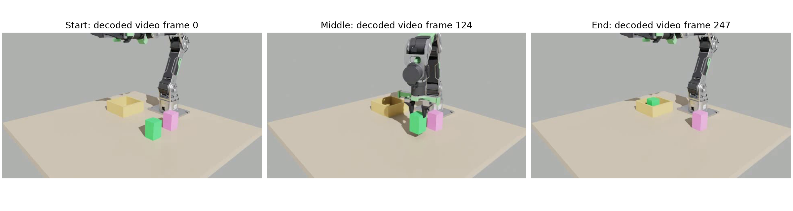
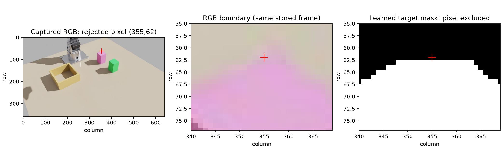

# Optional OVRTX renderer

Cascade has an opt-in `ovrtx` camera adapter and an independent scene-snapshot
renderer. It produces real RTX RGB and metric depth through NVIDIA OVRTX 0.5
and `ovstage`, without starting Kit or selecting a physics engine. Existing
Isaac, MuJoCo, hardware and desktop defaults are unchanged.

There are three entry points:

- `make_camera(load_profile("cameras", "ovrtx"))` renders the explicitly static
  example USD scene through the existing `CameraBase` interface.
- `OvrtxRenderer.render(SceneSnapshot(...))` applies a caller-provided scene
  and camera pose sample, then returns a dictionary of complete `Frame`s.
  This is an integration API, not an automatic Isaac or Newton state producer.
- `CASCADE_CAMERA_RENDERER=ovrtx` selects the live Isaac producer described
  below; existing Isaac camera profiles and the bridge protocol remain in use.

The standalone renderer can return semantic body masks for an explicit
geometry inventory. Joint and contact measurements belong to the physics
producer; rendering never steps physics or infers physical attachment.

## Live manipulation selection

The owned Isaac launcher forwards these explicit environment settings:

```bash
export CASCADE_CAMERA_RENDERER=ovrtx
export CASCADE_OVRTX_PYTHON=/absolute/path/to/ovrtx-env/bin/python
export CASCADE_OVRTX_OUTPUT=/absolute/path/to/new-run/render
export CASCADE_OVRTX_DEVICE=0  # CUDA-visible ordinal, same device visibility as Isaac
./run.sh isaac
```

The bridge's equivalent arguments are `--camera-renderer ovrtx`,
`--ovrtx-python`, `--ovrtx-output`, and `--ovrtx-device`. The normal Isaac
camera profiles remain selected, so `BridgeClient.observation()` and
`IsaacArm.state_from_frame()` consume the existing atomic frame contract.
The static `ovrtx.yaml` profile remains viewing-only.

`scripts/isaac_ovrtx.py` exports a private flattened, metre-authored Z-up USD
and a scene manifest. Every physics rigid body, including nested robot links
and fingers, receives its captured tensor pose. Reset xform stacks prevent
double composition of nested links. The wrist optical transform is derived
from the same captured wrist body and calibrated mount. Exported geometry is
static; runtime additions/removals or deformable geometry need a new owner
and inventory. The flattened scene hash does not attest external textures.
Kit only reads and flattens its existing stage. All render-only USD edits
occur in the child process: editing another stage with matching prim paths
inside Kit emitted global USD notices and invalidated the live physics view
in the first native trial. Static table/bin geometry also receives explicit
semantic labels; an unmapped native identifier is still rejected.

The SDK runs in a separately owned process over an inherited private socket;
there is one outstanding request and no snapshot backlog. Normal shutdown,
render errors and response deadlines close that child. A partial native
transaction cannot produce a new apparently fresh packet. The bridge retains
the original snapshot age on duplicate reads, rejects contradictory physical
repeats, and rebuilds the renderer across physics epochs.

RGB, optical Z depth and body segmentation come from the same sensor frame.
The opaque body labels encode case-sensitive USD paths because OVRTX
lowercases semantic class strings. Robot and per-prop masks combine with
captured contact state only when that channel is configured and available;
an unavailable contact channel produces an explicit mask error. Existing
pixel/contact-mask opt-ins still select the bridge's physical contact readers.

`render_reference.source=ovrtx_snapshot` binds the exact scene-state digest,
captured joints, physics step/epoch/time and renderer ordinal/sensor interval.
The ordinal is never presented as `rpFabricTime`. Readiness and held-object
guards validate this distinct binding while retaining their physical clock,
identity, age and measured-joint requirements.

The 2 October native dynamic smoke passed on RTX PRO 6000 with SDK 0.5:
target masks changed from 2,196 to 3,140 pixels and median optical depth from
1.85000026 to 1.60000026 m for a measured 0.25 m scene translation. The
nested reset transform, exact duplicate and stale-sequence rejection passed;
the owned worker exited normally. This is a renderer/packet test using
synthetic physical state, not a manipulation-success claim. Reproduce with
`benchmark/diagnostics/ovrtx_runtime_smoke.py --python <SDK-python> --output <new-directory>`.

## Native manipulation acceptance — 2 October 2026

One normal `pick_and_place("green object")` completed with live OVRTX cameras,
cuMotion planning, SafeArm execution and GPU PhysX at source
`f2b2186317a6eb6278bf7a57bf039c912e64dc18`. The
[compact evidence receipt](../benchmark/results/ovrtx-runtime-manipulation-20261002.json)
preserves source, config, runner and raw-artifact hashes, earlier failures,
the actual producer identity and its shutdown. This is a separate acceptance
from the standalone analytic renderer tests.

The run used cam0 and side at 640×360, required real GraspGenX and enabled
the observed-finger gate. Eight task curves covered 529 sampled targets;
the subsequent automatic park added 60. All nine native curves passed the
existing runtime checks. Both closing stages, measured contact stability,
lift, transport, release and return home completed. The observed task took
126.19 s under concurrent GPU use; this is not a performance comparison.
The post-close observer measured 0.482 mrad peak-to-peak over 0.5 physical
seconds against its 0.5 mrad bound. The separate final pre-command drift
limit remained 1 mrad; its measured-start check was not rebased or bypassed.

Independent post-task sampling confirmed 24 advancing physical samples with
open jaws and a stationary object. Its final center was
`(0.19958, -0.15699, 0.04000)` m, 23.51 mm from the configured drop-zone center.
Twelve further samples **after park** retained that position, with measured
jaw openings at least 0.04999999 m. Support evidence is the stationary pose
at the expected resting height; no table reaction force was measured. Held,
provisional-held, contact-episode and carry-attachment state were all clear.
Source hashes remained unchanged and the launcher, Kit interpreter and owned
SDK child were confirmed absent after termination.



The success does not replace these failed attempts:

| Attempt | Observed outcome |
| --- | --- |
| Pink, native03 | First closure sent; second observed-finger guard rejected a border pixel excluded by the learned target mask. No lift. The historical native prop mask was not retained, so its exact semantic identity is not reconstructed retrospectively. |
| Green, same native03 scene | The arm was still at the previous low pink pose after opening. Its proposed home sweep crossed pink; the gate rejected it before a task trajectory. Recorded same-frame native semantics confirmed pink at that pixel. |
| Green, fresh native04 | Both closures passed. Contact motion had not satisfied the then-0.25 mrad observation window before its deadline; a final short RPC timeout obscured the reason. No lift. |
| Green, fresh native05 | Full success above, with audited bounded contact stability and the unchanged final 1 mrad feedback-drift gate. |



No target-mask inflation, ground-truth contact exemption or simulator
object-pose write was used. Native04 and native05 started independent fixtures
after owned-process shutdown. The isolated fixture explicitly disabled
occupancy; this result does not establish end-to-end nvblox use. Wrist pose binding was checked
separately but did not authorize the grasp. This acceptance covers x86_64 RTX
PRO 6000 and the standard two-prop PhysX scene, not Newton, kitchen trial 12,
real hardware, or ARM manipulation.

## Install and run

Use a separate Python 3.10–3.13 environment on an RTX-capable host. The SDK
does not support Python 3.14. Its wheels and license are provided by NVIDIA;
the [official repository](https://github.com/NVIDIA-Omniverse/ovrtx) describes
driver requirements, first-use shader compilation and distribution terms.

```bash
python3.12 -m venv .venv-ovrtx312
.venv-ovrtx312/bin/python -m pip install -e '.[ovrtx]' pillow
timeout --signal=TERM --kill-after=5s 180s \
  .venv-ovrtx312/bin/python benchmark/diagnostics/ovrtx_rgbd_smoke.py \
  --device 0 --output /tmp/cascade-ovrtx-smoke-new
```

The output directory must not already exist. The diagnostic creates its own
cube scene, renders four RGBD packets, saves NPZ/PNG files and a receipt, and
compares depth with analytic ray/box intersections. It uses two cameras,
distinct focal lengths and positions, a parent transform, a rotated object,
and a moved/rotated camera. It also checks whole-packet duplicate retention.
The timeout belongs to the isolated process: native shader compilation cannot
be interrupted safely by a Python thread deadline. A cold cache may exceed the
example budget; that is a failed run, not a successful frame.

`device` is a **CUDA-visible ordinal**, independent of the physics device.
For a chosen physical GPU, set `CUDA_VISIBLE_DEVICES` to its UUID and use
`--device 0`. The SDK maps that ordinal to its graphics device. Record SDK
selection logs and process GPU usage when device attribution matters. The
x86 validation observed rendering on the selected GPU and a separate 8 MiB
graphics context on the other GPU; it does not establish exclusive GPU use.

Static profile example, run from the repository root:

```python
from cascade.config import load_profile
from cascade.perception.camera_base import make_camera

with make_camera(load_profile("cameras", "ovrtx")) as camera:
    frame = camera.get_frame()
    print(frame.rgb.shape, frame.depth_m.shape, frame.K)
```

The profile is [configs/cameras/ovrtx.yaml](../configs/cameras/ovrtx.yaml).
Portable runtime bundles include that profile, its USD example and both adapter
modules; assembly refuses missing members. This does not install the optional
SDK or enable the profile by default.
Selecting it does not mirror any live robot. First capture creates the native
renderer in the capture thread. `close()` releases queries, mappings, stage
and renderer; `keep_system_alive=False` prevents intentional global retention.
An initialization or partial frame failure invalidates that owner. Close it
and construct a new owner rather than retrying a partially applied scene.
`static_scene: true` is mandatory for this profile, so Cascade's visual
motion verifier abstains instead of treating static pixels as robot evidence.

## Frame and snapshot contract

`Frame.rgb` is BGR `uint8`, consistent with Cascade's camera interface.
`Frame.depth_m` is aligned `float32` optical **Z in metres**, from
`DistanceToImagePlaneSD`, not radial range or normalized depth. Background,
nonfinite and clipped depth is zero. There is no inferred depth fallback.

The supported camera is a centered, undistorted, square-pixel pinhole:

- `fx == fy` is required. Measured SDK rendering ignored unequal focal
  lengths in this RenderProduct path even with `adjustPixelAspectRatio`.
  Requests are rejected rather than returning misleading calibration.
- Array indices are integer pixel centers. The principal point is
  `cx=(width-1)/2`, `cy=(height-1)/2`; this accounts for the renderer's
  half-integer raster samples. Off-center requests are rejected.
- `T_base_cam` maps optical coordinates (+X right, +Y down, +Z forward) to
  the scene frame. The adapter converts that convention to USD camera axes.
- Source geometry and transform translations must be authored in metres.
  No mesh scale conversion is inferred from a profile.

The renderer owns a private `ovstage`. Each `SceneSnapshot` must contain
every configured dynamic prim, using **local parent-to-prim** transforms;
camera transforms are scene-frame transforms. Capture both under the actual
physics owner's lock if connecting a simulator. Hold a coherent sample rather
than mixing a historical image with later joints or camera poses. The adapter
does not make that external producer for the caller.

```python
import time
import numpy as np
from cascade.sim.ovrtx_renderer import CameraSpec, OvrtxRenderer, SceneSnapshot

T = np.diag([1., -1., -1., 1.])
T[2, 3] = 3.
camera = CameraSpec("cam0", 320, 240, 240., 240., T)
with OvrtxRenderer("demo/ovrtx/rgbd.usda", [camera],
                   dynamic_paths=["/World/Cube"]) as renderer:
    sample = SceneSnapshot("example-owner", "episode-1", 1, 0.,
                           time.monotonic(), {"/World/Cube": np.eye(4)})
    frame = renderer.render(sample)["cam0"]
```

Snapshot source/epoch are fixed for an owner. Sequence, simulation time and
capture time must advance on a new sample. Capture time uses the same host's
monotonic clock and precedes rendering. An identical sequence returns a copy
of the **whole previous packet**, including timestamp, image, depth, pose and
identity. A contradictory duplicate or regressing clock is rejected before
stage writes. Remote clock translation is not supplied by this API.

The ordinal publishes a sealed scene transaction; it is not a historical
physics-state lookup. RGB and depth are copied from one instantaneous camera
frame after the same renderer step, before native mappings are released.
Missing/interpolated frames, exposure intervals, incompatible dimensions or
formats, and repeated sensor time on a new sample fail the transaction.
The capture metadata separately records snapshot simulation time, snapshot
monotonic time, renderer step/sensor time and source hashes. It never labels a
packet with a newly read current robot pose.

`scene_sha256` attests the **root USD file only**, checked before and after
load. It does not cover referenced assets, textures or a dependency closure.
Applications needing that provenance must inventory those dependencies too.
Snapshot metadata is descriptive and grants no physics authority. The
freshness barrier binds camera/source/renderer epoch; duplicate packets cannot
satisfy a request for a newer capture. A slow first render retains its original
capture time and can correctly be considered stale by downstream consumers.

## Original standalone validation

The [dated evidence receipt](../benchmark/results/ovrtx-renderer-20261001.json)
records exact SDK versions, source hashes and failed attempts as well as the
successful x86 and ARM analytic smokes and the x86 public-profile capture. Python-only contract tests use a synthetic SDK and are
reported separately from actual GPU rendering.

| Platform | Package availability | Execution evidence |
| --- | --- | --- |
| Linux x86_64 | OVRTX 0.5.0.377615 / ovstage 0.2.0.377349 | RTX PRO 6000 Blackwell, Python 3.12: analytic RGBD and public static camera profile passed |
| Linux aarch64 | Same pinned versions | DGX Spark GB10, Python 3.12: four analytic RGBD packets passed |
| Windows | Listed by upstream | Not tested by this adapter |

Both GPU smokes' four frames have zero pixel bounding-box error and at most
2.50 micrometres of interior Z-depth error against the analytic scene. The
additional x86 `make_camera` capture has zero pixel bounding-box error and
less than 0.5 micrometres of interior depth error. ARM's first cold render
exceeded the isolated 180-second startup budget while compiling shaders;
that failure remains recorded. A new run with a 360-second startup budget
completed in 65.4 seconds using the partial cache. This is not a guarantee
about cold-start latency and changes no robot or service timeout. This
does not validate a loaded kitchen, material realism, mapping, grasping,
continuous sensor timing, motion safety or an Isaac/Newton producer. Those
require an explicit physics-to-snapshot connection, matching masks and
provenance where required, and separate end-to-end acceptance. The later live
producer above supplies that software connection; its dated green-object
acceptance is recorded separately and does not broaden these analytic tests.
