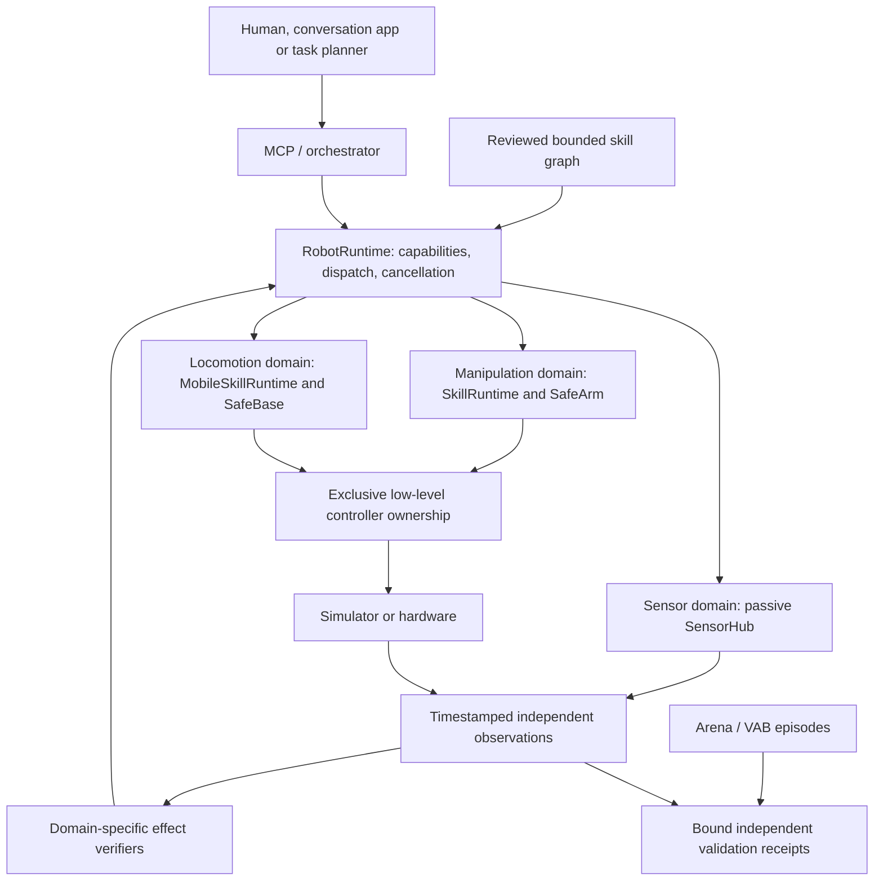

# Composable robots, observations and validation

Research and implementation review: 2 October 2026. Based on merged MicroDuck
and stop-lifecycle fixes, commit `0a65887c14605186dc1bc6a4b4084d0582418076`.
This adds an opt-in composed
runtime. Existing arm and mobile profiles continue to select their existing
runtime. The new mixed profile is explicitly synthetic; this change does not
establish physical humanoid or MicroDuck locomotion admission.

## Architecture and the implemented boundary

Robot identity is not a class hierarchy of arm, duck and humanoid. A profile
declares domains and resources. The coordinator registers the tools those
domains actually implement. Perception, locomotion, manipulation and tactile
measurements can therefore evolve independently while retaining the existing
runtime, MCP, traces and memory.



| Module | Implemented responsibility | Deliberate boundary |
| --- | --- | --- |
| `robotics/contracts.py`, `resources.py` | Immutable descriptors, JSON schemas, static controller ownership | Descriptors never connect a lazy actuator or certify a robot |
| `robotics/runtime.py` | Namespaced dispatch, global stop latch, generation invalidation, domain lifecycle | Domain controllers retain transport leases, physical timing and safety |
| `apps/robot_runtime.py` | Explicit `--robot` / `CASCADE_ROBOT` composition | Multiple physical actuation domains and mobile-mounted arms are refused |
| `sensing/` | Typed passive observations, provenance, freshness, bounded readers/history | Reading cannot step physics or claim actuator ownership |
| `robotics/graph.py` | Immutable bounded DAG of registered skills, outcome and data edges | No graph-generated code, online self-editing or automatic stop reset |
| `eval/vab.py`, `eval/arena.py`, `eval/trials.py` | Optional external API adapters and bound independent verdicts | Upstream success alone does not grant physical admission |

Tools are namespaced, for example `manipulation.open_gripper`,
`locomotion.get_base_state` and `sensing.read_sensor`. Global resource discovery,
stop, explicit stop reset and task completion remain global. A MicroDuck-only
profile has no arm domain and therefore advertises no fictional arm or gripper.
Configuration is explicit; there is no import-scanning plugin discovery that
could initialize hardware during tool listing.

The ownership unit is the **command endpoint**, not merely a joint subset. The
existing Unitree arm driver publishes an entire `LowCmd`, including unselected
slots. Two writers with disjoint joint names can still interfere. The catalog
rejects multiple writers for one controller; known transports have conservative
endpoint mappings. These local claims do not replace cross-process admission.

Stop invalidates dispatch before waiting for transport IO. Each domain has at
most one stop worker and one replaceable pending request. A blocked transport
does not prevent another domain receiving stop. Pending stop is reported, reset
is refused while stop IO remains pending, and a late motion result is invalidated.
A stop receipt is not proof of physical rest. Biped controllers must maintain
their own balance-preserving stop behavior.

## Observation and policy contracts

An observation carries sensor/source identity, schema, epoch, sequence, capture
time, clock domain, local receipt time, producer age, measurement kind and model
identity. Payloads include frame, units, calibration and saturation metadata.
The hub rejects replay, stale data, changed epochs and mismatched identities.
It limits provider count, payload bytes and retained history. A timed-out reader
is quarantined; repeated reads do not spawn unlimited workers. Closing reports
an uncooperative reader instead of claiming it was cancelled.

The implementation distinguishes IMU, proprioception, solved contact,
estimated tactile force, tactile image, RGB and RGB-D. A force estimate is not
a solver reaction or proof of foot support. An image is not a force measurement.
Missing acceleration/contact/depth stays unknown; it does not become zero.
Legacy camera data is BGR and depth is metric; adapters preserve those semantics.
Mobile providers read independent truth/frame endpoints without opening the
actor connection or advancing the simulation.

The registry and generic payloads are implemented; a humanoid tactile device
driver, calibration procedure and task-specific tactile verifier are not.
An injected provider is trusted integration code, not sandboxed untrusted code.
Production providers must demonstrate passive behavior and independent clocks.

For future policy adapters, shape alone is insufficient. Admission must bind
joint and observation ordering, units, frames, normalization, history/horizon,
action representation, limits, policy rate/physics decimation, model hash and
the exclusive controller. This PR does not add a generic policy loader.
MicroDuck retains its existing audited 61-observation/14-action native contract.
Its head/neck joints belong to that policy; the mouth lies outside it. A speech
app must not obtain a second writer to policy-owned joints.

## Why these research directions fit

This is a focused survey of relevant primary implementations, not a claim that
one framework already solves deployment for every humanoid.

| Primary source and inspected revision | Transfer to CASCADE |
| --- | --- |
| [ros2_control ResourceManager](https://github.com/ros-controls/ros2_control/blob/ed2a6ea169172d3bfe08e2c7bf6ca9dea5e10767/hardware_interface/include/hardware_interface/resource_manager.hpp) and [controller chaining](https://control.ros.org/rolling/doc/ros2_control/controller_manager/doc/controller_chaining.html) | Resource claims, coordinated mode changes and explicit command ownership; joint lists alone are insufficient |
| [ROS 2 lifecycle](https://design.ros2.org/articles/node_lifecycle.html) | Configuration, activation and teardown have different meanings from cancelling a task or maintaining balance |
| [Isaac Lab manager environment](https://github.com/isaac-sim/IsaacLab/blob/2c9c4df629ee0c553fbba432721b6e7caeda4b08/source/isaaclab/isaaclab/envs/manager_based_env.py) | Policy processing and physics substep application belong to the controller clock, independent of LLM latency |
| [Isaac ROS G1 GR00T integration](https://nvidia-isaac-ros.github.io/v/release-4.6/repositories_and_packages/isaac_ros_physical_ai/isaac_ros_unitree_g1_gr00t/index.html) | Upper-body task actions and lower-body balance are distinct responsibilities; stopping must respect their coordination |
| [GR00T data configuration](https://github.com/NVIDIA/Isaac-GR00T/blob/51d4c89f72fda44cbf77285c6a8114b52676b8a1/getting_started/data_config.md) | Bind modality ordering, action representations and temporal horizons, not only tensor dimensions |
| [LeRobot robot interface](https://github.com/huggingface/lerobot/blob/ff71cae1ae2d09fd035553c35da65888ed6c8304/src/lerobot/robots/robot.py) | Reusable robot/observation adapters; retain separate CASCADE cancellation and independent verification |
| [Isaac Lab contact semantics](https://isaac-sim.github.io/IsaacLab/v3.0.0-EA/source/concepts/sensors/contact_sensor.html) and [TacSL sensor APIs](https://isaac-sim.github.io/IsaacLab/main/source/api/lab_contrib/isaaclab_contrib.sensors.html) | Declare backend force semantics, contact-pair coverage and estimated versus solved forces explicitly |
| [DORA dataflow](https://github.com/dora-rs/dora/blob/b2df5ec2be1fc0f2755eca80316c679e94132283/guide/src/concepts/dataflow-yaml.md) | Bounded queues and transport separation are useful optional infrastructure; transport is not authority to command actuators |
| [ROS4HRI standard](https://ros4hri.github.io/standard.html) | Human interaction can be a separate typed domain. Speech produces bounded intent, not joint targets |

The requested [Reachy conversation app](https://github.com/pollen-robotics/reachy_mini_conversation_app/tree/5ab905d018de8d88f07444ca57677b2ffbe762ca)
separates realtime conversation, vision/tools and choreographed motion. Its
local endpoint mode connects to the independently hostable
[Hugging Face speech-to-speech server](https://github.com/huggingface/speech-to-speech/tree/411399d34555b2169823a6eaeb7f8ff192db89db).
For MicroDuck, the proposed boundary is a conversation client translating tool
calls into this capability catalog, with speech interruption/disconnection
propagating cancellation. Audio timing remains separate from the policy clock.
Reachy's motion blending and head poses cannot be transferred to policy-owned
MicroDuck joints. A hosted voice deployment and microphone/audio validation are
still separate implementation work; this refactor does not deploy that service.

The [HomeBody comparison](HOMEBODY_COMPARISON.md) extends this design with six
proposed increments: source-bound spatial memory, dynamic transforms,
auditable reconstruction, bounded local correction, actuator health and one
whole-body command owner. The first increment should be passive exploration
replay with explicit map/transform invalidation. These are design additions,
not enabled robot features; the comparison separates HomeBody's presentation
from its pending robot-code release and separately available components.

## Graph-as-policy: useful above the domain runtimes

The relevant paper is [GaP: A Graph-as-Policy Multi-Agent Self-Learning Harness
For Variational Automation Tasks, arXiv:2607.05369v1](https://arxiv.org/html/2607.05369v1).
It composes perception, planning, control and verification skills into graphs,
then uses rehearsal and failure analysis to improve them. Its evaluated
automation tasks motivate reusable skill contracts and offline graph revision;
they do not establish humanoid locomotion validity.

CASCADE now has a small execution substrate for that direction. It validates
an entire immutable graph before dispatch, hashes the graph and tool catalog,
and uses the same `runtime.execute()` boundary as MCP. Every motion explicitly
routes `confirmed`, `refuted`, `unverified` and `error`. Read nodes route
`success` and `error`. `$result` references must come from a node that precedes
the consumer on every execution path. Resolved arguments are schema-checked
before calling the destination tool; legacy tools without result schemas do
not receive an invented static output guarantee.

Graphs are acyclic and bounded by steps and elapsed time. Cancellation/deadline
requests priority stop. Python cannot forcibly unwind arbitrary native IO;
the backend still needs its own deadline or a supervised process boundary.
Graph cleanup and a successful terminal cannot erase a failed or synthetic
motion. Reports always retain `physical_admission: false`; deployment decisions
require a separate episode/campaign gate. The implementation is not GaP's
multi-agent learning harness and does not copy its benchmark success claims.

## VAB, VABAR and Arena

The supplied public repository is [Variational-Automation-Benchmark (VAB)](https://github.com/ehehee/Variational-Automation-Benchmark),
inspected at `edcc4bf005446839c0c6f43f8a3bf416702af030`. The proposed name VABAR
does not establish a public API or feature set; this integration targets the
available VAB code. GaP's inspected vendored VAB revision is different:
`fd2bc0f63369ba39137df018bbca8f6b372ffa0b`.

The retained [source inspection](evidence/robot-modularity/vab-source-inspection.json)
enumerates 62 task YAMLs and 3,052 initial states. The narrow adapter accepts 40
task manifests and excludes 22; those are configuration checks, not rollouts.

VAB is useful for manipulation task variation and repeatable initializations.
Some tasks teleport delivered objects off scene, and some success predicates
only inspect the last stage. Preserve the upstream criterion as
`benchmark_success`, then separately check the physical behavior requested by
CASCADE. The existing LIBERO runtime builder cannot simply be reused: it has
table/workspace/camera assumptions incompatible with the inspected VAB scenes.
The adapter therefore requires an explicit reviewed runtime factory.

[Isaac Lab Arena](https://github.com/isaac-sim/IsaacLab-Arena), inspected at
`c8d04e2199b86abbbb301bb22cec0effd83c4e63`, supplies scene, embodiment, task and
policy boundaries plus structured campaign results. That is a useful place to
rehearse a robot-specific admission matrix before real deployment. The adapter
imports its actual experiment result schema and can lazily construct a
`PolicyBase` subclass inside an installed Arena environment. A supplied,
explicitly owned controller remains responsible for low-level action tensors.
API compatibility is not a validated controller or a physical rollout.
The imported `source_revision` identifies the reviewed API revision selected by
the caller; Arena's result file does not itself attest the producer commit.

Independent verdicts bind the exact external artifact and record, configuration,
model, epoch, physical step/time window and independent snapshots. Missing or
mismatched evidence remains unverified. A verifier callback is a trusted
measurement boundary, not cryptographic proof that measurements are truthful.
See [the benchmark adapter guide](../benchmark/arena/README.md) for the concrete
APIs, pinned manifests, source caveats and execution requirements.

No native Arena or VAB episode is claimed by this change. Their simulator
dependencies stay optional and isolated from the working MicroDuck native
environment. The current Arena dependency recipe must be checked separately
before installation; it is not interchangeable with the existing Newton recipe.

## Try the composed software path

Use an installed CASCADE environment with development dependencies. The example
profile explicitly uses mock actuators and a synthetic IMU:

```bash
uv run python -m cascade.apps.demo --robot mixed_mock --llm mock --no-view --no-serve
CASCADE_ROBOT=mixed_mock uv run python -m cascade.apps.mcp_server
uv run python -m cascade.apps.skill_graph --robot mixed_mock \
  --graph configs/graphs/inspect_sensors.json --run-dir /tmp/cascade-graph-review
uv run pytest tests/test_robot_contracts.py tests/test_robot_runtime.py \
  tests/test_robot_mcp.py tests/test_skill_graph.py tests/test_sensing*.py \
  tests/test_vab*.py tests/test_arena*.py -q
```

The graph example discovers sensors and reads one synthetic IMU capture. It
produces `graph-result.json`; successful read flow is not locomotion evidence.
Composed domain runs have separate directories and learned-store defaults.
Explicit store environment overrides remain authoritative.

## Software validation

The retained [local validation receipt](evidence/robot-modularity/software-validation.json)
records a frozen-source full run: 5,178 passed, 252 skipped, four hardware cases
deselected and three failures. All three failures were existing mobile stop
tests whose independent loopback reads exceeded their configured deadlines;
their verdicts remained unverified. The five cases covering those parametrized
tests passed unchanged in an isolated rerun. This does not erase the full-run
failures or establish their scheduler/GC root cause.

The same source passed 62 packaging checks. The new composed MCP route and
synthetic sensor graph were exercised directly; no native Arena/VAB episode or
new physical sensor/locomotion result is included. Source hashes and protected
shared learned state were unchanged during the retained test runs. PR CI
provides the separate checks against the committed source on supported runners.

Initial CI at `d7f706c` passed Linux x86, minimal installation and browser checks;
ARM failed one freshness case and macOS failed two healthy late-read cases. The
same macOS failure also occurred on the base with unchanged relevant code.
The [CI follow-up receipt](evidence/robot-modularity/ci-followup.json) retains
those results. A controlled cyclic-GC injection reproduced a reader veto;
test-only isolation now keeps such collection outside two bounded
healthy-channel functions. Their focused suite passed 192 cases, including
unchanged stale/timeout negatives. macOS gains a compact failure diagnostic.
Neither adjustment establishes the original CI cause or a green full rerun.

## Admission work for an actual humanoid

The next physical vertical must select one real embodiment and controller,
rather than assert support for all humanoids at once. Required work includes:

1. Bind the model, policy, command endpoint and all observation/action mappings;
   demonstrate exclusive ownership and controller-clock execution.
2. Measure dynamic transforms with epochs and freshness. Replace static arm
   workspace/extrinsic assumptions before enabling mobile manipulation.
3. Validate whole-body limits, balance, self/environment collision and contact
   coordination. Independent per-domain success is insufficient when moving
   the base changes reachability or support.
4. Calibrate each added sensor and define missing, stale, saturated and degraded
   behavior. Validate tactile evidence against task-specific physical measures.
5. Rehearse balance, gait, turns, loaded manipulation, stop, disconnect, reset
   and sensor loss through the real MCP/controller/physics/verifier route.
   Arena can organize variation; independent measurements and video must bind
   to the same episode. Physical deployment requires its own staged validation.

MicroDuck's latest retained native results still refute the tested walking
commands and leave turning unverified. This refactor preserves those findings;
software composition and a new benchmark adapter do not resolve them.
