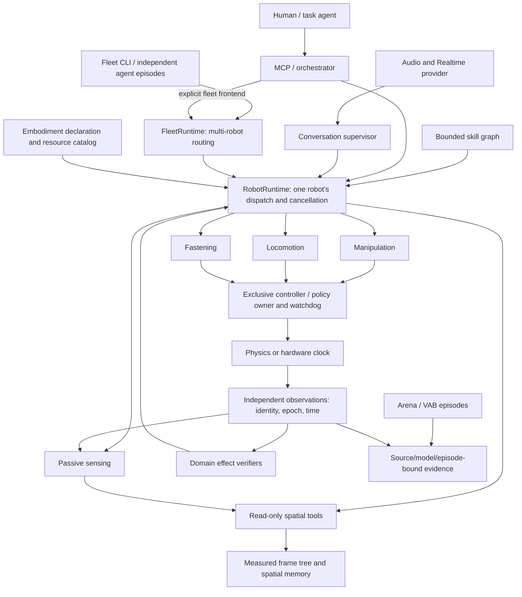

# Composable robots, observations and validation

The diagram and module table describe the implemented composition, with proposed
extensions marked explicitly. The [capability and acceptance index](PROJECT_STATUS_20261003.md)
holds source-bound physical results; this page describes interfaces rather than
repeating campaign history. The research references and dated software results
below retain their original 2 October scope.

Existing arm and mobile entrypoints remain available alongside the opt-in
composed runtime. Passive multi-DoF observations do not admit whole-body control;
mixed physical actuation remains refused. `mixed_mock` is a synthetic example.

## Architecture and the implemented boundary

Robot identity is not a class hierarchy of arm, duck and humanoid. A profile
declares domains and resources. The coordinator registers the tools those
domains actually implement. Perception, locomotion, manipulation and tactile
measurements can therefore evolve independently while retaining the existing
runtime, MCP, traces and memory.

The architecture is independent of a robot model or simulator release. Isaac
Sim, MuJoCo and hardware drivers implement backend-specific adapters behind
shared contracts. MicroDuck is one embodiment; its policy and actuator model
do not define locomotion for every robot. Dependency versions and build
identities belong to deployment configuration and validation records.

[Architecture image (SVG)](assets/architecture.svg) · [PNG](assets/architecture.png)



Solid arrows describe existing interfaces, not admission of every combination.
The fleet runtime routes concurrent tasks to isolated robot runtimes; the
native MicroDuck bridge currently owns one robot. Twelve native agents need a
shared scene owner: read one physical step, evaluate each robot's policy/BAM,
perform one scene solve, then publish observations bound to each robot. Calling
twelve current steppers would advance the shared scene twelve times. Per-robot
policy history, cancellation and balance-preserving stop must remain separate.
There is no measured twelve-robot episode or real-time performance guarantee.

| Module | Implemented responsibility | Deliberate boundary |
| --- | --- | --- |
| `robotics/contracts.py`, `resources.py`, `embodiment.py` | Immutable tools/resources, joint/link/transmission and sensor declarations, static controller ownership | Declarations never connect a lazy actuator, supply measured transforms or certify a robot |
| `robotics/runtime.py` | Namespaced dispatch, global stop latch, generation invalidation, domain lifecycle | Domain controllers retain transport leases, physical timing and safety |
| `apps/robot_runtime.py` | Explicit manipulation, locomotion, fastening, sensing and spatial composition through `--robot` / `CASCADE_ROBOT` | Multiple physical actuation domains and mobile-mounted arms are refused |
| `conversation/`, `apps/conversation.py` | Browser media, Realtime provider, allowlisted semantic intents, deadlines and priority interruption | Supervisor above one robot runtime; no joint writer, implicit stop reset or hosted-service deployment |
| `sensing/` | Typed passive observations, provenance, freshness, bounded readers/history | Reading cannot step physics or claim actuator ownership |
| `spatial/` | Capture-time frame lookup, source-bound memory, synthetic route proposals, observed RGB-D annotations and an optional [cuVSLAM RGB-D provider](SPATIAL_PROVIDERS.md#optional-cuvslam-localization) | cuVSLAM has CPU contract coverage and a 12-frame native synthetic RGB-D replay; physical localization and navigation execution remain pending; annotations are not a collision map |
| `control/microduck_policy.py`, `sim/microduck_stepper.py` | Pinned ONNX contract and physics-clock policy application | Robot-specific implementation; no generic humanoid policy loader or second writer to head joints |
| `robotics/graph.py` | Immutable bounded DAG of registered skills, outcome and data edges | No graph-generated code, online self-editing or automatic stop reset |
| `eval/vab.py`, `eval/arena.py`, `eval/trials.py` | Optional external API adapters and bound independent verdicts | Upstream success alone does not grant physical admission |
| `robotics/fleet.py`, `apps/fleet.py`, `apps/fleet_mcp.py` | Concurrent task routing, an independent agent episode per robot, and bounded fleet MCP with per-robot/global stop | Shared-space coordination and shared-scene physics remain pending |

## Capability boundaries

| Capability | Present in the code | Still required |
| --- | --- | --- |
| Talk and understand tool intents | Local browser/provider/session path with bounded audio and curated tools | Reliable general dialogue, hardware audio and public service operation |
| Interact with objects | Arm skills, SafeArm, grasp/release observations, optional cuMotion and OVRTX | Validation for each body/tool/scene; whole-body mobile manipulation |
| Turn a fastener | Mounted Factory domain with per-solve observations and final rest checks | Successful configured full task, acquisition/engagement/withdrawal and calibrated preload |
| Walk or turn | MicroDuck MobileBase, pinned policy, BAM, command leases and independent support/rest checks | General gait, longer paths and other robot/model/controller combinations |
| Perceive and remember space | Passive sensors, measured-frame contracts and retained RGB-D surface annotations | Physical SLAM/localization, metric reconstruction admission and execution of planned routes |
| Describe different bodies | Fixed/floating roots, links, transmissions and typed scalar/generalized joint observations | Drivers and control mappings for each mechanism; dynamic whole-body control |
| Sense touch | Contact, estimated-force and tactile-image contracts | Calibrated tactile device drivers and task-specific tactile verification |
| Coordinate twelve robots | Concurrent fleet runtime, agent CLI and MCP with independent robot identities, ownership and stop state; twelve-member mock diagnostics | Shared native scene, collision interaction and measured physical fleet stop/reset |

`ResourceDescriptor.admission` is declared metadata (for example `unvalidated`
or `software_only`), not an automatic certificate state
machine. Keep capability declaration, software execution and physical evidence
distinct. A future fleet must preserve each robot's source/model/epoch and
unresolved outcomes; a successful aggregate response cannot promote another
robot's unverified result.

The agent clock chooses goals and semantic tools. The controller clock applies
bounded actions and watchdogs. For the current MicroDuck recipe, the measured
physics step is 5 ms and policy evaluation occurs every four completed solves;
rendering and LLM latency cannot manufacture extra solves. Speech never writes
the policy-owned neck/head joints. These contracts must be rebound for each new
robot rather than imposing MicroDuck's rates on every humanoid.

Tools are namespaced, for example `manipulation.open_gripper`,
`locomotion.get_base_state` and `sensing.read_sensor`. Global resource discovery,
stop, explicit stop reset and task completion remain global. A MicroDuck-only
profile has no arm domain and therefore advertises no fictional arm or gripper.
Configuration is explicit; there is no import-scanning plugin discovery that
could initialize hardware during tool listing.

The ownership unit is the **command endpoint**, not merely a joint subset. The
existing Unitree arm driver publishes an entire `LowCmd`, including unselected
slots. Two writers with disjoint joint names can still interfere. The catalog
rejects multiple writers for one controller; known transports have conservative
endpoint mappings. These local claims do not replace cross-process admission.

Stop invalidates dispatch before waiting for transport IO. Each domain has at
most one stop worker and one replaceable pending request. A blocked transport
does not prevent another domain receiving stop. Pending stop is reported, reset
is refused while stop IO remains pending, and a late motion result is invalidated.
A stop receipt is not proof of physical rest. Biped controllers must maintain
their own balance-preserving stop behavior.

### Independent robot fleets

`robotics.fleet.FleetRuntime` composes already configured `RobotRuntime`
instances using explicit robot IDs. `execute(robot_id, tool, arguments)` routes
the member's unchanged tool catalog; different robots can act concurrently,
while each retains its own operation gate, generation, verification debt,
memory and trace directory. Duplicate robot/episode identities, shared runtime
state or store files and conflicting controller endpoints are refused. Configure
each robot's resource identity and controller explicitly before composition; renaming a
resource does not create another physical controller.

`stop(robot_id)` targets one member; `stop()` invalidates all members before
waiting for their existing stop workers with a shared half-second receipt
deadline. A blocked RPC remains pending and cannot hold up the other robots.
Only an explicit per-robot `reset_stop` restores dispatch permission; receipts
do not prove physical rest. Teardown queues cancellation for every robot before
waiting on any member's existing timeout and parking policy. CPU tests exercise
twelve concurrent synthetic robot runtimes, isolated stops, late dispatch
rejection and independent traces/debts.

This coordination API does not create a native twelve-MicroDuck scene.
A shared physical world still needs one admitted simulation
owner with distinct robot states, policy histories, contact registries and
perception/verifier identities, plus shared-space collision coordination.
The existing refusal of mixed physical actuation inside one robot is unchanged.

Run independent agent episodes with:

```bash
python -m cascade.apps.fleet --fleet microduck_mock12 --llm mock \
  --task "inspect and move briefly" --run-dir runs/fleet-example
```

The coordinator delegates one explicit task to each robot's `AgentOrchestrator`.
Clients, conversation histories and runtime evidence stay separate; configured
workers bound concurrent inference. `--llm mock` is a labelled scripted diagnostic
inside the agent loop. Its short kinematic movement is not physical locomotion
or a model deciding to walk. A real LLM profile uses the existing client API.

`--fleet` also accepts a YAML file with `version: 1`, `robots`, `deadline_s`,
`max_workers` and `max_steps`. Each robot entry selects `profile` and optionally
`config_dir` and `task`; relative config directories resolve beside that file.
Native profiles retain their exact backend IDs, connection endpoints and model
pins. `mock_id` is only available for unmounted mock mobile fixtures. The entire
resource graph is checked before any robot is built. No simulator or model
server is launched by this application.

`FleetAgents.stop(robot_id)` cancels one agent; `stop()` and SIGINT/SIGTERM cancel
all. The original episode generation and deadline fence every tool call and late
inference result. HTTP already in flight may remain pending; the report records
that instead of claiming cancellation. `catalog.json`, per-robot trace directories
and `report.json` retain assignments, outcomes, unresolved actions and shutdown.
Use a new run directory for each episode. Shared-world collision coordination,
physical fleet admission remain separate work.

The fleet MCP frontend lets an external agent host use these independent robot
episodes directly:

```bash
python -m cascade.apps.fleet_mcp --fleet microduck_mock12 \
  --run-dir runs/fleet-mcp-example --max-pending 64
```

The installed CLI is `cascade-fleet-mcp`. It speaks newline-delimited JSON-RPC
on stdio; stdout is reserved for protocol frames. `fleet.catalog` returns exact
robot IDs, distinct episode IDs and the local namespaced tool schemas.
`fleet.execute` requires `{robot_id, episode_id, tool, arguments}`; for example,
`tool: locomotion.get_base_state` selects that member's locomotion domain.
The MCP host owns conversations and agent inference. No LLM, simulator or model
server is started by this frontend, and no task-history reset is exposed.

`fleet.stop({robot_id})` stops one robot; `fleet.stop({})` stops all. Stops,
cancellation notifications and keepalive requests bypass ordinary work.
Cancellation of queued/running motion or control invalidates that robot's
generation and latches its existing stop path. `fleet.reset_stop({robot_id})`
requires a new explicit operator request; `CASCADE_HIDE_TOOLS=reset_stop` hides
and rejects it. Stops remain available even if a hiding list names them.

The existing profile's `max_workers` bounds concurrent requests; `--max-pending`
bounds queued plus running work (default 64, maximum 128). Over-capacity requests
are rejected without actuation. One robot still admits one ordinary operation.
Each request retains the server-received generation and original `deadline_s`
budget. Expiry cancels motion/control; delayed results cannot become success.
A blocked domain retains its slot until it returns, and incomplete shutdown is
reported rather than spawning replacement workers. Input frames are capped at
256 KiB. EOF and signals fence the whole fleet and use existing domain teardown
policies; `mcp-report.json` records closure and pending workers.

Software tests exercise actual child-process stdio, twelve synthetic robots with
separate traces, per-robot stop/cancel during blocked work with an unaffected
peer, capacity refusal, queued-request cancellation, stale reset rejection and
SIGTERM with stdin still open. These do not establish shared-scene physics or
physical collision/stop performance.

## Observation and policy contracts

An observation carries sensor/source identity, schema, epoch, sequence, capture
time, clock domain, local receipt time, producer age, measurement kind and model
identity. Payloads include frame, units, calibration and saturation metadata.
The hub rejects replay, stale data, changed epochs and mismatched identities.
It limits provider count, payload bytes and retained history. A timed-out reader
is quarantined; repeated reads do not spawn unlimited workers. Closing reports
an uncooperative reader instead of claiming it was cancelled.

The implementation distinguishes IMU, proprioception, solved contact,
estimated tactile force, tactile image, RGB and RGB-D. A force estimate is not
a solver reaction or proof of foot support. An image is not a force measurement.
Missing acceleration/contact/depth stays unknown; it does not become zero.
Legacy camera data is BGR and depth is metric; adapters preserve those semantics.
Mobile providers read independent truth/frame endpoints without opening the
actor connection or advancing the simulation.

The registry and generic payloads are implemented; a humanoid tactile device
driver, calibration procedure and task-specific tactile verifier are not.

The opt-in [camera-only RGB-D path](OBSERVED_RGBD.md) connects the native mobile
producer to passive sensing/runtime/MCP without constructing an arm. It retains
capture clocks, model/calibration pins, RGB8, metric optical-axis depth and the
static overview camera's optical-to-world transform. It is software-tested;
the new native recipe requires separate admission and GPU validation.
An injected provider is trusted integration code, not sandboxed untrusted code.
Production providers must demonstrate passive behavior and independent clocks.

For future policy adapters, shape alone is insufficient. Admission must bind
joint and observation ordering, units, frames, normalization, history/horizon,
action representation, limits, policy rate/physics decimation, model hash and
the exclusive controller. This PR does not add a generic policy loader.
MicroDuck retains its existing audited 61-observation/14-action native contract.
Its head/neck joints belong to that policy; the mouth lies outside it. A speech
app must not obtain a second writer to policy-owned joints.

## Why these research directions fit

This is a focused survey of relevant primary implementations, not a claim that
one framework already solves deployment for every humanoid.

| Primary source and inspected revision | Transfer to CASCADE |
| --- | --- |
| [ros2_control ResourceManager](https://github.com/ros-controls/ros2_control/blob/ed2a6ea169172d3bfe08e2c7bf6ca9dea5e10767/hardware_interface/include/hardware_interface/resource_manager.hpp) and [controller chaining](https://control.ros.org/rolling/doc/ros2_control/controller_manager/doc/controller_chaining.html) | Resource claims, coordinated mode changes and explicit command ownership; joint lists alone are insufficient |
| [ROS 2 lifecycle](https://design.ros2.org/articles/node_lifecycle.html) | Configuration, activation and teardown have different meanings from cancelling a task or maintaining balance |
| [Isaac Lab manager environment](https://github.com/isaac-sim/IsaacLab/blob/2c9c4df629ee0c553fbba432721b6e7caeda4b08/source/isaaclab/isaaclab/envs/manager_based_env.py) | Policy processing and physics substep application belong to the controller clock, independent of LLM latency |
| [Isaac ROS G1 GR00T integration](https://nvidia-isaac-ros.github.io/v/release-4.6/repositories_and_packages/isaac_ros_physical_ai/isaac_ros_unitree_g1_gr00t/index.html) | Upper-body task actions and lower-body balance are distinct responsibilities; stopping must respect their coordination |
| [GR00T data configuration](https://github.com/NVIDIA/Isaac-GR00T/blob/51d4c89f72fda44cbf77285c6a8114b52676b8a1/getting_started/data_config.md) | Bind modality ordering, action representations and temporal horizons, not only tensor dimensions |
| [LeRobot robot interface](https://github.com/huggingface/lerobot/blob/ff71cae1ae2d09fd035553c35da65888ed6c8304/src/lerobot/robots/robot.py) | Reusable robot/observation adapters; retain separate CASCADE cancellation and independent verification |
| [Isaac Lab contact semantics](https://isaac-sim.github.io/IsaacLab/v3.0.0-EA/source/concepts/sensors/contact_sensor.html) and [TacSL sensor APIs](https://isaac-sim.github.io/IsaacLab/main/source/api/lab_contrib/isaaclab_contrib.sensors.html) | Declare backend force semantics, contact-pair coverage and estimated versus solved forces explicitly |
| [DORA dataflow](https://github.com/dora-rs/dora/blob/b2df5ec2be1fc0f2755eca80316c679e94132283/guide/src/concepts/dataflow-yaml.md) | Bounded queues and transport separation are useful optional infrastructure; transport is not authority to command actuators |
| [ROS4HRI standard](https://ros4hri.github.io/standard.html) | Human interaction can be a separate typed domain. Speech produces bounded intent, not joint targets |

The requested [Reachy conversation app](https://github.com/pollen-robotics/reachy_mini_conversation_app/tree/5ab905d018de8d88f07444ca57677b2ffbe762ca)
separates realtime conversation, vision/tools and choreographed motion. Its
local endpoint mode connects to the independently hostable
[Hugging Face speech-to-speech server](https://github.com/huggingface/speech-to-speech/tree/411399d34555b2169823a6eaeb7f8ff192db89db).
The implemented [conversation client and supervisor](CONVERSATION.md) translate
selected tool calls into this capability catalog, with speech interruption and
disconnection propagating cancellation. Audio timing remains separate from the policy clock.
Reachy's motion blending and head poses cannot be transferred to policy-owned
MicroDuck joints. Local inference/browser and a synthetic-input native-motion
recording have [separate measured results](PROJECT_STATUS_20261003.md#rgb-d-geometry-speech-and-evaluation).
A public hosted voice service, hardware audio and general task reliability remain
unvalidated; the recorded motion episode has no spoken robot reply.

The [HomeBody comparison](HOMEBODY_COMPARISON.md) extends this design with six
proposed increments: source-bound spatial memory, dynamic transforms,
auditable reconstruction, bounded local correction, actuator health and one
whole-body command owner. The first increment now has [passive spatial replay](SPATIAL_PROVIDERS.md)
and [retained RGB-D annotations](RGBD_SPATIAL_OBSERVATIONS.md), with explicit
map/transform invalidation. Physical SLAM, reconstruction and whole-body
execution remain design work; the comparison separates HomeBody's presentation
from its pending robot-code release and separately available components.

## Graph-as-policy: useful above the domain runtimes

The relevant paper is [GaP: A Graph-as-Policy Multi-Agent Self-Learning Harness
For Variational Automation Tasks, arXiv:2607.05369v1](https://arxiv.org/html/2607.05369v1).
It composes perception, planning, control and verification skills into graphs,
then uses rehearsal and failure analysis to improve them. Its evaluated
automation tasks motivate reusable skill contracts and offline graph revision;
they do not establish humanoid locomotion validity.

CASCADE now has a small execution substrate for that direction. It validates
an entire immutable graph before dispatch, hashes the graph and tool catalog,
and uses the same `runtime.execute()` boundary as MCP. Every motion explicitly
routes `confirmed`, `refuted`, `unverified` and `error`. Read nodes route
`success` and `error`. `$result` references must come from a node that precedes
the consumer on every execution path. Resolved arguments are schema-checked
before calling the destination tool; legacy tools without result schemas do
not receive an invented static output guarantee.

Graphs are acyclic and bounded by steps and elapsed time. Cancellation/deadline
requests priority stop. Python cannot forcibly unwind arbitrary native IO;
the backend still needs its own deadline or a supervised process boundary.
Graph cleanup and a successful terminal cannot erase a failed or synthetic
motion. Reports always retain `physical_admission: false`; deployment decisions
require a separate episode/campaign gate. The implementation is not GaP's
multi-agent learning harness and does not copy its benchmark success claims.

## VAB, VABAR and Arena

Follow-up: the optional [real Arena preflight](ARENA_NATIVE_PREFLIGHT.md) now
exercises ordinary runtime dispatch, native PhysX observation and final-consumer
cancellation. Its task and physical-stop verdicts remain unverified. The
original software-contract validation below retains its historical scope.

The supplied public repository is [Variational-Automation-Benchmark (VAB)](https://github.com/ehehee/Variational-Automation-Benchmark),
inspected at `edcc4bf005446839c0c6f43f8a3bf416702af030`. The proposed name VABAR
does not establish a public API or feature set; this integration targets the
available VAB code. GaP's inspected vendored VAB revision is different:
`fd2bc0f63369ba39137df018bbca8f6b372ffa0b`.

The retained [source inspection](evidence/robot-modularity/vab-source-inspection.json)
enumerates 62 task YAMLs and 3,052 initial states. The narrow adapter accepts 40
task manifests and excludes 22; those are configuration checks, not rollouts.

VAB is useful for manipulation task variation and repeatable initializations.
Some tasks teleport delivered objects off scene, and some success predicates
only inspect the last stage. Preserve the upstream criterion as
`benchmark_success`, then separately check the physical behavior requested by
CASCADE. The existing LIBERO runtime builder cannot simply be reused: it has
table/workspace/camera assumptions incompatible with the inspected VAB scenes.
The adapter therefore requires an explicit reviewed runtime factory.

[Isaac Lab Arena](https://github.com/isaac-sim/IsaacLab-Arena), inspected at
`c8d04e2199b86abbbb301bb22cec0effd83c4e63`, supplies scene, embodiment, task and
policy boundaries plus structured campaign results. That is a useful place to
rehearse a robot-specific admission matrix before real deployment. The adapter
imports its actual experiment result schema and can lazily construct a
`PolicyBase` subclass inside an installed Arena environment. A supplied,
explicitly owned controller remains responsible for low-level action tensors.
API compatibility is not a validated controller or a physical rollout.
The imported `source_revision` identifies the reviewed API revision selected by
the caller; Arena's result file does not itself attest the producer commit.

Independent verdicts bind the exact external artifact and record, configuration,
model, epoch, physical step/time window and independent snapshots. Missing or
mismatched evidence remains unverified. A verifier callback is a trusted
measurement boundary, not cryptographic proof that measurements are truthful.
See [the benchmark adapter guide](../benchmark/arena/README.md) for the concrete
APIs, pinned manifests, source caveats and execution requirements.

The initial composition refactor did not execute either simulator. The later
[native VAB CPU preflight](VAB_NATIVE_PREFLIGHT.md) exercised ordinary CASCADE
relative motion, independent physical readback and in-flight cancellation in
the pinned Panda environment. It did not complete a benchmark task or execute
Arena. Simulator dependencies remain optional and isolated from the working
MicroDuck environment. The current Arena dependency recipe must be checked separately
before installation; it is not interchangeable with the existing Newton recipe.

## Try the composed software path

Use an installed CASCADE environment with development dependencies. The example
profile explicitly uses mock actuators and a synthetic IMU:

```bash
uv run python -m cascade.apps.demo --robot mixed_mock --llm mock --no-view --no-serve
CASCADE_ROBOT=mixed_mock uv run python -m cascade.apps.mcp_server
uv run python -m cascade.apps.skill_graph --robot mixed_mock \
  --graph configs/graphs/inspect_sensors.json --run-dir /tmp/cascade-graph-review
uv run pytest tests/test_robot_contracts.py tests/test_robot_runtime.py \
  tests/test_robot_mcp.py tests/test_skill_graph.py tests/test_sensing*.py \
  tests/test_vab*.py tests/test_arena*.py -q
```

The graph example discovers sensors and reads one synthetic IMU capture. It
produces `graph-result.json`; successful read flow is not locomotion evidence.
Composed domain runs have separate directories and learned-store defaults.
Explicit store environment overrides remain authoritative.

## Software validation

The retained [local validation receipt](evidence/robot-modularity/software-validation.json)
records a frozen-source full run: 5,178 passed, 252 skipped, four hardware cases
deselected and three failures. All three failures were existing mobile stop
tests whose independent loopback reads exceeded their configured deadlines;
their verdicts remained unverified. The five cases covering those parametrized
tests passed unchanged in an isolated rerun. This does not erase the full-run
failures or establish their scheduler/GC root cause.

The same source passed 62 packaging checks. The new composed MCP route and
synthetic sensor graph were exercised directly; no native Arena/VAB episode or
new physical sensor/locomotion result is included. Source hashes and protected
shared learned state were unchanged during the retained test runs. PR CI
provides the separate checks against the committed source on supported runners.

Initial CI at `d7f706c` passed Linux x86, minimal installation and browser checks;
ARM failed one freshness case and macOS failed two healthy late-read cases. The
same macOS failure also occurred on the base with unchanged relevant code.
The [CI follow-up receipt](evidence/robot-modularity/ci-followup.json) retains
those results. A controlled cyclic-GC injection reproduced a reader veto;
test-only isolation now keeps such collection outside two bounded
healthy-channel functions. Their focused suite passed 192 cases, including
unchanged stale/timeout negatives. macOS gains a compact failure diagnostic.
Neither adjustment establishes the original CI cause or a green full rerun.

The next CI (`3dae06a`) passed both Linux architectures; macOS's new diagnostics
identified stale held replies in the two late-read tests. The
[bounded-wait follow-up](evidence/robot-modularity/macos-late-read-fix.json)
retains that failure and a controlled before/after comparison. The TCP fixture
now yields until its fixed target and retains the original detached packet;
production timing and freshness checks are unchanged. Six deterministic cases
exercise the actual sampler's late fresh/fault/stale returns, including the
stale channel's quarantine. All 198 focused cases passed with source and shared
learned state unchanged. Hosted CI remains a separate result on the PR.

## Admission work for an actual humanoid

The next physical vertical must select one real embodiment and controller,
rather than assert support for all humanoids at once. Required work includes:

1. Bind the model, policy, command endpoint and all observation/action mappings;
   demonstrate exclusive ownership and controller-clock execution.
2. Measure dynamic transforms with epochs and freshness. Replace static arm
   workspace/extrinsic assumptions before enabling mobile manipulation.
3. Validate whole-body limits, balance, self/environment collision and contact
   coordination. Independent per-domain success is insufficient when moving
   the base changes reachability or support.
4. Calibrate each added sensor and define missing, stale, saturated and degraded
   behavior. Validate tactile evidence against task-specific physical measures.
5. Rehearse balance, gait, turns, loaded manipulation, stop, disconnect, reset
   and sensor loss through the real MCP/controller/physics/verifier route.
   Arena can organize variation; independent measurements and video must bind
   to the same episode. Physical deployment requires its own staged validation.

MicroDuck's [current evidence index](PROJECT_STATUS_20261003.md#fastening-and-locomotion)
includes historical short-distance passes alongside retained failed commands.
Those episode-specific results do not establish general walking, twelve-robot
operation or admission of a later source/model combination.
