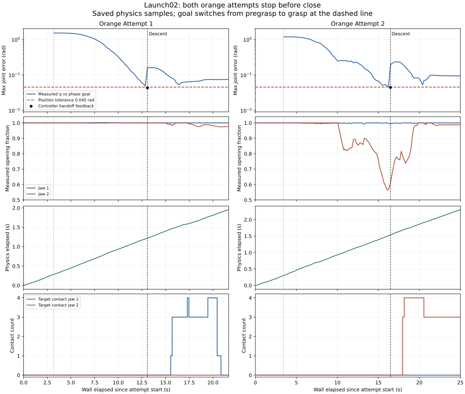

# Spark launch02: orange fails before close

The instrumented native launch at `5365fcb18df2c5d96ada993e781cb8d9cd7e8d2c`
produced a verified green-cube grasp and two orange attempts that both raised
`SkillError: did not settle at grasp pose` during descent. Neither orange
attempt entered the close phase or sent a closing command. This evidence does
not complete the two-case native acceptance campaign.

The [machine-readable receipt](../benchmark/results/spark_native_launch02_forensics_20261001.json)
contains SHA-256 hashes for all three attempt JSON/NPZ pairs, both passive
physics witnesses and their metadata, the owner trace, and memory before/after.
The retained inputs are under
`/home/johnny/Projects/demo/cascade-lab/CODEX_NEWTON/native-evidence-02-20261001`.
Attempt telemetry reports a clean source tree at that commit; its source hashes
describe files on disk at flush, not imported-bytecode attestation. All three
NPZ hashes match their JSON receipts; no events were dropped or logging errors
reported. Analysis was offline and did not connect to a bridge or change a
controller.

The read-only generator is retained beside those inputs as
`launch02-forensics-analysis.py`; its path and hash are in the receipt. It
requires the repository's NumPy, Pinocchio and Matplotlib environment with
`PYTHONPATH=src`. The generated PNG is also retained locally; the SVG below is
committed with this report.

## Direct observations

| Observation | Orange attempt 1 | Orange attempt 2 |
| --- | ---: | ---: |
| Attempt identifier suffix | `83bffc3e` | `770577ff` |
| Total attempt wall time | 21.652 s | 25.005 s |
| Pregrasp handoff position error, maximum joint | 0.04304 rad | 0.04406 rad |
| Position tolerance used | 0.045 rad | 0.045 rad |
| FK position error at that handoff | 7.743 mm | 12.560 mm |
| Reported maximum absolute joint velocity at handoff | 0.3467 rad/s | 2.1323 rad/s |
| Mean opening fraction at handoff | 0.9998 | 0.8027 |
| First target contact-count sample, seconds into attempt | 15.534 s | 17.956 s |
| First contact counts, left/right finger | `[1, 0]` | `[0, 3]` |
| Bilateral target contact-count samples | 0 | 0 |
| Closing commands / close stages | 0 / 0 | 0 / 0 |

These are saved measurements, not a new stability criterion. The old executor
accepted one sample inside the position tolerance; it did not require a stable
position window. Raw instantaneous `dq` can be noisy under contact and is not,
by itself, proof of continued displacement. The plotted joint positions show
the approach continuing around the handoff.

Contact counts and force measurements are preserved separately. The first
count-positive sample in attempt 1 has zero reported finger force; its later
force-positive samples are also unilateral. Attempt 2 has a force-positive
right-finger contact at its first count-positive sample. The contact tensor
is filtered to the requested target and the two fingers; it cannot identify
contacts between other props and other arm links.

The passive witness records neighbor displacement **before descent**:

| Attempt | Neighbor | First displacement over 1 mm | Descent starts | Maximum displacement during attempt |
| --- | --- | ---: | ---: | ---: |
| 1 | Pink cube | 12.287 s | 13.079 s | 4.238 mm |
| 2 | Tomato can | 10.452 s | 16.475 s | 45.431 mm |

Displacement is measured from each prop's first physics sample inside that
attempt. It establishes physical disturbance, but does not identify which
link caused it. Attempt 2 starts in the scene disturbed by attempt 1; these
are sequential attempts, not independent reset trials.

Attempt 2 already reports fully open jaws at the start of pregrasp. With only
an `open=1.0` command, mean opening subsequently falls to 0.7812 before the
handoff; the individual right jaw closes further than that mean suggests.
Therefore, simply calling this a delayed initial opening would misdescribe
the evidence. Checking actual opening before descent would detect that state,
but would not explain its cause or the first attempt's failure.

## Wall time and physical time

The saved source streams minimum-jerk targets against the client monotonic
clock. The following physical-time intervals bracket the first and last
transport-send event with the preceding/following physics witness samples.
They are bounds on elapsed physical time, not exact target-application times.

| Attempt | Command window | Targets | Wall elapsed | Physics elapsed bounds |
| --- | --- | ---: | ---: | ---: |
| Green cube | Pregrasp | 375 | 7.480 s | 0.717–0.750 s |
| Green cube | Descent | 100 | 1.980 s | 0.150–0.183 s |
| Orange 1 | Pregrasp | 375 | 7.480 s | 0.683–0.717 s |
| Orange 1 | Descent | 100 | 1.978 s | 0.183–0.217 s |
| Orange 2 | Pregrasp | 375 | 7.480 s | 0.700–0.733 s |
| Orange 2 | Descent | 100 | 1.979 s | 0.167–0.200 s |

Every joined `server_monotonic` lies inside its observer request/response
interval on this host. Simulation time comes from the saved `SimulationManager`
clock and physics-step count. The JSON retains the sample sequence numbers
used for each bound, so interpolation is not mistaken for an observation.

The dotted line starts pregrasp; the dashed line starts descent. Joint error
uses `q_pre` before descent and `q_grasp` after it, so that goal change causes
a discontinuity. Black dots are the controller's handoff feedback, which need
not coincide with a passive witness sample. Contact curves show counts, not
force or successful holding.

## Memory and geometric limits

The saved memory before launch contains `orange|fp6cm|h6cm`, with one earlier
air-grasp loss and a −5 mm Z nudge. The two current depth localizations have
height components of 24.807 and 26.972 mm; the source-pinned `object_profile`
function maps both to **`orange|fp6cm|h3cm`**. Both attempt events explicitly
record `prior=None` and an applied Z nudge of **0 mm**. The historical h6cm
row therefore did not apply that −5 mm adjustment to these attempts. The
after-memory still contains the same h6cm row. The green-cube h3cm prior was
present and its win count increased from one to two.

At the selected nominal pose, the first orange request cloud fits inside
the configured ±45 mm opening interval; the second has one observed point
outside it. The author's separate CAD-slab diagnostic finds positive nominal
gap margins for both selected poses and their sampled descent commands. That
analysis uses a partial observed cloud and an envelope of the CAD fingers;
it is **not** an exact collider or swept-clearance proof. Its hash and scope
are retained in the receipt. A simple nominal-width filter does not explain
the first failure.

The clock compression and observed approach behavior support investigating an
executor paced by authoritative physical time, with independent wall-time
limits and stable feedback. They do not establish the clock as the sole cause
of every collision. Neighbor geometry, the actual approach path, tracking,
and the observed loss of jaw opening remain separate constraints. This report
does not claim a successful orange close, lift, placement, home or reset, and
does not change GGX conditioning, motion limits, geometry or controller timing.
