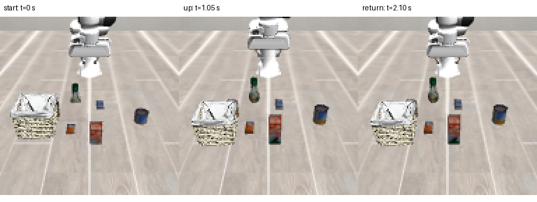

# Real VAB adapter preflight (2 October 2026)

CASCADE completed two ordinary `move_relative` calls in the **real pinned VAB
framework**, using Panda OSC_POSE, MuJoCo CPU physics and OSMesa/llvmpipe RGB.
A separate reader of the same completed simulation steps measured the TCP
movement. A second native episode cancelled the first call after step 8 and
refused another command without advancing simulation time or joint positions.
This closes a narrow interface preflight, **not pick/place success, a benchmark
score, hardware admission, or Arena execution**.

The upstream pin is
[`edcc4bf005446839c0c6f43f8a3bf416702af030`](https://github.com/ehehee/Variational-Automation-Benchmark/tree/edcc4bf005446839c0c6f43f8a3bf416702af030).
The unchanged task is
[`libero_object_all_variance/pick_up_the_alphabet_soup_and_place_it_in_the_basket.yaml`](https://github.com/ehehee/Variational-Automation-Benchmark/blob/edcc4bf005446839c0c6f43f8a3bf416702af030/tasks/libero_object_all_variance/pick_up_the_alphabet_soup_and_place_it_in_the_basket.yaml),
initial state 0. The public interface exposes RGB and robot proprioception.
Its [`contained_in`](https://github.com/ehehee/Variational-Automation-Benchmark/blob/edcc4bf005446839c0c6f43f8a3bf416702af030/libero/libero/vab/predicates.py)
criterion tests object-center proximity; it is not a release/support verifier.
It remains false in these movement-only episodes.

## Execution boundary

[`native_preflight.py`](../benchmark/vab/native_preflight.py) uses the existing
`run_trial` / `VabLiberoView`, `RobotRuntime`, ordinary `SkillRuntime.move_relative`,
`SafeArm`, `SafetyHarness`, and the existing Panda OSC action conversion. It
exposes only vertical movements of 1–4 cm. Object localization/grasp tools are
absent; neither object poses nor the success bit feed the controller. Real
128×128 RGB is preserved, with vertical readback flip and RGB-to-BGR conversion
for CASCADE. No depth is synthesized.

FK/IK run on a **separate `mujoco.MjData`**, initialized from the same composed
model. Only that scratch object's joint positions are written for kinematics.
The physical simulator's `qpos` is never temporarily changed by FK/IK. Scratch
`mj_forward` recomputes Jacobian prerequisites which the historical helper
obtained incidentally from live physics. Normal upstream reset initializes the
chosen task; after reset all physical advancement is ordinary `env.step(action)`.

The preflight's floor/world-frame envelope is explicit: TCP workspace
`[-.65,-.6,0]..[.65,.6,.8]` m, table plane 0 m, clearance .02 m, joint margin
.025 rad, joint velocity cap 1.2 rad/s. The backend checks commanded and observed
edges and settling against the harness at the actual 20 Hz control period;
MuJoCo solves at .002 s. Controller completion requires 2 mm TCP error and
.05 rad orientation error. Independent displacement verification requires
5 mm vector error and .05 rad orientation error. This is a restricted empty-space
probe, not general object collision checking: occupancy/perception is not
configured, and the declared arm resource stays `unvalidated`.

A witness records physical time, control/solver step, actual qpos/qvel, native
TCP site transform and object positions after every solve batch. Privileged
object positions exist **only in the observer evidence**. Per-episode UUID,
configuration, compiled model bytes, effective controller configuration,
package versions and source hashes bind the receipt. Source inventories are
compared before and after execution; upstream source/assets remain unchanged.

## Results and retained failures

The final movement episode used 42 control steps / 1,050 MuJoCo solver steps,
2.10 s of physical time. Requested +40 mm measured +38.488 mm (1.513 mm vector
error); requested −40 mm measured −38.617 mm (1.395 mm vector error).
Orientation changes were below .001 rad. Both independent TCP verdicts were
confirmed. The benchmark success bit remained false and placement remained
unverified. Start/middle/end images and a short 20 fps video preserve the
rendered episode; enlarging the 128×128 frames does not add image detail.



The cancellation episode ended at control step 8 / solver step 200 / .400 s.
The in-flight move failed, the next move was rejected, and qpos/time remained
unchanged. Runtime and native environment close returned successfully. VAB is
a synchronous local simulator: this verifies **cancellation of further step
submission**, not physical braking under a separate world producer. There is
no transport lease in this execution mode.

Retained startup failures identify missing upstream dependencies `termcolor`,
`easydict`, and optional camera utility dependency `h5py`. A controller-recipe
serialization attempt initially included the simulator handle; only that
non-serializable handle is now excluded (compiled model/episode bind it).
Another attempt rejected IK before actuation because scratch Jacobian
prerequisites were stale. These failed attempts are retained separately;
none are counted as native passes. CPU unit regressions exercise displacement,
episode binding, orientation, real scratch-state isolation, control cadence,
settling approvals, stop, and clock discontinuity.

## Reproduce without changing the SDK

Create a private Python 3.11 environment and install the retained
[dependency lock](../benchmark/vab/requirements-native-lock.txt). Clone the
upstream revision with all assets. Do not reuse the old LIBERO builder, whose
table geometry and capture size differ. Write a private
`$VAB_CONFIG/config.yaml` containing absolute `benchmark_root` and `assets`
paths to `<VAB>/libero/libero` and `<VAB>/libero/libero/assets` respectively.
Provide a CPU OSMesa library (the recorded Ubuntu packages were unpacked under
the task directory; no system installation or shared environment changes).

```bash
export CUDA_VISIBLE_DEVICES=-1 MUJOCO_GL=osmesa LIBGL_ALWAYS_SOFTWARE=1
export OMP_NUM_THREADS=2 OPENBLAS_NUM_THREADS=2
export LIBERO_CONFIG_PATH="$VAB_CONFIG"
export LD_LIBRARY_PATH="$PRIVATE_MESA/usr/lib/x86_64-linux-gnu"
export NUMBA_CACHE_DIR="$PRIVATE_RUNS/numba-cache"
export PYTHONPATH="$CASCADE_REPO/src:$CASCADE_REPO:$VAB/libero"
"$PRIVATE_VENV/bin/python" -m benchmark.vab.native_preflight \
  "$VAB" "$PRIVATE_RUNS/movement"
"$PRIVATE_VENV/bin/python" -m benchmark.vab.native_preflight \
  "$VAB" "$PRIVATE_RUNS/cancel" --cancel-after-step 8
```

Each output directory must be new. The runner pins all CASCADE learned-memory
paths inside it. It does not modify `HOME`, shared learned stores, upstream
source, or other simulation services. Evidence hashes and final source-bound
receipts are indexed in
[`vab-native-preflight-20261002.json`](evidence/robot-modularity/vab-native-preflight-20261002.json).

Arena still needs its separately pinned IsaacLab/Isaac Sim stack and an
admitted action owner; no Arena episode is implied by this VAB result. The
upstream Panda controller is not an SO-101 driver. Full benchmark task success
still requires real object perception, a reviewed task-specific manipulation
configuration, and independent release/support evidence.
